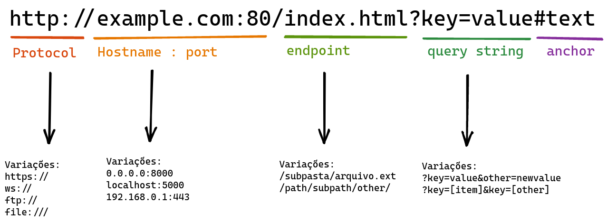

# Introdução a Web

Essa primeira parte do treinamento será bastante introdutória e tem como público alvo principalmente pessoas que nunca tiveram contato com
o desenvolvimento web.

Após essa fase de introdução entraremos em deselvolvimento com Python porém essa introdução é essencial!

## Hipertexto

Um documento de texto, como um livro ou artigo cientifico costuma ter referência a outros documentos como em notas de rodapé e índices.

Essa técnica de escrever documentos que podem conter ligações é chamada de escrita hipertextual, que significa expressar "o que vai além do texto" ou "ir de um texto ao outro".

Hipertexto é o nome de um texto que contém essas ligações e as ligações são chamadas de Hiperligações ou `hyperlinks`.

O termo hipertexto surgiu em 1964 para designar qualquer marcação que leva o leitor a outro texto, através de uma leitura hipertextual,
e é importante notar que Hipertexto não foi criado para a internet, este conceito existe desde que existe a escrita, livros históricos como antigas enciclopédias e até mesmo a biblia possuem ligações e notas que ligam um texto a outro. 

## A web

A web foi originalmente criada para o compartilhamento de
texto, especificamente artigos cientificos, livros e documentos,
e uma das principais carecteristicas de documentos cientificos é o 
uso de hipertexto, por exemplo, em bibliografias.

Portanto para organizar esse compartilhamento de documentos na internet de forma interativa foi criado o padrão HTML, HyperText Markup Language. (Linguagem de marcação de hipertexto) que originalmente servia apenas para ligar um documento a outro.


`documento1.txt`
```
Este é o documento 1 e para mais informações acesse
o <a href="documento2">documento número 2</a>
```

`documento2.txt`
```
Este é o documento 2 e você chegou até aqui através do link no <a href="documento1">documento número 1</a>
```

> E por falar em hipertexto (ou hipermidia) segue aqui um link com a [história da criação da internet](https://www.w3.org/People/Raggett/book4/ch02.html)

Desde a sua invenção a linguagem HTML passou por diversas revisões e através do W3C (World Wide Web Consortium) chegou finalmente na especificação que usamos hoje em dia, o HTML5 que além de conter os hiperlinks também contém diversas outras marcações para organizar a estrutura dos documentos.

Quando os documentos estão em computadores diferentes espalhados pela rede precisamos acessa-los através de um endereço e este endereço chama-se URL.
## URL

Uma URL (Uniform Resource Location) é o caminho onde um recurso está
servido, este recurso pode ser um texto em qualquer formato suportado pelos protocolos, pode ser um stream que entrega texto constamente ou pode ser apenas o ponto de entrada para um processo.

A estrutura de uma URL




A URL é muito importante pois é através dela que estabelecemos a comunicação com o servidor e especificamos exatamente quais recursos desejamos obter ou criar.

A palavra **URL** muitas vezes vai ser mencionada por um de seus sinônimos dependendo do contexto, exemplos: **URI**, **Rota**, **Path**, **Caminho**, **endereço**, **HREF**, **SRC**, etc.