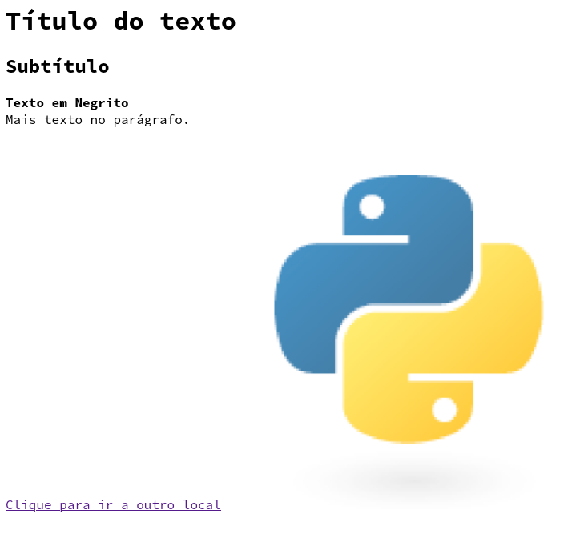
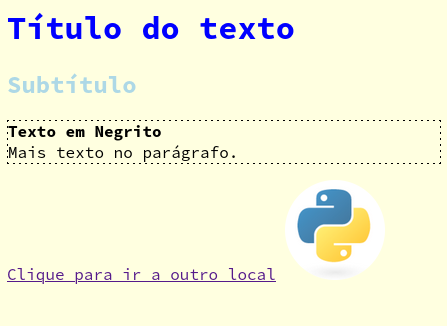
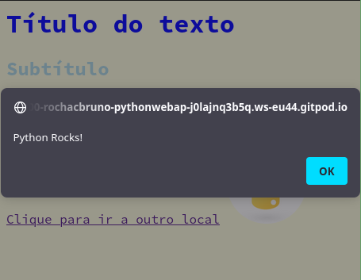

# HTML

A linguagem HTML tem foco em como o documento é estruturado e na adição de significado semantico aos elementos de um texto.

`pagina.html`
```html
<html>

<body>
    <h1> Título do texto </h1>
    <h2> Subtítulo </h2>
    <p>
        <strong> Texto em Negrito </strong>
        <br>
        Mais texto no parágrafo.
    </p>
    <a href="https://python.org">Clique para ir a outro local</a>
    
</body>

</html>
```

Basta salvar o arquivo `pagina.html` e abrir no navegador o resultado será:




Como você pode reparar uma página apenas com HTML não tem um design muito interessante e isso é proposital já que o foco do HTML é apenas organizar o conteúdo, a tarefa de adicionar estilo e formatação fica para o CSS.


## CSS

Cascading Style Sheets, ou CSS, é uma linguagem declarativa que pode ser carregada em um documento HTML e ela define formatação

O CSS de preferência deve ser colocado em um arquivo separado `estilo.css` e ligado ao documento principal através de `<link>` tags.


Com o CSS é possível definir o estilo de texto, bordars, cores, alinhamento e até fazer pequenas animações.

Vamos aplicar as seguintes declarações

- A cor do fundo será amarelo claro
- A cor do titulo será Azul
- A cor do subtitulo será Azul claro
- O parágrafo terá borda pontilhada
- A Imagem terá 100 pixels de largura
- A imagem terá bordas arredondadas

`estilo.css`
```css
body {
    background-color: lightyellow;
}

h1 {
  color: blue;
}

h2 {
  color: lightblue;
}

p {
  border: 1px dashed black;
}

img {
  border-radius: 50%;
  width: 100px;
}
```

Agora para aplicar este estilo ao HTML precisamos definir uma ligação dentro da tag `<head>`


`pagina.html`
```html
<html>

<head>
    <link rel="stylesheet" href="estilo.css">
</head>

...

</html>
```

Ao abrir o arquivo no Browser verá que agora está um pouco melhor.





Como você já deve ter percebido eu não tenho muitos talentos para front-end e design portanto nem vou tentar deixar isso mais bonito, a intenção foi só te apresentar o funcionamento do CSS :) 


## Javascript

> Mesmo o foco do nosso curso ser **Python para web e API**, ou seja, nosso foco aqui será o backend (que já vou explicar em breve), é muito importante que você tenha noções de como funciona a parte de programação no front-end.

Para finalizar o trio do front-end, agora temos o papel do javascript, enquanto o HTML define a estrutura dos elementos através de tags e o CSS declara o estilo, a linguagem javascript é a responsável por processar o  comportamento que acontece do lado cliente, ou seja, interação do usuário com a página web.

Já é possível escrever a parte front-end usando Python e WebAssembly, e veremos um pouco disso no final do treinamento, porém o Javascrip ainda será uma linguagem necessária e importante para inclusive permitir essa interação.

Nossa missão é fazer com que ao clicar na imagem do logo do Python apareça uma mensagem de alerta dizendo `Python Rocks` na tela.

`script.js`
```js
function emite_alerta() {
    alert("Python Rocks!");
};

logo = document.getElementsByTagName("img")[0];
logo.onclick = emite_alerta;
```

E da mesma maneira que linkamos o `css` vamos agora conectar o `script.js` porém faremos usando a tag `script` e no final do documento antes de fechar o `body` desta forma os elementos já estarão carregados e disponiveis para adicionarmos programação.

`pagina.html`
```html
<html>

<head>
    <link rel="stylesheet" href="estilo.css">
</head>

<body>
    <h1> Título do texto </h1>
    <h2> Subtítulo </h2>
    <p>
        <strong> Texto em Negrito </strong>
        <br> <!-- quebra de linha -->
        Mais texto no parágrafo.
    </p>
    <a href="https://python.org">Clique para ir a outro local</a>
    

    <script type="application/javascript" src="script.js"></script>
</body>

</html>
```

Ao executar e clicar no logo:



O exemplo completo pode ser encontrado no seguinte URL https://jsfiddle.net/b1o6rup2/76/ 

## Conclusão

Os exemplos mostrados aqui são apenas introdutórios e não seguem as melhores práticas de HTML, CSS e JS, o foco deste treinamento está nas tarefas de back-end que é o que veremos a seguir portanto caso tenha interesse em desenvolver suas habilidades no front-end eu recomendo os sites da Mozilla e W3C para começar.

Agora vamos ao back-end com Python :)

# Questões

## O que significa HTTP?

## Para que serve o HTML

## Para que serve o CSS

## Para que serve o Javascript

