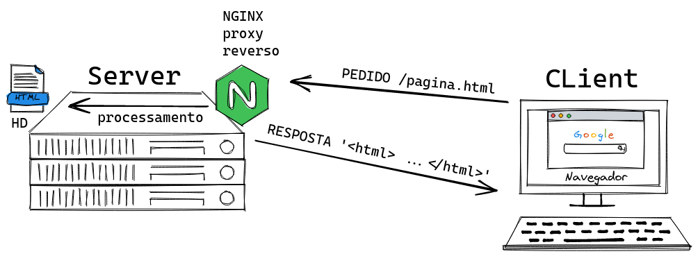
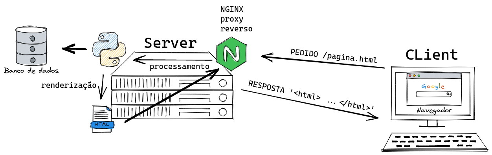
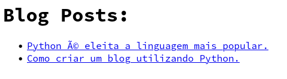
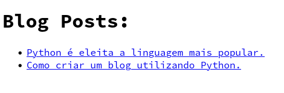

# Onde entra o Python no desenvolvimento web?

Python é uma das linguagens principais para desenvolvimento `backend`, o que fizemos até agora com `html`, `css` e `js` é dominio do desenvolvimento `front-end`, ou seja, arquivos renderizados no cliente, no navegador e o servidor só tem a responsabilidade de simplesmente **servir** sem alterações e o cliente faz o que chamamos de `Client Side Rendering`

Acontece que existem casos onde os dados do `HTML` não são estáticos, mas precisam variar de acordo com informações vindas de bancos de dados por exemplo, ou através da interatividade com o usuário.

Quando falamos em desenvolvimento de Web Sites, focando na entrega de HTML para o navegador e neste cenário Python assume um papel que chamamos de `Server Side Rendering`, como linguagem de programação que executa no servidor Python tem acesso a muitos recursos do sistema como sistema de arquivos e bancos de dados e o objetivo final na aplicação continua sendo entregar `html`, `css` e `js` porém no meio do caminho o Python consegue alterar ou até mesmo gerar esses arquivos em tempo de execução.

Vamos ver um exemplo simples usando apenas funcionalizades embutidas no Python de como podemos renderizar um template HTML.

No terminal Ipython

```py
dados = {"nome": "Bruno", "cidade": "Viana"}
template = """\
<html>
<body>
    <ul>
        <li>Nome: {dados[nome]}</li>
        <li>Cidade: {dados[cidade]}</li>
    </ul>
</body>
</html>
"""
print(template.format(dados=dados))
```

```
<html>
<body>
    <ul>
        <li>Nome: Bruno</li>
        <li>Cidade: Viana</li>
    </ul>
</body>
</html>
```

Portanto como deve ter percebido utilizamos as funcionalidades de formatação e interpolação de textos do Python para no back-end acessar
qualquer tipo de banco de dados e renderizar templates preenchedo as lacunas com o dado.

O objetivo final continua sendo entregar o HTML ao navegador, porém este HTML não está estático, nós temos apenas o template do html estático e dinãmicamente em tempo de real efetuamos a renderização para entregar ao client o resultado do HTML.

Repare que para o cliente a presença do Python no back-end é transparente

Sem Python

> O arquivo HTML está estático disponível no sistema de arquivos.



Com Python

> O template HTML está estático, porém contém lacunas (placeholders) a serem preenchidos com dados vindo de um banco de dados, o HTML final é processado e renderizado em tempo de execução e entregue ao cliente de forma dinâmica.




## Blog estático

Vamos gerar as páginas HTML para um blog usando a abordagem mostrada anteriormente.


O blog ficará em `exemplos/day1/blog`.

Vamos começar criando 2 templates HTML

`list.template.html` é o template que usaremos para criar a home page, a página de listagem do conteúdo.

```html
<html>
<body>
    <h1>Blog Posts:</h1>
    <ul>
        {post_list}
    </ul>
</body>
</html>
```

`post.template.html` é a página que iremos gerar para cada postagem do blog.
```html
<html>
<body>
    <h1>{post[title]}</h1>
    <hr />
    <p>
        {post[content]}
    </p>
    <hr />
    <small>{post[author]}</small>
</body>
</html>
```

Nosso blog usará SQLITE como banco de dados então vamos usar Python para conectar a um banco de dados, criar a tabela para armazenar as postagens e
alimentar com alguns posts de exemplo.

`database.py`
```py
# 1 - conectamos ao banco de dados
from sqlite3 import connect
conn = connect("blog.db")
cursor = conn.cursor()

# 2 - Criamos a tabela caso não exista
conn.execute(
    """\
    CREATE TABLE if not exists post (
        id integer PRIMARY KEY AUTOINCREMENT,
        title varchar UNIQUE NOT NULL,
        content varchar NOT NULL,
        author varchar NOT NULL
    );
    """
)

# 3 - Criamos os posts iniciais para alimentar o banco de dados
posts = [
    {
        "title": "Python é eleita a linguagem mais popular",
        "content": """\
        A linguem Python foi eleita a linguagem mais popular pela revista
        tech masters e segue dominando o mundo.
        """,
        "author": "Satoshi Namamoto",
    },
    {
        "title": "Como criar um blog utilizando Python",
        "content": """\
        Neste tutorial você aprenderá como criar um blog utilizando Python.
        <pre> import make_a_blog </pre>
        """,
        "author": "Guido Van Rossum",
    },
]


# 4 - Inserimos os posts caso o banco de dados esteja vazio
count = cursor.execute("SELECT * FROM post;").fetchall()
if not count:
    cursor.executemany(
        """\
        INSERT INTO post (title, content, author)
        VALUES (:title, :content, :author);
        """,
        posts,
    )
    conn.commit()

# 5 - Verificamos que foi realmente inserido
posts = cursor.execute("SELECT * FROM post;").fetchall()
assert len(posts) >= 2
```

Agora vamos finalmente fazer a renderização das postagens que estão no banco de dados e preencher os templates HTML.

- Buscamos os posts no banco de dados
- Criamos a pasta `site` que será o destino do site final
- Renderizamos a página `index.html`
- Renderizamos uma página para cada post
- Fechamos a conexão

`render.py`
```py
from pathlib import Path
from database import conn

# 1 - Obtemos os posts do banco de dados e deserializamos em um dict
cursor = conn.cursor()
fields = ("id", "title", "content", "author")
results = cursor.execute(f"SELECT * FROM post;")
posts = [dict(zip(fields, post)) for post in results]

# 2 - Criamos a pasta de destino do site
site_dir = Path("site")
site_dir.mkdir(exist_ok=True)

# 3 - Criamos uma função capaz de gerar a url de um post
def get_post_url(post):
    slug = post["title"].lower().replace(" ", "-")
    return f"{slug}.html"


# 3 - Renderizamos o a página `index.html` a partir do template.
index_template = Path("list.template.html").read_text()
index_page = site_dir / Path("index.html")
post_list = [
    f"<li><a href='{get_post_url(post)}'>{post['title']}</a></li>"
    for post in posts
]
index_page.write_text(
    index_template.format(post_list="\n".join(post_list))
)

# 4 - Renderizamos todas as páginas para cada post  partir do template.
for post in posts:
    post_template = Path("post.template.html").read_text()
    post_page = site_dir / Path(get_post_url(post))
    post_page.write_text(post_template.format(post=post))

print("Site generated at", site_dir)

# 5 - fechamos a conexão
conn.close()
```


Agora sim tudo pronto para gerar o site

```bash
$ cd exemplos/day1/blog
$ python render.py
```

O programa vai gerar uma pasta `site` e agora podemos servir esta pasta
com o servidor HTTP do Python.

```bash
$ python -m http.server --directory site
Serving HTTP on 0.0.0.0 port 8000 (http://0.0.0.0:8000/) ...
```

Ao acessar http://0.0.0.0:8000/ você vai perceber um pequeno probleminha...



Podemos resolver isto facilmente alterando os nossos templates, no topo de cada template adicionamos `meta` tags para definir o encoding correto

```
<!DOCTYPE html>
<html lang="en">
<head>
    <meta charset="UTF-8">
    <title>Blog</title>
</head>
...
```

Agora sim está tudo ok!




## Desafio

Repare que nossa URL foi criada com acentuação
`python-%C3%A9-eleita-a-linguagem-mais-popular.html`

Consegue alterar a função `get_post_url` e fazer com que 
ela remova os acentos?

## Conclusão

O modelo visto aqui funciona para renderizarmos dados para entregar ao cliente, mas e se quisermos ler informações enviadas pelo cliente?

Veremos no próximo video.