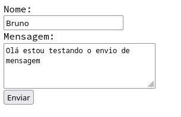
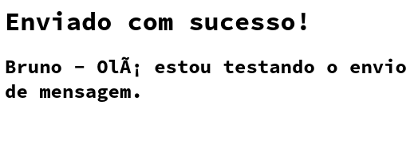

# Formulários

Até aqui vimos o funcionamento de uma requisição `GET` com o objetivo **pegar** um recurso que está localizado no servidor.

Acontece que na web também temos a comunicação inversa, o cliente (navegador) pode enviar informações para o servidor e para isso precisamos utilizar uma estrutura de formulários do HTML.

Os formulários foram introduzidos no HTML para permitir o envio
de mensagens em páginas de contato, as páginas `contato.html` que tem
na maioria dos sites.


Conforme a imagem acima, o primeiro passo que precisamos fazer é criar um formulário vazio para que o cliente possa preencher.


`contato.html`
```html
<!DOCTYPE html>
<html lang="en">
<head>
    <meta charset="UTF-8">
    <title>Contato</title>
</head>
<body>
    <form action="envia.py" method="post">
        <label for="nome">Nome:</label><br>
        <input type="text" name="nome" /><br>
        <label for="mensagem">Mensagem:</label><br>
        <textarea name="mensagem" cols="30" rows="5"></textarea><br>
        <input type="submit" value="Enviar">
    </form>
</body>
</html>
```

Acessamos a mesma pasta onde está o arquivo html e podemos servir com 

```bash
python -m http.server
```

Ao acessar http://localhost:8000/contato.html podemos preencher e enviar o formulário.



Porém ao clicar em enviar veremos a seguinte mensagem de erro:

```
Error response

Error code: 501

Message: Unsupported method ('POST').

Error code explanation: HTTPStatus.NOT_IMPLEMENTED - Server does not support this operation.
```

E este será o output no log do servidor

```bash
10.20.58.74 - - [11/May/2022 18:25:58] "GET /contato.html HTTP/1.1" 200 -
10.20.58.74 - - [11/May/2022 18:28:40] code 501, message Unsupported method ('POST')
10.20.58.74 - - [11/May/2022 18:28:40] "POST /envia.py HTTP/1.1" 501 -
```

> **Calma**, está tudo bem! este erro era esperado.

O servidor que rodamos com `python -m http.server` não está preparado para receber requisições
do tipo `POST`, por padrão ele apenas entende `GET`.

## CGI

Common Gateway Interface é um protocolo de comunicação para servidores web, o `http.server` da forma como estamos rodando não tem suporte a CGI, precisamos adicionar o suporte a scripts CGI.

Passo 1 criamos uma pasta chamada `cgi-bin` (este nome é padrão do protocolo CGI, suportado por servidores como Apache, Cherokee etc) e nesta pasta podemos
colocar scripts CGI escritos em Python ou Perl.

```
# na mesma pasta onde está o contato.html
mkdir cgi-bin
```

Agora criamos um arquivo chamado `cgi-bin/envia.py` e neste script faremos o processamento dos dados vindos do formulário e a resposta será em forma de texto HTML.

```py
#!/usr/bin/env python
import cgi
form = cgi.FieldStorage()
nome = form.getvalue('nome')
mensagem  = form.getvalue('mensagem')

print("Content-type:text/html\r\n\r\n")
print("<html>")
print("<head>")
print("<title>Enviado</title>")
print("</head>")
print("<body>")
print("<h1>Enviado com sucesso!</h1>")
print(f"<h2>{nome} - {mensagem}</h2>")
print("</body>")
print("</html>")
```

Agora precisamos dar permissão de execução ao script acima

```
chmod +x cgi-bin/envia.py
```

Alteramos o form para submeter a `action` para o caminho do CGI

```html
<form action="/cgi-bin/envia.py" method="post">
```

E agora servimos novamente usando o argumento `--cgi`

```bash
python -m http.server --cgi
```

Agora sim podemos tentar novamente e enviar nossa mensagem.

Acesse http://localhost:8000/contato.html


Preencha e clique no botão enviar!



> **Atenção** repare que tem erros de encoding 😯, mas você já sabe o que fazer para corrigir não é?


Repare também que a URL final é `/cgi-bin/envia.py` 🤷 se você clicar para ver o código fonte, verá que é apenas HTML

```html
<html>
<head>
<title>Enviado</title>
</head>
<body>
<h1>Enviado com sucesso!</h1>
<h2>Bruno - Olá estou testando o envio de mensagem.</h2>
</body>
</html>
```

## Conclusão

- A tag `<form>` no html estrutura os campos que pretendemos receber no backend
- O script em Python é executado pelo webserver que tem suporte a CGI
- No script podemos capturar os valores do formulário
- Neste ponto podemos fazer o que quiser, ex: enviar e-mail ou guardar em um banco de dados
- Todos os `prints` que fazemos no CGI são retornados para o cliente, a saida padrão é impressa no stream de response.

Parabéns você acabou de programar para web do mesmo modo que os entepassados faziam :) 

Agora vamos partir para uma abordagem um pouco mais moderna.