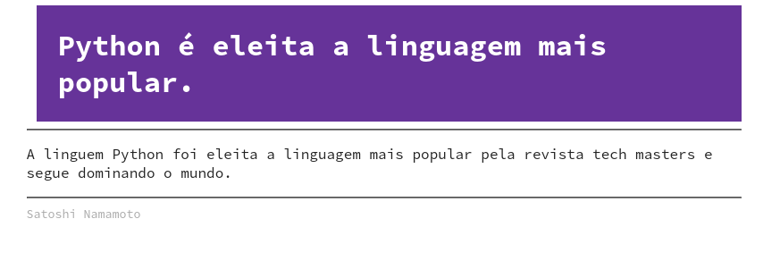
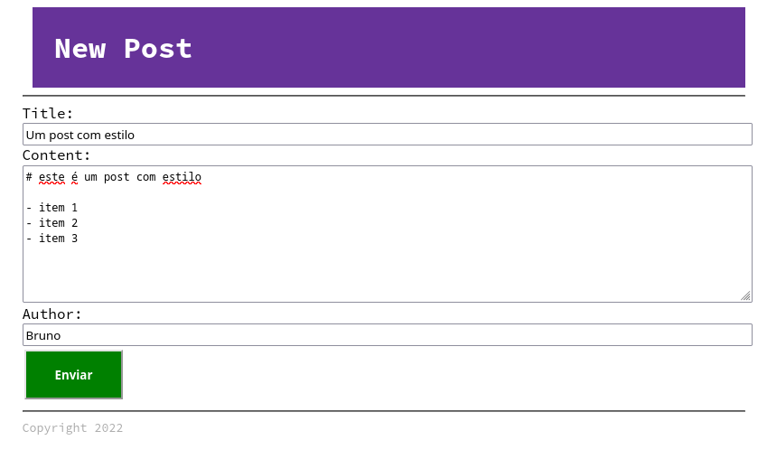
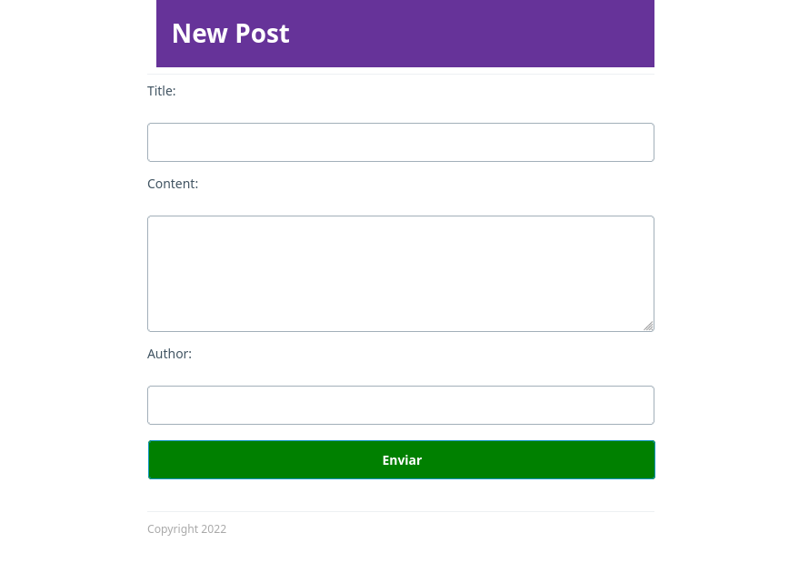

# Templates

Até aqui usamos templates HTML com `str.format` do Python e isso funciona bem para exemplos simples porém para obter maior produtividade e reutilizar blocos de template é mais recomandado utilizar uma biblioteca de renderização de templates, chamada de **template engine**.

Um dos template engines mais famosos e utilizados chama-se `Jinja2`, ele virou um padrão para templates que é inclusive seguido fora da web como por exemplo no **Ansible** (ferramenta de automação de infra estrutura e configurações da Red Hat), o Jinja também inspirou o Twig do PHP, o Tera do Rust, entre outros.

> `pip install jinja2`

## Jinja2

Jinja não serve apenas para HTML, ele pode ser usado para qualquer tipo de texto.

Ex: Template de email.

`email.template.txt`
```
Olá , {{ name }}

Estes são os produtos em promoção:


    - {{ product.name }} - R$ {{ product.price }}



E você tem 20% de desconteo por ser cliente especial!

```

Agora podemos renderizar este template usando Jinja


`render_message.py`
```py
from jinja2 import Environment, FileSystemLoader
env = Environment(loader=FileSystemLoader("."))
template = env.get_template("email.template.txt")

data = {
    "name": "Bruno",
    "products": [
        {"name": "iphone", "price": 13000.320},
        {"name": "ferrari", "price": 900000.430},
    ],
    "special_customer": True
}

print(template.render(**data))
```

```bash
$ python render_message.py 
Olá , Bruno

Estes são os produtos em promoção:

- iphone - R$ 13000.32
- ferrari - R$ 900000.43

E você tem 20% de desconto por ser cliente especial!
```

> Perceba que os produtos estão todos em letras minusculas, e os preços não estão formatados corretamente, podemos resolver isso com filtros.

### Filtros


Filtros são funções que podem ser aplicadas em pedaços de texto dentro do template e a sintaxe é:

`'texto' | filtro`

Existem alguns filtros embutidos no Jinja2 https://jinja.palletsprojects.com/en/3.1.x/templates/#list-of-builtin-filters

Exemplo:

```

    - {{ product.name | capitalize }} - R$ {{ "%.3f" | format(product.price) }}

```

```bash
$ python render_message.py 
Olá , Bruno

Estes são os produtos em promoção:

- Iphone - R$ 13000.320
- Ferrari - R$ 900000.430

E você tem 20% de desconto por ser cliente especial!
```

No exemplo acima usamos `capitalize` para deixar as primeiras letras em maiusculo e `format` para formatar um valor numérico,
ambos são filtros embutidos do Jinja.

Uma coisa interessante é que o Jinja permite o registro de novos filtros customizados.

Vamos alterar o template para usar um filtro chamado `addhearts`

```txt

E você tem {{ "20%" | addhearts }}  de desconto por ser cliente especial!

```

Nosso objetivo é imprimir `❤️ 20% ❤️` no lugar do texto.

agora no `render_message.py`
```py
from jinja2 import Environment, FileSystemLoader
env = Environment(loader=FileSystemLoader("."))
template = env.get_template("email.template.txt")

# NEW
def addhearts(text):
    return f"❤️ {text} ❤️"

env.filters['addhearts'] = addhearts
# NEW

data = {
    "name": "Bruno",
    "products": [
        {"name": "iphone", "price": 13000.320},
        {"name": "ferrari", "price": 900000.430},
    ],
    "special_customer": True
}

print(template.render(**data))
```

```bash
$ python render_message.py 
Olá , Bruno

Estes são os produtos em promoção:

- Iphone - R$ 13000.320
- Ferrari - R$ 900000.430

E você tem ❤️ 20% ❤️  de desconto por ser cliente especial!
```

Acredito que agora já deu para você entender o objetivo da biblioteca `Jinja` e como ela pode ajudar com funções, controles, filtros etc..

Agora vamos coloca-la em prática em nosso blog :)


## Blog com Jinja2

Vamos copiar nosso blog existente e migrar ele para usar Jinja como motor de templates.

```bash
cd exemplos/day1
cp -R blog blog_jinja
```

Podemos apagar alguns arquivos que não usaremos no blog.

```bash
rm blog_jinja/render.py
rm -rf blog_jinja/site/
```

Agora temos uma pasta chamadas `blog_jinja` e vamos começar a editar:

O primeiro passo é alterar os templates:

`post.template.html`
```html
<!DOCTYPE html>
<html lang="en">
<head>
    <meta charset="UTF-8">
    <title>Blog</title>
</head>
<body>
    <h1>{{ post.title }}</h1>
    <hr />
    <p>
    {{ post.content }}
    </p>
    <hr />
    <small>{{ post.author }}</small>
</body>
</html>
```

No Jinja o acesso a chaves de dicionário é feito usando `.` e por isso trocamos `post[title]` por `post.title`


`list.template.html`
```html
<!DOCTYPE html>
<html lang="en">
<head>
    <meta charset="UTF-8">
    <title>Blog</title>
</head>
<body>
    <h1>Blog Posts:</h1>
    <ul>
    
        <li><a href="{{ post.id }}">{{ post.title }}</a></li>
    
    </ul>
</body>
</html>
```

Repare que trocamos `{post_list}` for uma construção `for`diretamente no template :) 

Agora podemos alterar o `wsgi.py`

- Criamos um environment para o Jinja
- Alteramos a função render template para usar o Jinja
- Removemos a função `get_post_list` e passamos os `posts` diretamente na url `/`
  (lembre-se, agora o `for` acontece dentro do template)

```py
import cgi
from pathlib import Path
from database import conn
# NEW
from jinja2 import Environment, FileSystemLoader
# NEW
env = Environment(loader=FileSystemLoader("."))

def add_new_post(post):
    cursor = conn.cursor()
    cursor.execute(
        """\
        INSERT INTO post (title, content, author)
        VALUES (:title, :content, :author);
        """,
        post,
    )
    conn.commit()


# NEW
def render_template(template_name, **context):
    template = env.get_template(template_name)
    return template.render(**context).encode("utf-8")


def get_posts_from_database(post_id=None):
    cursor = conn.cursor()
    fields = ("id", "title", "content", "author")

    if post_id:
        results = cursor.execute("SELECT * FROM post WHERE id = ?;", post_id)
    else:
        results = cursor.execute("SELECT * FROM post;")

    return [dict(zip(fields, post)) for post in results]


def application(environ, start_response):
    path = environ["PATH_INFO"]
    method = environ["REQUEST_METHOD"]
    body = b"Content Not Found"
    status = "404 Not Found"

    if path == "/" and method == "GET":
        posts = get_posts_from_database()
        body = render_template(
            "list.template.html",
            post_list=posts  # NEW
        )
        status = "200 OK"

    elif path.split("/")[-1].isdigit() and method == "GET":
        post_id = path.split("/")[-1]
        body = render_template(
            "post.template.html",
            post=get_posts_from_database(post_id=post_id)[0],
        )
        status = "200 OK"

    elif path == "/new" and method == "POST":
        form = cgi.FieldStorage(
            fp=environ["wsgi.input"], environ=environ, keep_blank_values=1
        )
        post = {item.name: item.value for item in form.list}
        add_new_post(post)
        body = b"New post Created with Success!"
        status = "201 Created"

    elif path == "/new" and method == "GET":
        body = render_template("form.template.html")
        status = "200 OK"

    headers = [("Content-type", "text/html")]
    start_response(status, headers)
    return [body]


if __name__ == "__main__":
    from wsgiref.simple_server import make_server

    server = make_server("0.0.0.0", 8000, application)
    server.serve_forever()

```

> **IMPORTANTE** Ao trabalhar com templates é bom estabelecer um limite sobre o que é lógica de apresentação e o que é lógica de negócio. Ex: Iterar objetos, transformar para maiusculo, adicionar opções de formatação etc, são ok de ir ao lado HTML. Já filtragem, ordenação, permissões etc, precisam ser feitas no nível de função ao invés de ser feito no template.


Pode executar com `python wsgi.py` para ver se o blog continuar funcionando.

## Eliminando repetições

Uma das vantagens em usar um sistema de templates é a possibilidade de reaproveitamento de código entre os templates.

Vamos organizar o nosso blog de uma maneira melhor, vamos agora focar em organizar os nossos templates, dentro da pasta `blog_jinja` vamos começar adicionando uma nova pasta chamada `templates`.

```bash
cd blog_jinja
mkdir templates
```

Agora vamos mover todos os arquivos HTML para esta nova pasta

```bash
mv *.template.html templates/

```

E no arquivo `wsgi.py` vamos alterar para que os templates sejam carregados da pasta correspondente.

```diff
- env = Environment(loader=FileSystemLoader("."))
+ env = Environment(loader=FileSystemLoader("templates"))
```

Agora o projeto `blog_jinja` deve ter a seguinte estrutura.

```bash
tree -L 2
.
├── blog.db
├── database.py
├── templates
│   ├── form.template.html
│   ├── list.template.html
│   └── post.template.html
└── wsgi.py
```

Existe um bloco de HTML que se repete em nossos 3 templates:

```html
<!DOCTYPE html>
<html lang="en">
<head>
    <meta charset="UTF-8">
    <title>Blog</title>
</head>
```

Quando trabalhamos com Jinja podemos criar um template `base` que servirá para construir todos os outros templates a partir dele, portanto na mesma pasta `templates/` vamos criar um arquivo chamado `base.template.html`

`templates/base.template.html`
```jinja
<!DOCTYPE html>
<html lang="en">
<head>
    <meta charset="UTF-8">
    <title>Blog</title>
</head>
<body>
    <h1></h1>
    <hr />
    
    <hr />
    <small>Copyright 2022</small>
</body>
</html>
```

Repare que agora temos um HTML padrão com algumas areas demarcadas `headline`, `content` e `footer`.

Portanto agora nos templates podemos `extender` o template `base.html` e definir apenas o conteúdo dos blocos.


`post.template.html`
```jinja



  {{ post.title }}

    

  <p>
  {{ post.content }}
  </p>
 


  {{ post.author }}

```

e

`list.template.html`
```jinja



  Blog Posts:

    

  <ul>
  
    <li><a href="{{ post.id }}">{{ post.title }}</a></li>
  
  </ul>

```

e `form.template.html`

```jinja



  New Post

    

<form action="/new" method="post">
    <label for="title">Title:</label><br>
    <input type="text" name="title" /><br>
    <label for="content">Content:</label><br>
    <textarea name="content" cols="30" rows="5"></textarea><br>
    <label for="author">Author:</label><br>
    <input type="text" name="author" /><br>
    <input type="submit" value="Enviar">
</form>

```

Agora pode executar com `python wsgi.py` e ver o resultado :)


## Macros

Uma das vantagens de usar Jinja é possibilidade de reaproveitar código HTML através de macros, que são funções definidas dentro do HTML.

VAmos alterar o `form.template.html` e usar macros para criar os campos do formulário.

```jinja



  New Post



<label for="{{name}}">{{name | capitalize}}:</label><br>

<input type="text" name="{{name}}" /><br>

<textarea name="{{name}}" cols="30" rows="5"></textarea><br>




<form action="/new" method="post">
    {{ field("title") }}
    {{ field("content", type="textarea") }}
    {{ field("author") }}
    <input type="submit" value="Enviar">
</form>

```


## Mas qual a vantagem de usar blocks?

Agora podemos aplicar estilo em nosso bloco apenas alterando o template base :) 

`base.template.html`

```jinja
<!DOCTYPE html>
<html lang="en">
<head>
    <meta charset="UTF-8">
    <title>Blog</title>
    
    <style>
      body {
          max-width: 800px;
          margin-left: auto;
          margin-right: auto;
      }
      h1 {
        margin: 0 0 0 0.35em;
        color: #fff;
        background-color: rebeccapurple;
        padding: 24px;
      }
      p {
          color: #222;
      }
      small {
          color: darkgray;
      }
      input[type=text] {
         width: 100%;
      }
      textarea {
          width: 100%;
      }
      input[type=submit] {
          background-color: green;
          padding: 16px 32px;
          margin: 4px 2px;
          color: white;
          font-weight: bold;
      }
    </style>
    
</head>
<body>
    <h1></h1>
    <hr />
    
    <hr />
    <small>Copyright 2022</small>
</body>
</html>
```

E você vai reparar que o estilo foi aplicado automaticamente a todas as páginas que extendem o mesmo template.






> É eu sei, você deve estar pensando "Nossa mas que blog feio!" concordo, meu talento para design é nota 0 :(, mas felizmente :) existem frameworks que podem nos ajudar.

Experimente adicionar a seguinte linha no `base.template.html`

```html

<link rel="stylesheet" href="https://unpkg.com/marx-css/css/marx.min.css">
...
```



## Conclusão

Usar um bom sistema de templates é essencial para organizar nossa aplicação web e permitir a reutilização de blocos de código HTML.

Nosso foco neste treinamento está no back-end, portanto agora vamos voltar a focar no Python :) 
