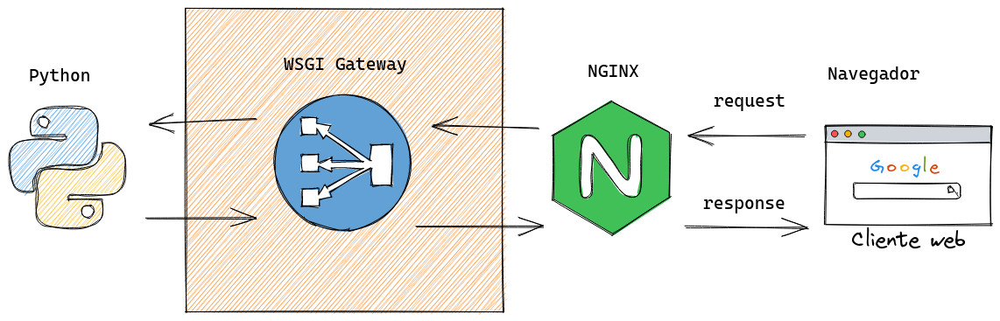

# Frameworks

Framework é o nome que damos a um conjunto de bibliotecas e utilidades que são construidas com a intenção de facilitar o desenvolvimento, abstraindo as partes repetivivas e requisitando que seus usuários sigam um padrão de construção pré estabelecido, a principal vantagem em usar um framework é o fato de não precisar ficar criando coisas comuns novamente, o exemplo que fizemos anteriormente renderizando templates HTML e usando CGI é considerado repetitivo, para um site simples pode até funcionar mas imagina este trabalho sendo feito em sites complexos com milhares de páginas e dezenas de pessoas programando.


## WSGI

o padrão CGI que vimos agora pouco para processar um formulário foi bastante útil durante os primórdios da internet e muitos servidores adotaram, porem o CGI se mostrou limitado principalmente em termos de extensibilidade e segurança e as linguagens de programação passaram a definir seus próprios padrões e protocolos de comunicação com servidores web.

Em Python o padrão estabelecido para comunicação com servidores web é o [WSGI (Web Server Gateway Interface)](https://peps.python.org/pep-0333/) e a finalidade do WSGI é 
permitir que vários frameworks possam ser criados e todos falarem com servidores web como Apache e Nginx de forma padronizada atráves do WSGI.



Portanto TODOS os frameworks Python, como Django, Flask, Web2py, FastAPI etc puderam ser criados seguindo cada um uma abordagem particular porém todos mantendo o mesmo padrão de comunicação com os servidores web.

Hoje em dia é muito dificil existir a necessidade de escrever aplicações web usando CGI puro como fizemos antes ou usando WSGI diretamente pois os frameworks já abstraem isso para você, quando você programa em Django por exemplo, raramente precisa saber sa existência do WSGI.

Porém se a apartir de agora já partissemos para usar um framework este aqui seria um curso de framework e esta não é a minha intenção com este material, este é um treinamento de Python para Web, independente de frarmework, os conceitos aprendidos aqui serão úteis para você trabalhar com qualquer framework web existe ou até os que venham a surgir no mundo Python.

## Criando uma aplicação WSGI pura sem framework :)

Só para você ter uma idéia de como funciona o protocolo WSGI na prática

- Criamos um objeto callable (pode ser função ou classe) que recebe 2 argumentos:
    - environ: as variaveis do `request` aqui vai vir dados como:
    - start_reponse: Uma função de callback que o app server wsgi vai nos enviar
      como parâmetro e invocamos essa função para indicar o inicio da resposta
- Criamos o `body` do nosso response (aqui podemos fazer o que quisermos para montar o HTML de resposta)
- Executamos o callback `start_response` passando o `status` e os `headers` conforme o protocolo HTTP.
- Retornamos um objeto iterável contendo o HTML a ser retornado.
- Usamos o entry point `__main__` para iniciar um app server builtin do python e executar essa aplicação.


`wsgi.py`
```py
def application(environ, start_response):
    body = b"<strong>Hello world!</strong>"
    status = "200 OK"
    headers = [("Content-type", "text/html")]
    start_response(status, headers)
    return [body]


if __name__ == "__main__":
    from wsgiref.simple_server import make_server

    server = make_server("0.0.0.0", 8000, application)
    server.serve_forever()
```

Executamos com `python wsgi.py` e pode abrir o navegador para ver o resultado :)

O `wsgiref.simple_server` é um servidor para ser usado apenas para testes e durante o desenvolvimento, ele não é multi thread, ou seja, permite apenas um request a ser requisitado por vez.

Podemos também executar utilizando um app server wsgi mais robusto como o `gunicorn` ou `uwsgi` que são ferramentas mais utilizadas em produção.

```bash
$ pip install gunicorn

$ gunicorn wsgi:application

[2022-05-12 13:55:28 +0000] [2304] [INFO] Starting gunicorn 20.1.0
[2022-05-12 13:55:28 +0000] [2304] [INFO] Listening at: http://127.0.0.1:8000 (2304)
[2022-05-12 13:55:28 +0000] [2304] [INFO] Using worker: sync
[2022-05-12 13:55:28 +0000] [2306] [INFO] Booting worker with pid: 2306
```

O funcionamento é o mesmo porém o gunicorn pode trabalhar com multiplos workers e contém uma série de melhorias para tornar nossa aplicação concorrente com threads.

```bash
$ gunicorn wsgi:application -w 8
[2022-05-12 13:59:29 +0000] [2509] [INFO] Starting gunicorn 20.1.0
[2022-05-12 13:59:29 +0000] [2509] [INFO] Listening at: http://127.0.0.1:8000 (2509)
[2022-05-12 13:59:29 +0000] [2509] [INFO] Using worker: sync
[2022-05-12 13:59:29 +0000] [2511] [INFO] Booting worker with pid: 2511
[2022-05-12 13:59:29 +0000] [2512] [INFO] Booting worker with pid: 2512
[2022-05-12 13:59:29 +0000] [2513] [INFO] Booting worker with pid: 2513
[2022-05-12 13:59:29 +0000] [2514] [INFO] Booting worker with pid: 2514
[2022-05-12 13:59:29 +0000] [2515] [INFO] Booting worker with pid: 2515
[2022-05-12 13:59:30 +0000] [2516] [INFO] Booting worker with pid: 2516
[2022-05-12 13:59:30 +0000] [2517] [INFO] Booting worker with pid: 2517
[2022-05-12 13:59:30 +0000] [2518] [INFO] Booting worker with pid: 2518
```

Passando o parâmetro `-w 8` faz com que ele inicie 8 workers, ou seja, é capaz de administrar 8 requisições simultaneas.

> **NOTA** Mais a frente no treinamento falaremos sobre workers assincronos.

## Blog 

Vamos transformar nosso blog estático usando wsgi puro, ao invés de gerarmos um site estático vamos entregar os posts do banco de dados dinâmicamente.

Na nossa pasta `blog` vamos criar um arquivo chamado `wsgi.py` e programar o seguinte:

- Uma applicação wsgi para interceptar a comunicação com o web server
- Uma função para renderizar os templates que já possuimos `list.template.html` e `post.template.html`
- Um roteamento simples de URLs usando apenas condicionais com `if`


Detalhes:

O objeto `environ` que recebemos na aplicação `WSGI` contém as variáveis de ambiente do O.S
e também algumas variáveis que existem apenas no tempo de request, algumas delas que precisaremos usar são:

- environ["REQUEST_METHOD"]  - Informa qual o método da requisição (GET, POST, PUT, PATCH, DELETE)
- environ["PATH_INFO"] - Informa qual o `path` no cliente, ex: `http://server/foo/bar/` essa variável vai conter `/foo/bar/`

`blog/wsgi.py` (este arquivo deve ficar na mesma pasta onde estão os templates html)


```py
from pathlib import Path
from database import conn


def render_template(template_name, **context):
    template = Path(template_name).read_text()
    return template.format(**context).encode("utf-8")


def get_posts_from_database(post_id=None):
    cursor = conn.cursor()
    fields = ("id", "title", "content", "author")

    if post_id:
        results = cursor.execute("SELECT * FROM post WHERE id = ?;", post_id)
    else:
        results = cursor.execute("SELECT * FROM post;")

    return [dict(zip(fields, post)) for post in results]


def get_post_list(posts):
    post_list = [
        f"""<li><a href="/{post['id']}">{post['title']}</a></li>"""
        for post in posts
    ]
    return "\n".join(post_list)


def application(environ, start_response):
    path = environ["PATH_INFO"]
    method = environ["REQUEST_METHOD"]
    body = b"Content Not Found"
    status = "404 Not Found"

    if path == "/" and method == "GET":
        posts = get_posts_from_database()
        body = render_template(
            "list.template.html", post_list=get_post_list(posts)
        )
        status = "200 OK"

    elif path.split("/")[-1].isdigit() and method == "GET":
        post_id = path.split("/")[-1]
        body = render_template(
            "post.template.html",
            post=get_posts_from_database(post_id=post_id)[0],
        )
        status = "200 OK"

    headers = [("Content-type", "text/html")]
    start_response(status, headers)
    return [body]


if __name__ == "__main__":
    from wsgiref.simple_server import make_server

    server = make_server("0.0.0.0", 8000, application)
    server.serve_forever()

```

Com o programa acima já temos um site dinâmico com banco de dados, roteamento, renderização de templates no lado servidor 🎉

E se quisermos agora permitir que o usuário escreva novas postagens?

Vamos criar uma função nova responsável por receber um dicionário com os dados do post 

Na próxima aula :) 