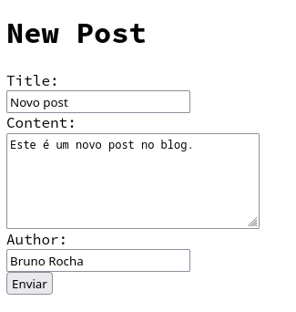
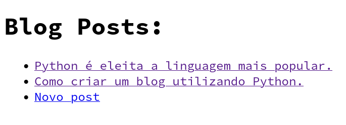
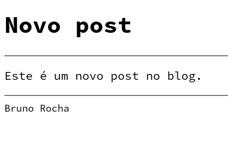

# WSGI form input

E se quisermos agora permitir que o usuário escreva novas postagens?

Vamos criar uma função nova responsável por receber um dicionário com os dados do post 

```py
# Exemplo de entrada
{
    'title': 'Novo post',
    'content': 'Este é um post novo...',
    'author': 'Bruno Rocha'
}
```

E efetuar a consulta SQL responsável por gravar o novo post no banco de dados.

```py
def add_new_post(post):
    cursor = conn.cursor()
    cursor.execute(
        """\
        INSERT INTO post (title, content, author)
        VALUES (:title, :content, :author);
        """,
        post,
    )
    cursor.commit()
```

E alterar o roteamento na função `application` para interceptar uma requisição post e pegar os dados enviados pelo form.


```py
import cgi
# ...

#def application(...):
#    ...

    elif path == "/new" and method == "POST":
        form = cgi.FieldStorage(
            fp=environ['wsgi.input'],
            environ=environ,
            keep_blank_values=1
        )
        post = {item.name: item.value for item in form.list}
        add_new_post(post)
        body = b"New post Created with Success!"
        status = "201 Created"


# headers = ...
```

Agora precisamos adicionar também um formulário e para isso vamos criar mais um template

`form.template.html` contendo os campos necessários para inserir um novo post no blog.

```html
<!DOCTYPE html>
<html lang="en">
<head>
    <meta charset="UTF-8">
    <title>Blog</title>
</head>
<body>
    <h1>New Post</h1>
    <form action="/new" method="post">
        <label for="title">Title:</label><br>
        <input type="text" name="title" /><br>
        <label for="content">Content:</label><br>
        <textarea name="content" cols="30" rows="5"></textarea><br>
        <label for="author">Author:</label><br>
        <input type="text" name="author" /><br>
        <input type="submit" value="Enviar">
    </form>
</body>
</html>
```

E por fim adicionamos mais uma rota

```py
elif path == "/new" and method == "GET":
    body = render_template("form.template.html")
    status = "200 OK"

# headers = ...
```

O programa completo:

```py
import cgi
from pathlib import Path
from database import conn


def add_new_post(post):
    cursor = conn.cursor()
    cursor.execute(
        """\
        INSERT INTO post (title, content, author)
        VALUES (:title, :content, :author);
        """,
        post,
    )
    conn.commit()


def render_template(template_name, **context):
    template = Path(template_name).read_text()
    return template.format(**context).encode("utf-8")


def get_posts_from_database(post_id=None):
    cursor = conn.cursor()
    fields = ("id", "title", "content", "author")

    if post_id:
        results = cursor.execute("SELECT * FROM post WHERE id = ?;", post_id)
    else:
        results = cursor.execute("SELECT * FROM post;")

    return [dict(zip(fields, post)) for post in results]


def get_post_list(posts):
    post_list = [
        f"""<li><a href="/{post['id']}">{post['title']}</a></li>"""
        for post in posts
    ]
    return "\n".join(post_list)


def application(environ, start_response):
    path = environ["PATH_INFO"]
    method = environ["REQUEST_METHOD"]
    body = b"Content Not Found"
    status = "404 Not Found"

    if path == "/" and method == "GET":
        posts = get_posts_from_database()
        body = render_template(
            "list.template.html",
            post_list=get_post_list(posts)
        )
        status = "200 OK"

    elif path.split("/")[-1].isdigit() and method == "GET":
        post_id = path.split("/")[-1]
        body = render_template(
            "post.template.html",
            post=get_posts_from_database(post_id=post_id)[0],
        )
        status = "200 OK"

    elif path == "/new" and method == "POST":
        form = cgi.FieldStorage(
            fp=environ["wsgi.input"], environ=environ, keep_blank_values=1
        )
        post = {item.name: item.value for item in form.list}
        add_new_post(post)
        body = b"New post Created with Success!"
        status = "201 Created"

    elif path == "/new" and method == "GET":
        body = render_template("form.template.html")
        status = "200 OK"

    headers = [("Content-type", "text/html")]
    start_response(status, headers)
    return [body]


if __name__ == "__main__":
    from wsgiref.simple_server import make_server

    server = make_server("0.0.0.0", 8000, application)
    server.serve_forever()
```





Ao submeter verá:

```
New post Created with Success!
```

Agora basta voltar a raiz `/` do site



E ao clicar para ir a `/3` verá




## Conclusão


No dia a dia é muito melhor e mais produtivo utilizar um framework que já cai trazer a maior parte dessas funcionalidades de forma abstraida e fácil de usar,

O ponto desta aula é que é possível programar para web em Python sem a necessidade de usar frameworks, para isso basta seguir o padrão do protocolo `WSGI`, 
esse conhecimento de como essa parte funciona por baixo dos frameworks é essencial para que você inclusive saiba usar melhor qualquer um dos
frameworks do mercado e quem sabe até criar o seu próprio framework se desejar.
