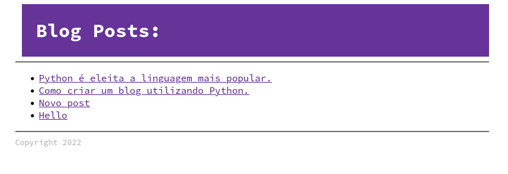

# O que é uma API?

Uma API é uma interface de interação com nosso programa, porém ao invés do público alvo ser um usuário humano via navegador, a API tem como objetivo prover integração com outros programas, é uma conversa maquina-com-máquina.

Porém, como as integrações são feitas por humanos, mesmo a API sendo uma interface para programas devemos sempre nos procupar com questões de usabilidade.

Da mesma forma que em nosso blog entregamos os dados ao usuário através de um HTML estilizado como em:




Em uma API entregaremos os mesmos dados, porém em um formato um pouco diferente, um formato que segue um padrão e sem a necessidade de estilização, APIs podem usar diferentes formatos como `XML`, `MsgPack` e `CBOR`, porém o formato mais utilizado com certeza é o `JSON`

`JSON`
```json
{
    "posts": [
        {"id" 1, ...}
    ]
}

```


Sim, é possível adicionar uma API em nosso projeto sem precisar de nenhum framework, vamos fazer isso em nosso blog editando o arquivo principal, o `wsgi.py`

Uma `API` Json, basicamente é um conjunto de endpoints (urls) que retornam dados no formato JSON (Java Script Object Notation).

O formato JSON se parece bastante com um dicinário Python, porém tem algumas restrições e para converter um dicionário para JSON podemos usar o módulo `json` que já está embutido na biblioteca padrão do Python, com ele podemos chamar `json.dumps` e criar um objeto JSON a partir de um dicionário Python.

Dentro da função application vamos mapear uma nova rota:

```py
import json

def application(....):
    ...
    elif path == "/api" and method == "GET":
        headers = [("Content-type", "application/json")]
        posts = get_posts_from_database()
        status = "200 OK"
        start_response(status, headers)
        body = {"posts": posts}
        return [json.dumps(body).encode("utf-8")]

    ...
```

Ao acessar executar `python wsgi.py`  e executar no browser verá algo como:

```json
{
  "posts": [
    {
      "id": 1,
      "title": "Python é eleita a linguagem mais popular.",
      "content": "        A linguem Python foi eleita a linguagem mais popular pela revista\n        tech masters e segue dominando o mundo.\n        ",
      "author": "Satoshi Namamoto"
    },
    {
      "id": 2,
      "title": "Como criar um blog utilizando Python.",
      "content": "        Neste tutorial você aprenderá como criar um blog utilizando Python.\n        <pre> import make_a_blog </pre>\n        ",
      "author": "Guido Van Rossum"
    },
    {
      "id": 3,
      "title": "Novo post",
      "content": "Este é um novo post no blog.",
      "author": "Bruno Rocha"
    },
    {
      "id": 4,
      "title": "Hello",
      "content": "Novo Post",
      "author": "Bruno"
    },
    {
      "id": 5,
      "title": "Um post com estilo",
      "content": "# este é um post com estilo\r\n\r\n- item 1\r\n- item 2\r\n- item 3\r\n",
      "author": "Bruno "
    }
  ]
}
```

## Conclusão

API é sobre retornar dados em formatos mais fáceis de integrar com outros sistemas, tem muito mais coisas para falarmos a respeito de APIs.

Nós falaremos mais sobre API quando entrarmos no capitulo sobre **FastAPI** então vou deixar o restante dos detalhes para depois :)