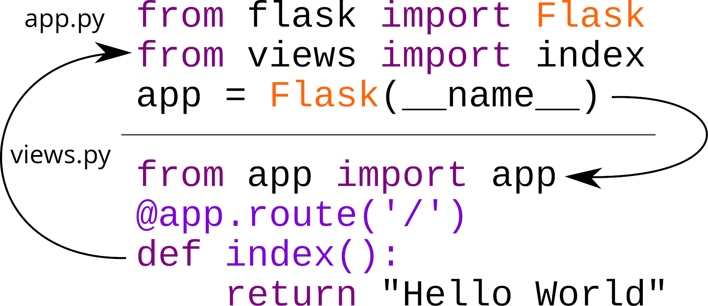

# Application Factory

Chegamos até aqui e acredito que já deu para você entender o funcionamento básico do Flask,
uma instância `app` que possui 3 contextos e que podemos adicionar configurações, handlers e views (funções que respondem por URLs).

E acabamos de ver que para inicializar uma extensão geralmente usamos a classe da extensão como fizemos com `PyMongo` e passamos a `app` Flask
como parâmetro.

A partir de agora o nosso aplicativo de blog vai começar a tomar forma e ficar maior, portanto precisamos começar a pensar em uma melhor organização
de módulos e objetos.

O Flask permite que organizemos a aplicação da forma que desejarmos, ele nos dá a liberdade total e por isso as vezes podemos acabar fazendo escolhas ruins que vão nos dar dor de cabeça no futuro.

Eu comecei a trabalhar com Flask em 2010, logo quando foi lançado, inclusive neste mesmo ano dei a minha palestra em um grande evento de tecnologia, a Python Brasil 6 na Universidade Federal de Curitiba onde eu abordei justamente o recém nascido Flask.

Nesses 12 anos trabalhando com Flask eu aprendi bastante coisa, criei muitas aplicações e até um CMS (framework para gestão de conteúdo) e em 2014 eu **criei** um padrão pro Flask que virou a recomendação da documentação oficial do Flask, chamado de **application factory**.

A idéia é simples: o `app` é um objeto que será criado através de uma `factory function` essa função irá criar a instância de `app` e repassar este objeto
para outras funções e classes, permitindo a mutabilidade e no final teremos uma `app` completamente **fabricada** e pronta para servir.

Para facilitar o entendimento, o app factory funciona mais ou menos assim:

**Pseudo código**
```python
# main factory
app = funcao_que_cria_um_app()

# sub factories
adiciona_configuracoes(app)
adiciona_banco_de_dados(app)
adiciona_plugin_x(app)
adiciona_autenticação(app)
registra_plugins(app)

app.run()  # app pronta para rodar
```

**Imagem**


**Mas qual a vantagem em usar este padrão?**


Imagine que seu programa tem muitas **views** e componentes, a tendência é que você comece a separar em módulos diferentes e então importar os objetos necessários no módulo principal `app`.

acontece que fazendo isso ocorre um dos principais problemas enfrentados por quem programa com Flask, o **circular import error**



Para evitar o problema de circular imports existe uma regra muito importante: **Nunca devemos importar `app`** mas sim uma factory capaz de criar o `app`

```diff
- from app import app
+ from app import create_app
```

Vamos ver isso na prática.

### Organizando a aplicação com application factory

Vamos então refatorar a nossa aplicação usando o conteito de application factory,
vamos começar criando uma pasta chamada `exemplos/day2/flask/blog` e movemos o `app.py` para dentro dela.


```bash
mv exemplos/day2/flask/app.py exemplos/day2/flask/blog/app.py
```

E agora alteramos a linha de comando para executar adicionando o caminho correto a variavel `FLASK_APP`

> Se preferir pode dar `export` nas variaveis de ambiente e então usar apenas `flask run`

```diff
- FLASK_APP=exemplos/day2/flask/app.py FLASK_ENV=development flask run
+ FLASK_APP=exemplos/day2/flask/blog/app.py FLASK_ENV=development flask run
```

Agora vamos reestruturar o modulo principal da aplicação separando em multiplos módulos, porém evitando circular imports com o uso de sub factories.

Vamos criar alguns arquivos:

- `auth` - aqui vamos definir a autenticação de usuários
- `admin` - aqui vamos criar uma interface administrativa
- `config` - aqui vamos carregar as configurações do aplicativo
- `commands`  - aqui vamos adicionar comandos ao `flask` CLI no terminal
- `database` - aqui vamos definir a conexão com banco de dados
- `posts` - aqui vamos definir tudo referente a postagens do nosso blog
- `plugins` - aqui vamos carregar plugins extras
- `__init__` - define que `blog` é um módulo Python

No Linux oou mac podemos criar os arquivos em uma única linha de comando:

```bash
touch exemplos/day2/flask/blog/{config,database,posts,auth,admin,commands,plugins,__init__,views}.py
```

Precisaremos também de uma pasta para os templates onde criaremos alguns templates:

- `base.html.j2` - Template base para todos os outros
- `index.html.j2` - Página inicial com a listagem de posts 
- `post.html.j2` - Página de cada post
- `form.html.j2` - Página para cadastro de novas postagens
- `error.html.j2` - Página de erros

```bash
mkdir exemplos/day2/flask/blog/templates
touch exemplos/day2/flask/blog/templates/{base,index,post,form,error}.html.j2
```

> DICA: no VSCode pode instalar a extensão **Better Jinja** para ajudar com os templates.

E criaremos um arquivo para armazenar as configurações default

```bash
touch exemplos/day2/flask/blog/settings.toml
```

Um passo muito importante é transformar a aplicação em um pacote Python instalável, isso irá facilitar para resolver os imports.

```bash
touch exemplos/day2/flask/setup.py
```

E essa será a estrutura final das pastas da aplicação:

```bash
exemplos/day2/flask
├── blog
│   ├── admin.py
│   ├── app.py
│   ├── auth.py
│   ├── commands.py
│   ├── config.py
│   ├── database.py
│   ├── __init__.py
│   ├── plugins.py
│   ├── posts.py
│   ├── views.py
│   ├── settings.toml
│   └── templates
│       ├── base.html.j2
│       ├── error.html.j2
│       ├── form.html.j2
│       ├── index.html.j2
│       └── post.html.j2
└── setup.py
```

## Vamos criar a aplicação usando esta nova estrutura

Começando pelo `setup.py` que vai definir a instalação e dependencias,
vamos fazer da maneira mais simples possível para não precisar entrar em detalhes
sobre empacotamento e gestão de dependencias em Python.


### Instalação

> **NOTA** Se você preferir pode ficar a vontade para usar **Poetry**, **PDM** ou qualquer outro gestor de pacotes que preferir.

**setup.py**
```python
from setuptools import setup

setup(
    name="flask_blog",
    version="0.1.0",
    packages=["blog"],
    install_requires=["flask", "flask-pymongo", "dynaconf"]
)
```

Com isso já podemos instalar o projeto

```bash
cd exemplos/day2/flask

pip install -e .
...
Successfully installed dynaconf-3.1.9 flask-blog-0.1.0
```

Ao abrir um `ipython` já será possível visualizar os pacotes instalados.

```python
from blog import <TAB>
                  admin       commands    plugins     __doc__     __package__
                  app         config      posts       __file__               
                  auth        database    templates   __name__
```

### Main Factory

Agora vamos editar o arquivo `app.py` e aplicar o conceito de Application Factory, ao invés de criarmos diretamente uma
instância de `app` vamos criar uma função chamada `create_app`


`exemplos/day2/flask/blog/app.py`
```python
from flask import Flask


def create_app():
    app = Flask(__name__)
    return app
```

E de volta ao terminal podemos executar a aplicação com:


```bash
FLASK_APP=blog.app:create_app FLASK_ENV=development flask run
```

> **DICA** o mesmo funciona com os subcomandos `routes` e `shell` e você pode persistir as variáveis de ambiente exportando para o ambiente.


repare na linha `FLASK_APP=blog.app:create_app`, agora informamos ao flask que deve usar uma função para iniciar uma instância da aplicação e dessa
forma evitamos os problemas de circular imports e a aplicação fica muito mais fácil de estender pois podemos seguir com o padrão factory em nossos outros módulos.


### Configurações

Para organizar as configurações vamos utilizar a lib `dynaconf` que permite separar as configurações da aplicação Flask e para começar vamos criar 
no arquivo `config.py` uma função chamada `configure` que será responsável por inicializar as configurações.


`exemplos/day2/flask/blog/config.py`
```python
import os
from dynaconf import FlaskDynaconf

HERE = os.path.dirname(os.path.abspath(__file__))


def configure(app):
    FlaskDynaconf(app, extensions_list="EXTENSIONS", root_path=HERE)
```

Para inicializar a `FlaskDynaconf` usaremos a prática de **inversão de controle**, repare que ao invés de fazer `from app import app` nós criamos uma função `configure` que recebe `app` como injeção de dependencia, e isso é feito para evitar problemas de circular imports.

Agora precisamos alterar mais uma vez o arquivo `app.py`


`exemplos/day2/flask/blog/app.py`
```python
from flask import Flask
from .config import configure


def create_app():
    app = Flask(__name__)
    configure(app)
    return app
```

A partir de agora a extensão `Dynaconf` vai buscar as configurações do Flask no arquivo `settings.toml` e podemos nele definir as nossas configurações de maneira mais organizada.


### Database

Vamos iniciar o banco de dados em outro módulo, o `blog.database` porém não vamos em NENHUM momento fazer `from app import app` pois isso iria gerar o problema de circular import, ao invés disso vamos utilizar a **Inversão de Controle** através de uma factory funcion que por convenção vamos chamar de `configure` (algumas extensões chamam de `init_app`)

Aqui é que está o **Pulo do Gato** o nosso objeto `mongo` que vai apontar a nossa conexão com o banco de dados será um objeto de inicialização **lazy** e só será inicializado quando a função `configure` for invocada.

`exemplos/day2/flask/blog/database.py`
```python
from flask_pymongo import PyMongo

mongo = PyMongo()


def configure(app):
    mongo.init_app(app)
```

Agora alteramos o `settings.toml` para incluir a nossa extensão `database`

`exemplos/day2/flask/blog/settings.toml`
```toml
[default]
mongo_uri = "mongodb://localhost:27017/blog"
extensions = [
    "blog.database:configure"
]
```

Para garantir que a configuração do banco de dados funcionou pode entrar em um shell e efetuar uma consulta.

> **DICA** instale a extensão Flask Shell Ipython `flask-shell-ipython`

```bash
FLASK_APP=blog.app:create_app FLASK_ENV=development flask shell
```

```python
In [1]: from blog.database import mongo

In [2]: list(mongo.db.posts.find())
Out[2]: 
[{'_id': ObjectId('62b613a07e4b3c31107abd2b'),
  'title': 'Meu primeiro post',
  'content': 'Este é meu primeiro blog post',
  'published': True}]
```

Agora podemos seguir com a configuração dos outros módulos.


### Posts

O próximo passo é criarmos funções que servirão de **controllers** para nossos dados, essas funções serão úteis para abstrair o acesso ao MongoDB e serão usadas tanto pelas views quanto pela CLI.


`exemplos/day2/flask/blog/posts.py`
```python
from __future__ import annotations
from datetime import datetime
from blog.database import mongo


def get_all_posts(published=True):
    posts = mongo.db.posts.find({"published": published})
    return posts.sort("date")


def get_post_by_slug(slug: str) -> dict:
    post = mongo.db.posts.find_one({"slug": slug})
    return post


def update_post_by_slug(slug: str, data: dict) -> dict:
    return mongo.db.posts.find_one_and_update({"slug": slug}, {"$set": data})


def new_post(title: str, content: str, published: bool = True) -> str:
    slug = title.replace("_", "-").replace(" ", "-").lower()
    # TODO: Evitar a entrada de posts com slug duplicado?
    new = mongo.db.posts.insert_one(
        {
            "title": title,
            "content": content,
            "published": published,
            "slug": slug,
            "date": datetime.now(),
        }
    )
    return slug
```

Nesse ponto já podemos abrir o `shell` e testar se está tudo funcionando:


```python
In [1]: from blog.posts import get_all_posts, get_post_by_slug, update_post_by_slug, new_post

# Criar um novo post
In [2]: new_post(title="Flask é legal", content="Eu gosto de flask")
Out[2]: 'flask-é-legal'

# Buscar o post mais recente
In [3]: list(get_all_posts())[-1]
Out[3]: 
{'_id': ObjectId('62ba02d2ba946f4d625c87a7'),
 'title': 'Flask é legal',
 'content': 'Eu gosto de flask',
 'published': True,
 'slug': 'flask-é-legal',
 'date': datetime.datetime(2022, 6, 27, 20, 19, 46, 776000)}

# Buscar pelo slug
In [4]: get_post_by_slug("flask-é-legal")
Out[4]: 
{'_id': ObjectId('62ba02d2ba946f4d625c87a7'),
 'title': 'Flask é legal',
 'content': 'Eu gosto de flask',
 'published': True,
 'slug': 'flask-é-legal',
 'date': datetime.datetime(2022, 6, 27, 20, 19, 46, 776000)}

# Alterar um post
In [5]: update_post_by_slug("flask-é-legal", {"content": "Novo contéudo alterado."})
Out[5]: 
{'_id': ObjectId('62ba02d2ba946f4d625c87a7'),
 'title': 'Flask é legal',
 'content': 'Eu gosto de flask',
 'published': True,
 'slug': 'flask-é-legal',
 'date': datetime.datetime(2022, 6, 27, 20, 19, 46, 776000)}

# Confirmar a alteração
In [6]: get_post_by_slug("flask-é-legal")
Out[6]: 
{'_id': ObjectId('62ba02d2ba946f4d625c87a7'),
 'title': 'Flask é legal',
 'content': 'Novo contéudo alterado.',
 'published': True,
 'slug': 'flask-é-legal',
 'date': datetime.datetime(2022, 6, 27, 20, 19, 46, 776000)}
```

### CLI

O Flask oferece a possibilidade de extendermos a sua `CLI` e para fazer isso vamos criar no arquivo `commands.py` novos comandos:

- `post new`
- `post list`
- `post get`
- `post update`

`exemplos/day2/flask/blog/commands.py`
```python
import click

from blog.posts import (
    get_all_posts,
    get_post_by_slug,
    new_post,
    update_post_by_slug
)


@click.group()
def post():
    """Manage posts"""


@post.command()
@click.option("--title")
@click.option("--content")
def new(title, content):
    """Creates a new post"""
    new = new_post(title=title, content=content)
    click.echo(f"New post {new} created!")


@post.command("list")
def _list():
    """Lists all posts"""
    for post in get_all_posts():
        click.echo(post)


@post.command()
@click.argument("slug")
def get(slug):
    """Get post by slug"""
    post = get_post_by_slug(slug)
    click.echo(post or "post not found")


@post.command()
@click.argument("slug")
@click.option("--content", default=None, type=str)
@click.option("--published", default=None, type=str)
def update(slug, content, published):
    """Update post by slug"""
    data = {}
    if content is not None:
        data["content"] = content
    if published is not None:
        data["published"] = published.lower() == "true"
    update_post_by_slug(slug, data)
    click.echo("Post updated")


def configure(app):
    app.cli.add_command(post)
```

Agora inicializamos o módulo `commands no arquivo de settings`

`settings.toml`
```toml
[default]
mongo_uri = "mongodb://localhost:27017/blog"
extensions = [
    "blog.database:configure",
    "blog.commands:configure"  # NEW
]
```

E podemos testar no terminal.

```
export FLASK_APP=blog.app:create_app 
export FLASK_ENV=development
```


```bash
flask post --help    

Usage: flask post [OPTIONS] COMMAND [ARGS]...

  Manage posts

Options:
  --help  Show this message and exit.

Commands:
  get     Get post by slug
  list    Lists all posts
  new     Creates a new post
  update  Update post by slug
```

```bash
flask post get flask-é-legal

{'_id': ObjectId('62ba02d2ba946f4d625c87a7'), 'title': 'Flask é legal', 'content': 'Novo contéudo alterado.', 'published': True, 'slug': 'flask-é-legal', 'date': datetime.datetime(2022, 6, 27, 20, 19, 46, 776000)}

```

```bash
flask post list    

{'_id': ObjectId('62b613a07e4b3c31107abd2b'), 'title': 'Meu primeiro post', 'content': 'Este é meu primeiro blog post', 'published': True, 'slug': 'meu-primeiro-post'}
{'_id': ObjectId('62ba00a02a93f608c1b6978f'), 'title': 'Another post', 'content': 'this is even another', 'published': True, 'slug': 'another-post', 'date': datetime.datetime(2022, 6, 27, 20, 10, 24, 914000)}
{'_id': ObjectId('62ba02d2ba946f4d625c87a7'), 'title': 'Flask é legal', 'content': 'Novo contéudo alterado.', 'published': True, 'slug': 'flask-é-legal', 'date': datetime.datetime(2022, 6, 27, 20, 19, 46, 776000)}
```

```bash
flask post new --title "Flask na linha de 
comando" --content "É muito legal o CLI do Flask"

New post 62ba0a2528fe9264f931f142 created!
```

```bash
flask post update flask-é-legal --published "false"                                     

Post updated
```


Na próxima aula continuaremos adicionando views, templates e uma interface administrativa a nossa aplicação :)
