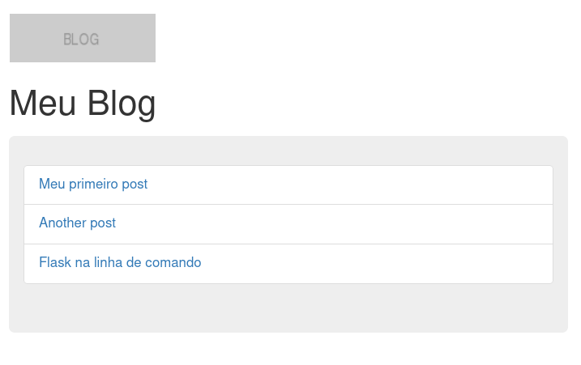
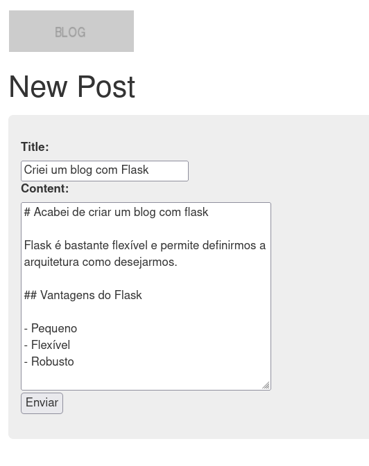
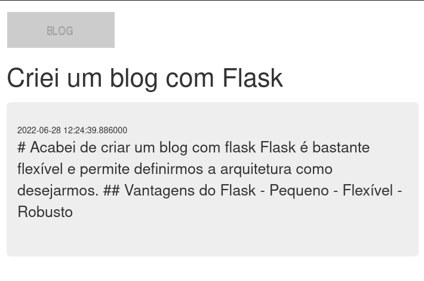
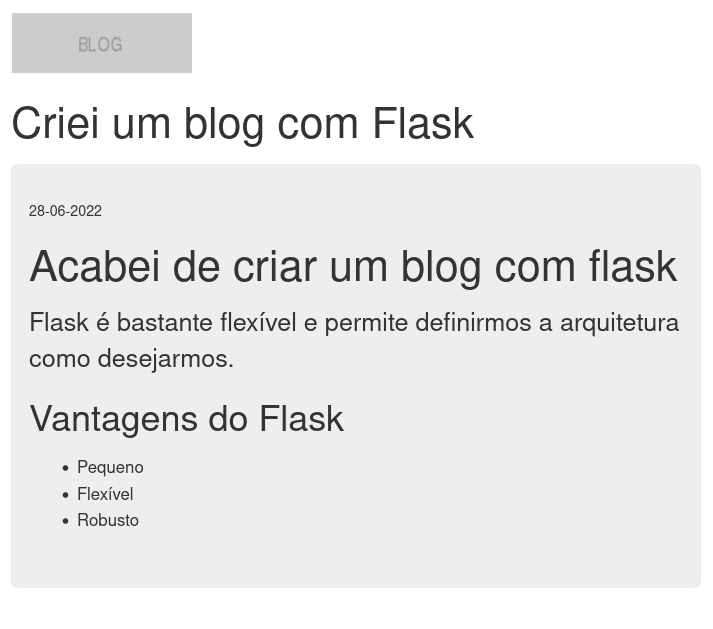

# Blueprints

Blueprint é o padrão usado pelo flask para extendermos nossa aplicação com funcionalidades,
em nosso caso teremos as views para o nosso blog.

- / -> listar todos os posts
- /new -> formulário para criar novo post
- /slug-do-post -> Ler um post especifico

Vamos começar pelos templates

Em todas essas URLs iremos renderizar um template base usando o framework CSS **Bootstrap**, portanto precisaremos da extensão Flask-Bootstrap e para inicializa-la faremos 2 alterações

`setup.py`
```python

    install_requires=["flask", "flask-pymongo", "dynaconf", "flask-bootstrap"]  # NEW

```
Depois rodamos na mesma pasta onde está o `setup.py`

```bash
pip install -e .
```

E no `settings.toml`

```toml
[default]
mongo_uri = "mongodb://localhost:27017/blog"
extensions = [
    "blog.database:configure",
    "blog.commands:configure",
    "flask_bootstrap:Bootstrap"  # NEW
]
```

## Templates

Agora podemos criar os templates:

`templates/base.html.j2`
```html

{{config.get('TITLE')}}


<div class="navbar container">
<div class="navbar-header">
    <a class="navbar-brand" href="/">
    
    </a>
</div>
</div>

```

`templates/index.html.j2`
```html



<div class="container">
<h1>{{config.get('TITLE')}}</h1>

<div class="jumbotron">
<ul class="list-group">
    
    <li class="list-group-item">
        <a href="{{url_for('post.detail', slug=post.slug)}}">{{post.title}}</a>
    </li>
    
</ul>
</div>

</div>

```

`templates/post.html.j2`
```html


<div class="container">
<h1>{{ post.title }}</h1>

<div class="jumbotron">
<small>{{ post.date }}</small>
<p>
    {{ post.content }}
</p>
</div>
</div>

```

`templates/form.html.j2`
```html


<div class="container">
<h1>New Post</h1>

<div class="jumbotron">

<form action="/new" method="post">
    <label for="title">Title:</label><br>
    <input type="text" name="title" /><br>
    <label for="content">Content:</label><br>
    <textarea name="content" cols="30" rows="5"></textarea><br>
    <input type="submit" value="Enviar">
</form>

</div>
</div>

```

### Blueprint

Vamos criar o nosso blueprint no arquivo `view.py` esse Blueprint será um módulo independente contendo as URLs para lidar com os posts da aplicação.


`views.py`
```python
from flask import (
    Blueprint,
    render_template,
    abort,
    request,
    url_for,
    redirect,
)
from blog.posts import (
    get_all_posts,
    get_post_by_slug,
    new_post,
)


bp = Blueprint("post", __name__,  template_folder="templates")


@bp.route("/")
def index():
    posts = get_all_posts()
    return render_template("index.html.j2", posts=posts)


@bp.route("/new", methods=["GET", "POST"])
def new():
    if request.method == "POST":
        title = request.form.get("title")
        content = request.form.get("content")
        slug = new_post(title, content)
        return redirect(url_for("post.detail", slug=slug))
    return render_template("form.html.j2")


@bp.route("/<slug>")
def detail(slug):
    post = get_post_by_slug(slug)
    if not post:
        return abort(404, "Post Not Found")
    return render_template("post.html.j2", post=post)


def configure(app):
    app.register_blueprint(bp)
```

E para invocar a factory `configure` vamos adicionar ao arquivo `settings.toml`


```toml
[default]
mongo_uri = "mongodb://localhost:27017/blog"
title = "Meu Blog"  # NEW
extensions = [
    "blog.database:configure",
    "blog.commands:configure",
    "flask_bootstrap:Bootstrap",
    "blog.views:configure"  # NEW
]

```

Agora ao executar podemos acessar a página inicial e ver os posts criados.

```bash
FLASK_APP=blog.app:create_app FLASK_ENV=development flask run
```

Em http://127.0.0.1:5000/ 



Para criar um novo blog post acesse http://127.0.0.1:5000/new




E após criar será feito o redirecionamento para http://127.0.0.1:5000/criei-um-blog-com-flask 




### Markdown

Escrevemos o nosso post usando a linguagem Markdown mas na imagem acima o conteúdo em markdown não foi corretamente renderizado, para resolver vamos adicionar ao sistema de templates uma função responsável por renderizar markdown.


O primeiro passo é instalar um renderizador de markdown, altere o `setup.py`


```setup.py
from setuptools import setup

setup(
    name="flask_blog",
    version="0.1.0",
    packages=["blog"],
    install_requires=[
        "flask",
        "flask-pymongo",
        "dynaconf",
        "flask-bootstrap",
        "mistune",  # NEW
    ],
)
```

Execute agora a instalação no diretório onde está o `setup.py`

```bash
pip install -e .
```

Agora vamos alterar o arquivo `plugins.py` e vamos aproveitar para adicionar também um filtro
para formatação de datas.


`exemplos/day2/flask/blog/plugins.py`
```python
from mistune import markdown


def configure(app):
    # adiciona {{ markdown('texto') }} para os templates
    app.add_template_global(markdown)

    # adiciona {{ date | format_date }}
    app.add_template_filter(lambda date: date.strftime("%d-%m-%Y"), "format_date")

```

Adicionamos o módulo `plugins` ao `settings.toml`

```toml
[default]
mongo_uri = "mongodb://localhost:27017/blog"
title = "Meu Blog"
extensions = [
    "blog.database:configure",
    "blog.commands:configure",
    "flask_bootstrap:Bootstrap",
    "blog.views:configure",
    "blog.plugins:configure",  # NEW
]
```


Agora podemos mudar o template `post.html.j2` e adicionar a renderização do markdown.

```html


<div class="container">
<h1>{{ post.title }}</h1>

<div class="jumbotron">
<small>{{ post.date | format_date }}</small>  <!-- NEW -->
<p>
    {{ markdown(post.content) }}   <!-- NEW -->
</p>
</div>
</div>

```

E agora sim temos o conteúdo melhor formatado.


