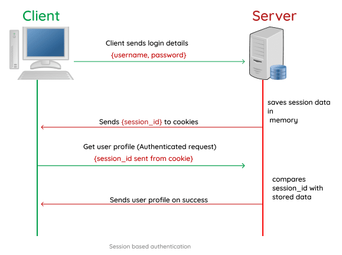
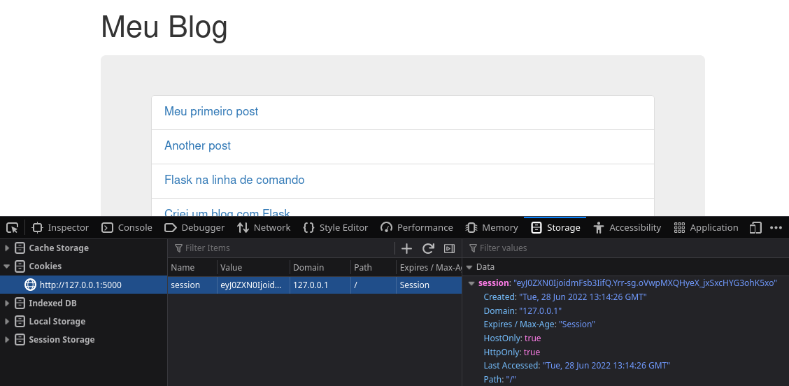
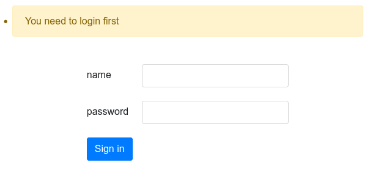

# Autenticação

O nosso blog atualmente tem um problema bem grande, qualquer usuário pode facilmente entrar na URL http://localhost:5000/new e adicionar um novo post mesmo sem a necessidade de autenticação.

O processo de autenticação funciona com os seguintes componentes:

- Uma base de dados com os usuários e suas credenciais devidamente criptografadas
- Uma view de login onde o usuário informa as credencias e a partir da verificação é feito o login
- Um registro na `session` (memória do servidor) informando que o usuário está autenticado
- Um cookie gravado no navegador contendo o ID da session



Existem diversas tecnologias e metodologias para controle de autenticação mas a autenticação baseada em cookies e sessions ainda é a mais utilizada quando falamos de web sites.

> **NOTA** Em breve, quando falarmos sobre o FastAPI vamos utilizar outro modelo de autenticação usando Tokens.

Portanto vamos desenvolver a camada de autenticação da nossa aplicação Flask no arquivo `auth.py`


### Criando session no Flask

No Flask podemos criar novas sessions usando o objeto `session` e isso pode ser feito no contexto de `request` pois a session precisa ser criada e ter seu `ID` enviado de volta ao cliente que requisitou para ser armazenado como um cookie.

Como os dados da session são encriptados um requisito para usar o objeto `session`
é colocar uma variavél `SECRET_KEY` nas configurações e você pode usar qualquer string como sua secret key desde que garante que não vá perde-la.

portanto no `settings.toml` adicione 

```toml
secret_key = "ThisIsARandomSecretKey"
```

**NOTA**: é recomendado gerar uma secret_key mais complexa e dificil de ser descoberta, Python oferece uma função que ajuda a gerar

```bash
python -c "import secrets; print(secrets.token_hex())"
aeeda9006f2eea595516f113468ddbfc4e0ca170ad40a612c6fc30346f4fcffb
```

Agora podemos adicionar valores a session alterando o arquivo `views.py`

```python

from flask import (
    # ...
    session,  # NEW
)


@bp.route("/")
def index():
    posts = get_all_posts()
    session["test"] = "valor"   # NEW
    return render_template("index.html.j2", posts=posts)

```

Agora ao executar e efetuar uma requisição verá no navegador que junto do Response terá recebido um `cookie` com o ID da `session` armazenado



A partir de agora, a cada request que este navegador fizer para o mesmo servidor este cookie será enviado de volta e o servidor irá saber qual o ID da sessão que pertende ao usuário.

Do lado servidor armazenamos `{"test": "valor"}` mas do lado cliente o navegador só tem acesso a um ID `session:"eyJ0ZXN0IjoidmFsb3IifQ.Yrr-sg.oVwpMXQHyeX_jxSxcHYG3ohK5xo"` que só pode ser decriptado em um servidor que tenha a mesma SECRET_KEY que configuramos no `settings.toml`.


### Como fazer o processo de login?

Com o conhecimento da session o que podemos fazer é o seguinte:

1. Um formulario com os campos `username` e `password`
2. Uma view `/login` para onde o formulário será submetido
3. Uma função que irá comparar as credenciais informadas com as credenciais existentes no banco de dados de usuários
4. Em caso de sucesso a view `/login` armazena uma session `{"logado": True}` informando que o usuário efetuou o login com sucesso.


Podemos fazer isso tudo do zero, mas as coisas ai envolvidas são exatamente as mesmas que já vimos: view, URL, formulário, session.


### Flask Simple Login

Existem várias extensões que automatizam esse processo no Flask, entre elas está a Flask-Login e a Flask-SimpleLogin, aqui vamos usar a Flask-SimpleLogin por 2 motivos:

- Ela é mais simples
- Ela é compativel com MongoDB
- Eu que sou o criador da biblioteca :) 


Adicionaremos ao `setup.py`

```python
from setuptools import setup

setup(
    name="flask_blog",
    version="0.1.0",
    packages=["blog"],
    install_requires=[
        "flask",
        "flask-pymongo",
        "dynaconf",
        "flask-bootstrap",
        "mistune",
        "flask-simplelogin",  # NEW
    ],
)
```
e
```bash
pip install -e .
```

Agora vamos começar alterando o arquivo `auth.py` onde adicionaremos:

- Função para criar um novo usuário (com password encriptado)
- Comando para criar um novo usuário via CLI
- Função para verificar o login de um usuário
- Inicialização da lib Flask-SimpleLogin


`auth.py`
```python
import click
from blog.database import mongo
from werkzeug.security import check_password_hash, generate_password_hash
from flask_simplelogin import SimpleLogin


def create_user(**data):
    """Creates user with encrypted password"""
    if "username" not in data or "password" not in data:
        raise ValueError("username and password are required.")

    data["password"] = generate_password_hash(
        data.pop("password"), method="pbkdf2:sha256"
    )
    mongo.db.users.insert_one(data)
    return data


def validate_login(data):
    """Check that incoming credentials matches database stored credentials."""
    if "username" not in data or "password" not in data:
        raise ValueError("username and password are required.")

    db_user = mongo.db.users.find_one({"username": data["username"]})
    if db_user and check_password_hash(db_user["password"], data["password"]):
        return True

    return False


def configure(app):
    SimpleLogin(app, login_checker=validate_login)

    @app.cli.command()
    @click.argument("username")
    @click.password_option()
    def add_user(username, password):
        """Creates a new user"""
        user = create_user(username=username, password=password)
        click.echo("User created")

```

E então incluimos esse módulo no `settings.toml`

```toml
[default]
secret_key = "ThisIsARandomSecretKey"
mongo_uri = "mongodb://localhost:27017/blog"
title = "Meu Blog"
extensions = [
    "blog.database:configure",
    "blog.commands:configure",
    "flask_bootstrap:Bootstrap",
    "blog.views:configure",
    "blog.plugins:configure",
    "blog.auth:configure",  # NEW
]
```


Agora podemos rodar na linha de comando:

```bash
flask add-user --help
Usage: flask add-user [OPTIONS] USERNAME

  Creates a new user

Options:
  --password TEXT
  --help           Show this message and exit.
```

Para criar um novo usuário:

```bash
flask add-user admin 
Password: <admin>
Repeat for confirmation: <admin>
User created
```

Ao consultar no MOngoDB verá uma nova collection chamada `users` com um documento contendo nosso usuário `admin`

```json
{
  "_id": {
    "$oid": "62bb440ae895634ddcf4e236"
  },
  "username": "admin",
  "password": "pbkdf2:sha256:260000$sRqsgnNK5udc3UKs$eca1d3c73dbd177abdfd5942645007816ba066290cb64bd37107d600e95c969c"
}
```

E repare que o password está salco como um hash.

> **NOTA** existem outros algoritmos de hashing mais seguros que podemos usar no lugar do pbkdf2


### Protegendo o formulário com login


Agora sim temos usuário criado e a extensão simple login adicionada, basta dizermos ao Flask quais endpoints são protegidos e para isso vamos alterar o arquivo `views.py`

```python
from flask_simplelogin import login_required  # NEW

...

@bp.route("/new", methods=["GET", "POST"])
@login_required()  # NEW
def new():
    if request.method == "POST":
        title = request.form.get("title")
        content = request.form.get("content")
        slug = new_post(title, content)
        return redirect(url_for("post.detail", slug=slug))
    return render_template("form.html.j2")
```

Com o decorator `@login_required()` informamos que as credenciais devem ser verificadas para acessar a url `/new`

Execute a aplicação e acesse: https://localhost:5000/new 



Faça login com o usuário criado anteriormente `admin:admin` e verá com sucesso o formulário.

Para fazer logout basta acessar `/logout`.

> **DICA** Na documentação do Flask-SimpleLogin tem instruções de como customizar o template e mensagens da tela de login.
