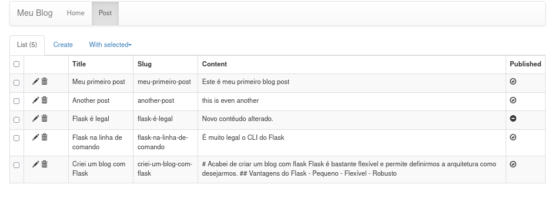
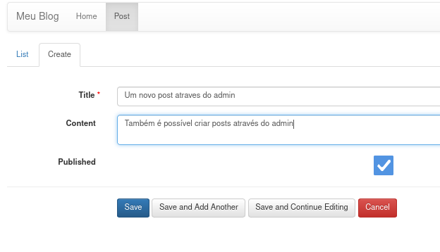

# Flask Admin

Esta aula é um bônus que estou incluindo apenas pelo motivo de que o próximo capítulo será sobre Django e o Django tem uma interface admin integrada e para a comparação ficar justa vamos implementar a interface admin no Flask também.


Vamos usar uma extensão chamada Flask-Admin e para isso começamos adicionando no `setup.py`

```python
from setuptools import setup

setup(
    name="flask_blog",
    version="0.1.0",
    packages=["blog"],
    install_requires=[
        "flask",
        "flask-pymongo",
        "dynaconf",
        "flask-bootstrap",
        "mistune",
        "flask-simplelogin",
        # "flask-admin",  # NEW
        "flask-admin @ git+ssh://git@github.com/flask-admin/flask-admin#egg=flask-admin"  # NEW
    ],
)
```

> **NOTA** no momento da gravação desta aula o Flask Admin com suporte a nova api do pymongo ainda não havia sido lançado e por isso foi preciso instalar diretamente do github. Assim que o Flask-Admin >1.6 for lançado a instalação poderá ser feita diretamente via `flask-admin`

Instale com `pip install =e .`

O nosso próximo passo é editar o arquivo `admin.py` e nele vamos:

- Iniciar a extensão Flask Admin
- Mapear a collection de Posts
- Proteger o admin com usuário e senha

```python
from datetime import datetime
from flask_admin import Admin
from flask_admin.base import AdminIndexView
from flask_admin.contrib.pymongo import ModelView
from flask_simplelogin import login_required
from wtforms import form, fields, validators
from blog.database import mongo


# decorate Flask-Admin view via Monkey Patching
AdminIndexView._handle_view = login_required(AdminIndexView._handle_view)
ModelView._handle_view = login_required(ModelView._handle_view)


class PostsForm(form.Form):
    title = fields.StringField("Title", [validators.data_required()])
    slug = fields.HiddenField("Slug")
    content = fields.TextAreaField("Content")
    published = fields.BooleanField("Published", default=True)


class AdminPosts(ModelView):
    column_list = ("title", "slug", "content", "published")
    form = PostsForm

    def on_model_change(self, form, post, is_created):
        post["slug"] = post["title"].replace("_", "-").replace(" ", "-").lower()
        if is_created:
            post["date"] = datetime.now()


def configure(app):
    """Inicia uma instancia do Flask-Admin"""
    app.admin = Admin(
        app,
        name=app.config.get("TITLE"),
        template_mode=app.config.get("FLASK_ADMIN_TEMPLATE_MODE", "bootstrap3"),
    )
    app.admin.add_view(AdminPosts(mongo.db.posts, "Post"))
```

E agora coloque no `settings.toml`

```toml
[default]
secret_key = "ThisIsARandomSecretKey"
mongo_uri = "mongodb://localhost:27017/blog"
title = "Meu Blog"
extensions = [
    "blog.database:configure",
    "blog.commands:configure",
    "flask_bootstrap:Bootstrap",
    "blog.views:configure",
    "blog.plugins:configure",
    "blog.auth:configure",
    "blog.admin:configure",  # NEW
]
```


Agora sim temos nossa aplicação pronta e podemos utilizar a interface administrativa.

http://127.0.0.1:5000/admin/  (Será necessário efetuar login)





> **DESAFIO** Consegue modificar o código para evitar a criação de posts com titulo duplicado?


## Conclusão

Terminamos aqui nossa aventura com o Flask, no próximo capítulo vamos explorar o framework Django criando exatamente o mesmo projeto :)
