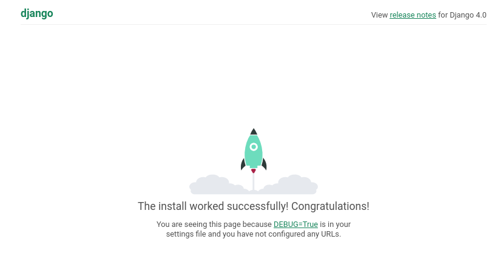

# 21 Django

Django é o framework full-stack mais famoso e mais utilizado no ecossistema Python,
aplicativos famosos como Instagram, Spotify e Pinterest são construidos com ele.

O Django foi desenvolvido pensando na criação de sites de gestão de conteúdo (CMS)
portanto muito do que vemos no framework tem um casamento perfeito para aplicações
como blogs, portais e lojas virtuais.

O Framework evoluiu junto com a web e também adicionou funcionalidades para a 
criação de APIs com o uso de plugins como é o caso do Django Rest Framework.

## Iniciando com o django

> **ATENÇÃO** antes de mais nada é importante criar uma virtualenv para o projeto

```bash
deactivate
rm -rf .venv
python -m venv .venv
source .venv/bin/activate
pip install --upgrade pip
```

E então instalamos o django.


```bash
pip install django
```

> **NOTA** durante a preparação deste treinamento a versão utilizada do Django foi a 4.0.6


O Django está organizado em 2 componentes principais

- Projeto - Workspace onde podemos criar um ou mais apps
- App - Unidade individual dentro de um projeto

O projeto é geralmente o diretório e arquivos de metadados que irão servir de ponto de partida para
inicializar o seu programa e os apps podem ser criados dentro do projeto ou podemos reaproveitar
apps de terceiros instalando através do PyPI.

### Projeto

Na pasta `exemplos/day2/django` vamos criar um projeto

```bash
cd exemplos/day2
mkdir django
django-admin startproject djblog django
```

O primeiro argumento `djblog` é o nome do nosso projeto e o segundo é o nome da pasta onde ele será criado.

Agora entramos na pasta django e vamos visualizar os arquivos dentro dela.

```bash
cd django
tree -L 2                    
.
├── djblog            # Pasta raiz do projeto
│   ├── asgi.py       # Entry point para deploy em servidor assincrono
│   ├── __init__.py   # Apenas para inicializar 
│   ├── settings.py   # Arquivo de configurações
│   ├── urls.py       # Arquivo de registro de URLS
│   └── wsgi.py       # Entry point para deploy em servidor sincrono
└── manage.py         # Script principal para manutenção do projeto
```

Nós já veremos cada um desses arquivos mas por enquanto os mais importantes são:

#### `settings.py`

O arquivo de settings é essencial para o Django, ele é necessário para o framework saber
de onde carregar as URLs, quais apps inicializar, qual secret key utilizar etc.

Ele é requerido e tem algumas configurações que precisam estar obrigatoriamente configuradas.

O caminho do arquivo de settings pode ser outro, não precisa necessariamente ser dentro da pasta do projeto
podemos customizar através da variável de ambiente `DJANGO_SETTINGS_MODULE` que aceita um caminho importável 
do Python para carregar os settings.

Podemos também utilizar a extensão `Dynaconf` (mesma que usamos no projeto com Flask) para substituir os
settings do django e delegar as configs ao Dynaconf.

####  `manage.py` 

Este arquivo é um script que inicializa a aplicação django e expõe todos os comandos de gerenciamento (management commands)
podemos executar ele diretamente dentro da pasta do projeto

```bash
python manage.py --help
```

Você verá a lista de comandos default que já vem instalados com o Django.

Este arquivo não é obrigatório e a maior parte da comunidade Django acaba não
utilizando, dando preferencia para o uso da ferramenta `django-admin` que 
já vem instalada no django e funciona da mesma maneira que o script.

```bash
django-admin --help
```

Mas repare que desta vez o django te avisa que ele não sabe onde está o arquivo de settings,
portanto é boa prática com Django **SEMPRE** ter a variável `DJANGO_SETTINGS_MODULE` configurada.

```bash
export DJANGO_SETTINGS_MODULE=djblog.settings
django-admin --help
```

Agora repare que o erro será outro

```bash
Note that only Django core commands are listed as settings are not properly configured (error: No module named 'djblog').
```

Isso acontece porque o caminho passado em `DJANGO_SETTINGS_MODULE` precisa ser um caminho importável pelo Python
para tornar o módulo `djblog` um objeto possível de ser importável precisamos transformar em um pacote e instalar
da mesma forma que fizemos anteriormente.

Vamos criar um arquivo `setup.py` dentro da pasta Django.

```python
from setuptools import setup

setup(
    name="django_blog",
    version="0.1.0",
    packages=["djblog"],
    install_requires=[
        "django"
    ],
)
```

E depois instalar com `pip install -e .` e o output será `Successfully installed django-blog-0.1.0`

Agora sim teremos o pacote `djblog` importável pelo sistema de imports do python.

```bash
django-admin --help
# Uma lista enorme de comandos
```

### App

Agora temos um projeto funcionando, porém o projeto sozinho não tem muita serventia, 
para desenvolvermos nosso blog precisamos incluir um `app` dentro do projeto.

Vamos rodar o comando `startapp`

```bash
django-admin startapp blog
```

Com isso agora teremos mais uma pasta criada

```bash
tree -L 3 blog               
blog
├── admin.py           # Aqui criaremos a interface admin
├── apps.py            # Atributos de configuração da app
├── __init__.py
├── migrations         # Migrations de banco de dados
│   └── __init__.py 
├── models.py          # modelagem de tabelas
├── tests.py           # Testes unitários
└── views.py           # Views que mapearemos nas urls
```

Agora que a estrutura da app está criada precisamos dizer ao projeto `djblog` 
que esta app existe, portanto vamos fazer 2 coisas.

1 - adicionar ao `setup.py`

```python
...
    packages=["djblog", "blog"],
...
```

2 - adicionar ao `settings.py`, abra este arquivo e altere adicionando `blog` no final da lista `INSTALLED_APPS`

```python
# Application definition

INSTALLED_APPS = [
    'django.contrib.admin',
    'django.contrib.auth',
    'django.contrib.contenttypes',
    'django.contrib.sessions',
    'django.contrib.messages',
    'django.contrib.staticfiles',
    "blog",  # NEW
]
```

Agora está tudo pronto para instalarmos e inicializarmos a app.


```bash
pip install -e .
```

e agora os 2 comandos iniciais de uma aplicação django

1. Inicializar o banco de dados

```bash
django-admin migrate
```
```                   
Operations to perform:
  Apply all migrations: admin, auth, contenttypes, sessions
Running migrations:
  Applying contenttypes.0001_initial... OK
  Applying auth.0001_initial... OK
  Applying admin.0001_initial... OK
  Applying admin.0002_logentry_remove_auto_add... OK
  Applying admin.0003_logentry_add_action_flag_choices... OK
  Applying contenttypes.0002_remove_content_type_name... OK
  Applying auth.0002_alter_permission_name_max_length... OK
  Applying auth.0003_alter_user_email_max_length... OK
  Applying auth.0004_alter_user_username_opts... OK
  Applying auth.0005_alter_user_last_login_null... OK
  Applying auth.0006_require_contenttypes_0002... OK
  Applying auth.0007_alter_validators_add_error_messages... OK
  Applying auth.0008_alter_user_username_max_length... OK
  Applying auth.0009_alter_user_last_name_max_length... OK
  Applying auth.0010_alter_group_name_max_length... OK
  Applying auth.0011_update_proxy_permissions... OK
  Applying auth.0012_alter_user_first_name_max_length... OK
  Applying sessions.0001_initial... OK
```

Após executar este comando perceba a presença do arquivo `db.sqlite3` na raiz do projeto.


2. Iniciar o servidor web

```bash
django-admin runserver
Watching for file changes with StatReloader
Performing system checks...

System check identified no issues (0 silenced).
July 22, 2022 - 19:20:41
Django version 4.0.6, using settings 'djblog.settings'
Starting development server at http://127.0.0.1:8000/
Quit the server with CONTROL-C.
```

Agora pode acessar http://127.0.0.1:8000/ e verá a tela inicial do Django




Pronto! já temos um projeto django para começar a criar o nosso blog!
