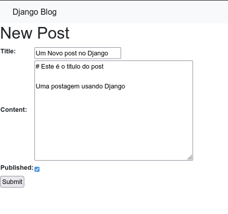
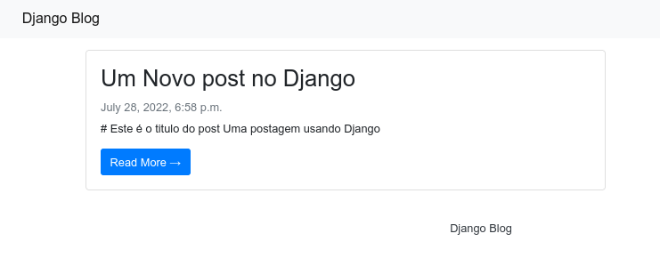
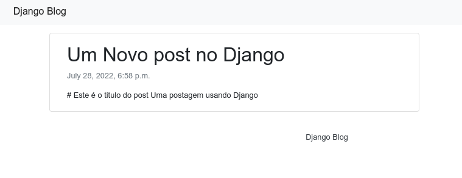
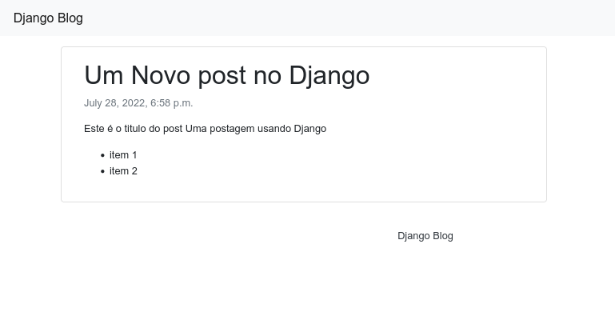

# 22 Django Models

O Django é um framework que segue um padrão de projeto conhecido como **MVT** 
Model, View, Template, teste padrão é utilizado para websites em geral e para
**APIs** o padrão seguido é geralmente o do Django Rest Framework **MVS**
Model, Viewset, Serializer.

Neste momento para nosso blog vamos focar no **MVT** e quase toda aplicação
Django nasce apartir da modelagem de dados.

## Models

Toda aplicação Django deve obrigatoriamente ter um módulo chamado **models.py** 
e neste módulo colocamos as classes que representam os dados do programa.

Usamos para isso o Django **ORM**, ferramenta integrada para mapear classes
em Python em tabelas no **SQL**.

Quando criamos o app `blog` o Django já colocou lá dentro um arquivo `models.py`
vamos começar definindo nosso model de **Post** para o blog que será bem 
parecido com o que fizemos no Flask.

`exemplos/day2/django/blog/models.py`
```python
from django.db import models


class Post(models.Model):
    title = models.CharField(max_length=255)
    slug = models.SlugField(max_length=255, unique=True)
    content = models.TextField()
    published = models.BooleanField(default=True)
    date = models.DateTimeField(auto_now_add=True)

    def __str__(self):
        return self.title

    class Meta:
        ordering = ["-date"]
```

Como pode perceber o Django já fornece os tipos necessários para criarmos o model e os seus campos e já está incluso por exemplo o `SlugField` que provê aquela lógica de transformar titulos em slug e o `DateTimeField` que já se encarrega de preencher com a data atual.

O método `__str__` é a definição do protocolo **Printable** do model e é útil para quando imprimirmos o model no terminal ou na ferramenta admin.

Repare que existe dentro da classe outra classe chamada `Meta`, esta é uma técnica chamada
de **inner class** e serve para definir um namespace de atributos separado do principal
e no caso do Django é usado para definir configurações como por exemplo a ordenação default.


## Migrations

Como estamos adicionando um novo model ao aplicativo o Django precisa criar a tabela referente no banco  de dados e para isso utilizamos as migrations.

1. Criar as instruções SQL que definem a nova tabela

```bash
django-admin makemigrations

Migrations for 'blog':
  exemplos/day2/django/blog/migrations/0001_initial.py
    - Create model Post
```

2. Aplicar as instruções criando de fato a nova tabela (outras pessoas desenvolvedoras nesse projeto só precisarão executar este comando)

```bash
django-admin migrate

Operations to perform:
  Apply all migrations: admin, auth, blog, contenttypes, sessions
Running migrations:
  Applying blog.0001_initial... OK
```

Se você quiser pode usar uma ferramenta SQLIte como a extensão do VSCode ou o SQLITE DB Browser para verificar as alterações aplicadas ao `exemplos/day2/django/db.sqlite3`

Esta é a estrutura SQL gerada pelo Django para este model.

```sql
CREATE TABLE "blog_post" (
    "id" integer NOT NULL PRIMARY KEY AUTOINCREMENT, 
    "title" varchar(255) NOT NULL, 
    "slug" varchar(255) NOT NULL UNIQUE, 
    "content" text NOT NULL, 
    "published" bool NOT NULL, 
    "date" datetime NOT NULL
)
```

Repare que a lógica para criar o `slug` e definir a `data atual` não faz parte do banco de dados, estas são operações efetuadas na camada Python antes do dado ser salvo no banco de dados.

## Views

Agora que temos uma tabela podemos partir para a próxima letra do M**V**T que são as views,
assim como no Flask, views são as funções que serão roteadas em uma URL e farão o acesso
aos models para apresentar a informação.

No django existem algumas formar de criarmos views, function based views e class based views,
vamos fazer cada uma delas para você aprender.

### Function view

A maneira clássica para criar views no Django é utilizando funções que são colocadas no arquivo `view.py` dentro do app, vamos começar criando uma view que irá expor um formulário para cadastrar posts ao blog.

`exemplos/day2/django/blog/views.py`
```python
from django.forms import ModelForm
from django.http import HttpResponseRedirect
from django.shortcuts import render
from django.urls import reverse
from django.utils.text import slugify

from blog.models import Post


class PostForm(ModelForm):
    class Meta:
        model = Post
        fields = ["title", "content", "published"]


def new_post(request):
    if request.method == "POST":
        form = PostForm(request.POST)
        if form.is_valid():
            new_post = form.save(commit=False)
            new_post.slug = slugify(new_post.title)
            new_post.save()
            return HttpResponseRedirect(reverse("index"))
    else:
        form = PostForm()

    return render(request, "new_post.html", {"form": form})
```

A view acima é responsável por criar um formulário que irá receber os novos posts e então através de um template html `new_post.html` entregar ao usuário o formulário a ser preenchido no caso de uma requisição `GET` e processar a criação do post no banco de dados no caso da requisição `POST`.

Repare que toda a lógica por trás da criação do registro no banco de dados é abstraida pelo Django.

> **OBS** já vamos criar o template em breve

#### URL

Sempre que criamos uma view no Django precisamos registrar sua URL e ao contrário do Flask onde o registro de URL fica junto da view o Django faz isso em outro arquivo, o `urls.py` na raiz do projeto.

O arquivo de URLS já tem prepopulado com as regras para a interface administrativa **que veremos em breve**

`exemplos/day2/django/djblog/urls.py`
```python
from django.contrib import admin
from django.urls import path

urlpatterns = [
    path('admin/', admin.site.urls),
]
```

E agora vamos alterar adicionando a URL para a adição de novas postagens ao blog.


`exemplos/day2/django/djblog/urls.py`
```python
from django.contrib import admin
from django.urls import path
from blog.views import new_post  # NEW

urlpatterns = [
    path('admin/', admin.site.urls),
    path('new/', new_post, name='new_post'),  # NEW
]
```

> **curiosidade** o caminho do arquivo de URLS é definido no `settings.py` na configuração `ROOT_URLCONF = 'djblog.urls'` e pode ser alterado para o caminho que preferir caso não queira usar o default.


### CBV - Class Based View

Em nossa primeira view nós criamos um redirect com `return HttpResponseRedirect(reverse("index"))`
portando agora precisamos criar uma view para este endpoint, dessa vez vamos usar uma class based view.

O Django possui uma série de classes chamadas **Views Genéricas** que atuam sobre models e facilitam 
bastante a listagem de dados e exibição de detalhes de um model.


`exemplos/day2/django/blog/views.py`
```python
from django.views.generic import ListView, DetailView
...

class PostList(ListView):
    model = Post
    template_name = "index.html"
    queryset = Post.objects.filter(published=True)


class PostDetail(DetailView):
    model = Post
    template_name = "detail.html"
```

A view `PostList` definida acima irá renderizar um template `index.html` e listar todos os `Post`s filtrados
através da **queryset** criada em `Post.objects.filter(...)`

A view `PostDetail` irá mostrar o post individual e iremos filtrar através do slug.

Essas views também precisam ser registrada no arquivo de urls.


`exemplos/day2/django/djblog/urls.py`
```python
from django.contrib import admin
from django.urls import path
from blog.views import new_post, PostList, PostDetail  # NEW

urlpatterns = [
    path('admin/', admin.site.urls),
    path('new/', new_post, name='new_post'),
    path('', PostList.as_view(), name='index'),  # NEW
    path('<slug:slug>/', PostDetail.as_view(), name='detail'),  # NEW
]
```

Repare que e url `''` será mapeada para `/` e a do detail utiliza o `slug` como padrão, o restante o Django abstrai.

## Templates

Agora que já temos **MODEL** e **VIEWS** precisamos adicionar os **T**emplates para fechar o processo.

As 3 views que criamos renderizam 3 templates

- `new_post.html` responsável por exibir o formulário
- `index.html` responsável por listar as postagens do blog
- `detailhtml` responsável por renderizar o conteúdo do post

A linguagem de templates do Django é bastante parecida com o `Jinja` que usamos no Flask, porém tem algumas
diferenças.


Primeiro precisamos dizer ao Django onde ficam os templates, para isso alteramos o `settings.py`

adicionamos a seguinte configuração logo após a definição de `BASE_DIR`

```python
TEMPLATES_DIR = BASE_DIR / 'templates'
```

Um pouco mais abaixo alteramos a configuração `TEMPLATES` adicionando `TEMPLATES_DIR` a variavel `DIRS`.


```python
TEMPLATES = [
    {
        'BACKEND': 'django.template.backends.django.DjangoTemplates',
        'DIRS': [TEMPLATES_DIR],  # NEW
    ...

```

Agora precisamos criar a pasta de templates no mesmo diretório onde está o arquivo `manage.py` e nela vamos criar os arquivos dos templates que usaremos.


```bash
mkdir exemplos/day2/django/templates
touch exemplos/day2/django/templates/{base,new_post,index,detail}.html
```


Vamos começar definindo um template `base.html` a partir de onde todos os outros irão herdar as caracteristicas principais.

`base.html`
```html
<!DOCTYPE html>
<html>

    <head>
        <title>Django Blog</title>
        <link rel="stylesheet" href="https://maxcdn.bootstrapcdn.com/bootstrap/4.0.0/css/bootstrap.min.css" />
    </head>

    <body>
        <!-- Navigation -->
        <nav class="navbar navbar-expand-lg navbar-light bg-light shadow" id="mainNav">
            <div class="container-fluid">
                <a class="navbar-brand" href="">Django Blog</a>
            </div>
        </nav>
        
        
        <footer class="py-3 bg-grey">
            <p class="m-0 text-dark text-center ">Django Blog</p>
        </footer>
    </body>
</html>
```

Agora criamos um template para permitir a adição de novos posts 

`new_post.html`

```html



  <h1>New Post</h1>

  <form action="" method="post">
    
    <table>
    {{ form.as_table }}
    </table>
    <input type="submit" value="Submit">
  </form>

```

Repare que neste template usamos `form.as_table` que vai colocar os campos do formulário todos no local correto e ainda usadmos `crsf_token` que irá colocar
um token de segurança para garantir que o envio deste formulário está sendo feito de forma segura.


Agora criamos um template `index.html` para listar os posts na página inicial do blog.

`index.html`
```html


<div class="container">
    <div class="row">
        <div class="col-md-8 mt-3 left">
            
            <div class="card mb-4">
                <div class="card-body">
                    <h2 class="card-title">{{ post.title }}</h2>
                    <p class="card-text text-muted h6">{{ post.date}} </p>
                    <p class="card-text">{{post.content|slice:":200" }}</p>
                    <a href="" class="btn btn-primary">Read More &rarr;</a>
                </div>
            </div>
            
        </div>
    </div>
</div>

```

Repare que neste template usamos `` que é o equivalente a `reverse('detail', post.slug)` e cria a URL correta para a página de detalhes.

Agora finalmente a página mais importante

`detail.html`
```html
 


<div class="container">
  <div class="row">
    <div class="col-md-8 card mb-4  mt-3 left  top">
      <div class="card-body">
        <h1> {{ object.title }} </h1>
        <p class=" text-muted"> {{ post.date }}</p>
        <p class="card-text ">{{ object.content | safe }}</p>
      </div>
    </div>
  </div>
</div>


```


Agora vamos adicionar uma postagem e ver o resultado, execute `django-admin runserver` e acesse http://127.0.0.1:8000/new/



Agora clique na barra de titulo ou acesse http://127.0.0.1:8000/ e veja





Agora clique no botão ou acesse http://127.0.0.1:8000/um-novo-post-no-django/





Pronto! nosso blog está quase 100% funcional, faltam apenas alguns detalhes :)


## Markdown

Para renderizar o conteúdo em formato Markdown precisamos instalar uma extensão no Django

https://pypi.python.org/pypi/django-markdownify

```bash
pip install django-markdownify
``` 

Agora adicionamos a extensão na configuração `settings.py` na variável `INSTALLED_APPS`

```python
INSTALLED_APPS = [
    ...
    "markdownify.apps.MarkdownifyConfig",
    "blog",
]

```

E agora alteramos o template `detail.html`


```html
 
   <!-- NEW -->


<div class="container">
  <div class="row">
    <div class="col-md-8 card mb-4  mt-3 left  top">
      <div class="card-body">
        <h1> {{ object.title }} </h1>
        <p class=" text-muted"> {{ post.date }}</p>
        <p class="card-text ">{{ object.content | markdownify }}</p>  <!-- NEW -->
      </div>
    </div>
  </div>
</div>


```

Agora sim o conteúdo em markdown será renderizado.



