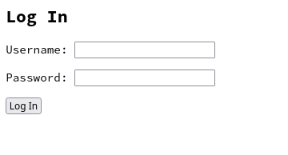

# 23 Usuário e autenticação

O Django possui um sistema de usuários que permite facilmente proteger as views com login e também tem uma interface administrativa, além disso o Django já vem com uma série de comandos administrativos para ajudar na criação de usuários.


## Criando usuários

A primeira tarefa que precisamos fazer para usar o sistema de admin e login do Django é criar um super usuário, isso pode ser feito através do terminal.

```bash
django-admin createsuperuser --username admin --email admin@blog.com
```

Este comando vai pedir para você digitar o password 2 vezes, escolha algo fácil por enquando, por exemplo: `admin`  novamente.

```bash
Password: admin
Password (again): admin 
```

O Django vai fazer algumas verificações de segurança no password mas você pode confirmat digitando `y`

```bash
The password is too similar to the username.
This password is too short. It must contain at least 8 characters.
This password is too common.
Bypass password validation and create user anyway? [y/N]: y
Superuser created successfully.
```

## Shell

Uma das ferramentas mais úteis do Django é o shell administrativo

```bash
django-admin shell
>>>
```

Ele abre um terminal REPL do Python com o contexto do Django onde você pode importar os objetos do sue projeto.

Para uma experiência mais rica eu recomendo instalar o pacote `django-extensions`

```bash
pip install django-=extensions ipython ipdb
```

e coloque `django_extensions` em `INSTALLED_APPS` no `settings.py`

Que oferece uma série de utilidades interessantes, algumas delas:


### Exibir todas as URLs registradas 

```bash
django-admin show_urls

/       blog.views.view index
/<slug:slug>/   blog.views.view detail
/admin/ django.contrib.admin.sites.index        admin:index
/admin/<app_label>/     django.contrib.admin.sites.app_index    admin:app_list
/admin/<url>    django.contrib.admin.sites.catch_all_view
/admin/auth/group/      django.contrib.admin.options.changelist_view    admin:auth_group_changelist
/admin/auth/group/<path:object_id>/     django.views.generic.base.view
/admin/auth/group/<path:object_id>/change/      django.contrib.admin.options.change_view        admin:auth_group_change
/admin/auth/group/<path:object_id>/delete/      django.contrib.admin.options.delete_view        admin:auth_group_delete
/admin/auth/group/<path:object_id>/history/     django.contrib.admin.options.history_view       admin:auth_group_history
/admin/auth/group/add/  django.contrib.admin.options.add_view   admin:auth_group_add
/admin/auth/user/       django.contrib.admin.options.changelist_view    admin:auth_user_changelist
/admin/auth/user/<id>/password/ django.contrib.auth.admin.user_change_password  admin:auth_user_password_change
/admin/auth/user/<path:object_id>/      django.views.generic.base.view
/admin/auth/user/<path:object_id>/change/       django.contrib.admin.options.change_view        admin:auth_user_change
/admin/auth/user/<path:object_id>/delete/       django.contrib.admin.options.delete_view        admin:auth_user_delete
/admin/auth/user/<path:object_id>/history/      django.contrib.admin.options.history_view       admin:auth_user_history
/admin/auth/user/add/   django.contrib.auth.admin.add_view      admin:auth_user_add
/admin/autocomplete/    django.contrib.admin.sites.autocomplete_view    admin:autocomplete
/admin/jsi18n/  django.contrib.admin.sites.i18n_javascript      admin:jsi18n
/admin/login/   django.contrib.admin.sites.login        admin:login
/admin/logout/  django.contrib.admin.sites.logout       admin:logout
/admin/password_change/ django.contrib.admin.sites.password_change      admin:password_change
/admin/password_change/done/    django.contrib.admin.sites.password_change_done admin:password_change_done
/admin/r/<int:content_type_id>/<path:object_id>/        django.contrib.contenttypes.views.shortcut      admin:view_on_site
/new/   blog.views.new_post     new_post
```

### Listar as propriedades de um Model

```bash
django-admin list_model_info --model blog.Post

blog.Post
    Fields:
        id -
        title -
        slug -
        content -
        published -
        date -
    Methods (non-private/internal):
        get_next_by_date()
        get_previous_by_date()

Total Models Listed: 1
```

### Um shell com todos os objetos automaticamente importados

```bash
❯ django-admin shell_plus

# Shell Plus Model Imports
from blog.models import Post
from django.contrib.admin.models import LogEntry
from django.contrib.auth.models import Group, Permission, User
from django.contrib.contenttypes.models import ContentType
from django.contrib.sessions.models import Session
# Shell Plus Django Imports
from django.core.cache import cache
from django.conf import settings
from django.contrib.auth import get_user_model
from django.db import transaction
from django.db.models import Avg, Case, Count, F, Max, Min, Prefetch, Q, Sum, When
from django.utils import timezone
from django.urls import reverse
from django.db.models import Exists, OuterRef, Subquery
Python 3.10.5 (main, Jun  6 2022, 18:49:26) [GCC 12.1.0]
Type 'copyright', 'credits' or 'license' for more information
IPython 8.4.0 -- An enhanced Interactive Python. Type '?' for help.

In [1]: 
```

O shell é muito útil para testar querysets do Django ORM

```python
In [1]: Post.objects.all()
Out[1]: <QuerySet [<Post: Um Novo post no Django>]>

In [2]: User.objects.all()
Out[2]: <QuerySet [<User: admin>]>
```


## Autenticação

Agora vamos aproveitar que temos um usuário e vamos proteger a nossa view `/new/` com usuário e senha.

Edite o arquivo `views.py`

```python


```

Agora precisamos habilitar o sistema default de login alterando o arquivo `urls.py`


```python
from django.contrib import admin
from django.urls import path, include  # NEW
from blog.views import new_post, PostList, PostDetail

urlpatterns = [
    path('admin/', admin.site.urls),
    path("accounts/", include("django.contrib.auth.urls")),  # NEW
    path('new/', new_post, name='new_post'),
    path('', PostList.as_view(), name='index'),
    path('<slug:slug>/', PostDetail.as_view(), name='detail'),
]

```

E por último precisamos criar um template para a página de login

```bash
mkdir templates/registration
touch templates/registration/login.html
```

`templates/registration/login.html`
```html
<h2>Log In</h2>
<form method="post">
  
  {{ form.as_p }}
  <button type="submit">Log In</button>
</form>
```

Agora ao tentar acessar a URL http://127.0.0.1:8000/new/ acontecerá um redirecionamento para a página de login





Basta usar `admin` e `admin` que conseguirá acessar :) 
