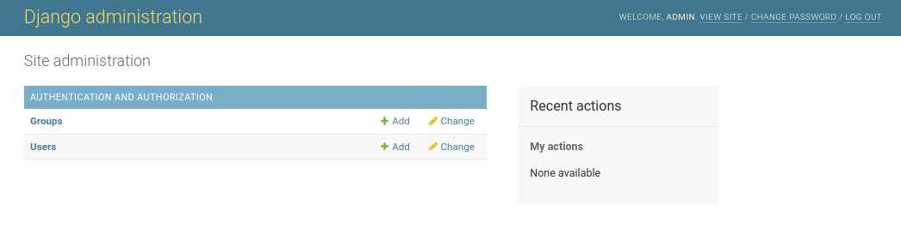
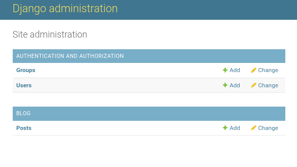
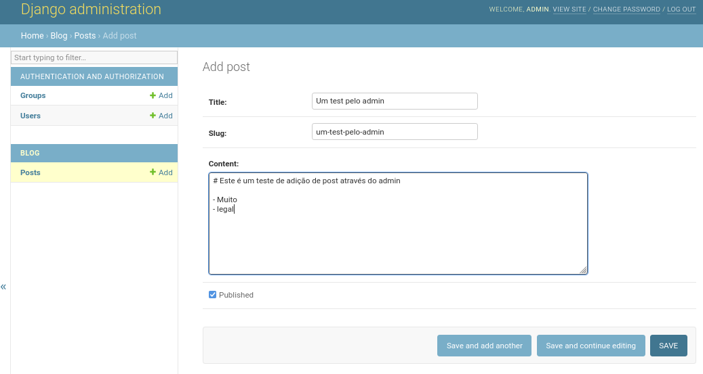
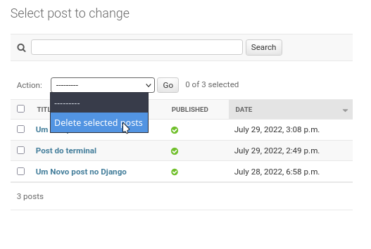
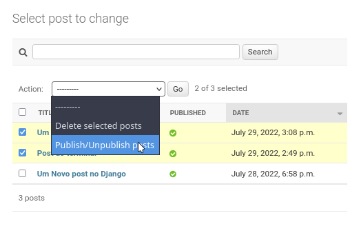

# 24 Django Admin e Management Commands

O Django possui 2 ferramentas administrativas, os management commands e o Django Admin,
vamos ver como podemos usar cada um deles.


## Management commands

Vamos adicionar um comando que permita escrever um novo post através da linha de 
comando.

```bash
django-admin add-post --title "Titulo" --content ¨"Este é um post da linha de comando"
```

Primeiro criamos a pasta para os comandos e o caminho deve ser exatamente uma pasta chamada `management/commands` dentro da app `blog`

```bash
mkdir -p blog/management/commands
```

Também precisamos transformar `management` e `commands` em módulos Python.

```bash
touch blog/management/__init__.py
touch blog/management/commands/__init__.py
```

Agora criamos o arquivo para o nosso primeiro comando:

```bash
touch blog/management/commands/add_post.py
```

E neste arquivo escrevemos o comando:


`add_post.py`
```python
from blog.models import Post
from django.core.management.base import BaseCommand, CommandError
from django.utils.text import slugify


class Command(BaseCommand):
    """Adds a new post to the database
    django-admin add-post --title 'Title' --content 'Content'
    """

    help = "Creates a new Post in the blog"

    def add_arguments(self, parser):
        parser.add_argument("--title", type=str)
        parser.add_argument("--content", type=str)

    def handle(self, *args, **options):
        """handles the arguments and creates the new post"""
        try:
            post = Post.objects.create(
                title=options["title"],
                slug=slugify(options["title"]),
                content=options["content"],
            )
        except Exception as e:
            raise CommandError(e)
        else:
            self.stdout.write(self.style.SUCCESS(f'Post "{post.title}" created'))
```


Agora verá o comando disponível

```
django-admin --help    

Type 'django-admin help <subcommand>' for help on a specific subcommand.

Available subcommands:

...

[blog]
    add_post

...
``` 

E pode utilizar


```bash
django-admin add_post --title "Post do terminal" --content "Postagem bem legal no terminal" 
Post "Post do terminal" created
```

Acesse o blog http://127.0.0.1:8000/ e verá a postagem publicada.


## Interface Admin

O Admin é a principal ferramenta e talvez o motivo de muitas pessoas escolherem o Django, esta interface já vam habilidade por default e pode ser acessada em http://127.0.0.1:8000/admin/ usando a conta de superuser `admin, admin`




Por default apenas os models referentes ao controle de usuários é ativado no admin, para adicionar os outros models precisamos alterar o arquivo `admin.py` dentro de cada app.


`blog/admin.py`

```python
from django.contrib import admin

from blog.models import Post


class PostAdmin(admin.ModelAdmin):
    list_display = ["title", "published", "date"]
    list_filter = ["published", "date"]
    search_fields = ["title", "content"]
    prepopulated_fields = {"slug": ("title",)}
    ordering = ["-date"]

    # Add action to publish/unpublish posts
    de


admin.site.register(Post, PostAdmin)

```

Agora pode dar o refresh na página http://127.0.0.1:8000/admin/ e verá a app blog listada




E através do admin podemos adicionar novos posts, alterar e deletar, experimente.





Ao listar todos os posts repare que tem um dropdown **action** que permite deletar vários posts selecionados



Podemos adicionar outras actions para serem aplicadas a todos os itens selecionados, por exemplo, para alterar o
status de publicado/não publicado.


`admin.py`
```python

class PostAdmin(admin.ModelAdmin):
    ...
    actions = ["publish"]

    @admin.action(description="Publish/Unpublish posts")
    def publish(self, request, queryset):
        for post in queryset:
            post.published = not post.published
            post.save()
```





## Conclusão

O Django é um dos frameworks mais produtivos pelo fato de entregar muitas coisas prontas e também o mais utilizado em grandes projetos por ser bastante suportado pela comunidade.

O Django é uma ótima opção para sites de gerenciamento de conteúdo (CMS) que usem banco de dados relacional (SQL).

Em um próximo capitulo do treinamento vamos fazer um projeto completo, mas será usando o FastAPI e o motivo de usa-lo é o fato dele não abstrair tantas coisas e de fato podermos aprender sem ter as mágicas do Django escondendo a implementação.
