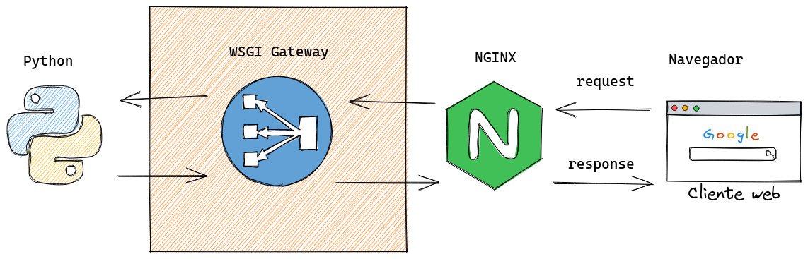

# 24 Deploy

A partir do momento em que temos uma aplicação web Python pronta para
produção chega a hora de fazer o deploy, o deploy geralmente é um
processo automatizado via uma esteira de CI/CD, este tipo de deploy automatizado será tema de uma aula no treinamento Python Automação e Devops que também faz parte aqui do pacote Python Expert.

Aqui no treinamento Python web nós veremos os fundamentos do deploy
de aplicações web Python utilizando 3 abordagens mais comuns e o
processo será primeiramente feito manualmente pois é muito importante você conhecer o processo manual para que possa depois dominar o processo automatizado.

Depois de entender o processo manual iremos utilizar o Ansible para
automatizar as tarefas de configuração do deploy.

As 3 principais abordagens que veremos aqui serão:

- VM
    - Instalamos a Virtual Machine com Linus
    - Configuramos os pacotes necessários
    - Configuramos a APP Python
    - Configuramos o web server NGINX
- Managed Service
    - Vamos usar o Heroku + git para um deploy semi automático
- Container / Kubernetes
    - Containerizamos nossa aplicação
    - Criamos um deployment K8s
    - Conectamos a um Cluster k8s
    - Fazemos o apply do deploy da aplicação

## O protocolo WSGI e a Arquitetura APP e WEB servers

Lá no comecinho do treinamento falamos sobre WSGI e também sobre web server e proxy reverso, agora vamos relembrar o papel de cada um deles nesta arquitetura:

Os componentes principais desta stack são:

- SERVIDOR (linux)
    - Instalaremos um Linux e todos os pacotes requeridos
- APP em ambiente Python (django, flask, fastapi, etc)
    - Criaremos o ambiente virtual Python 
    - Instalaremos todas as dependencias
    - Criaremos os diretórios e configurações necessárias
- APP SERVER WSGI (gunicorn) ou ASGI (uvicorn)
    - Iniciamos um daemon que faz o Gateway da aplicação Python e serve em um socket
- WEB SERVER (nginx)
    - Configuramos um proxy reverso que expoe o socket do APP server em portas web como 80 e 443

Esses 3 componentes precisam ser instalados em um servidor e Linux é o sistema operacional mais comum para aplicações Python.
