# 25 VM - Virtual Machine

Este é o modo mais tradicional de se fazer o deploy de uma aplicação
web, uma virtual machine é a réplica virtual de uma máquina fisica
o mesmo procedimento usado para configurar uma máquina virtual
poderia ser utilizado para configurar uma **bare metal** (servidor físico).

A vantagem de usar VM é que os procedimentos não são abstraidos, 
você tem a oportunidade de configurar cada componente manualmente
como desejar, e isto pode ser visto também como desvantagem, mas de qualquer modo neste curso o foco é que você aprenda como fazer manualmente para depois entender oq ue está por trás dos processos abstraidos.

## Escolhendo um Runtime de Virtual Machine

Existem algumas formas de rodar uma VM no seu computador, seja ele Linux, Mac ou windows você será capaz de escolher um runtime de virtualização adequado.

> Caso você já conheça e domine plataformas como QEMU, RHEV, libvirt,  
> Paralells, VMWare etc, fique a vontade para utilizar na  
> virtualização da máquina virtual para esta parte do treinamento.

Caso você nunca tenha trabalhado com máquina virtuais eu vou recomendar que você utilize o **Virtual Box** que é o que utilizarei neste treinamento, o motivo de eu escolher o Vbox é o fato dele ser o mais fácil e funcionar perfeitamente independente de qual for o seu sistema operacional.

O requisito para instalar o Virtual Box é ter virtualização ativada no seu computador, vá até https://www.virtualbox.org/wiki/Downloads e baixe a versão para o seu sistema operacional se tudo ocorrer corretamente com a instalação isso significa que a virtualização está ativada no seu computador, caso o Vbox não consigam encontrar o suporte ele irá exibir mensagens de erro.

> Se você utiliza **Linux** provavelmente o virtualbox já está disponível no seu gerenciador de pacotes e pode instalar com `apt`, `dnf`, `pacman` etc.

### VPS - Virtual Private Server

> Caso por algum motivo você não consiga executar o VirtualBox ou qualquer outro serviço de virtualização, não tem problema! acompanhe a aula normalmente que em breve iremos replicar os mesmos procedimentos em uma VPS 

VPS é um serviço oferecido por empresas e hospedagem como a Digital Ocean e a AWS, eles oferecem uma máquina virtualizada provada para usarmos ns infraestrutura de virtualização deles, o funcionamento é praticamente o mesmo que usaremos para configurar a VM localmente, com a diferença que o serviço é gerenciado por empresas que provem as questões de segurança e abstração de tarefas administrativas.


## Escolhendo a distribuição Linux

Esta tarefa vai depender bastante do tipo de produto que você está
desenvolvendo e de quais contratos e serviços sua empresa/projeto já
possuem.

Para projetos gerais, como nosso blog por exemplo, podemos escolher entre algumas distruibuições e todas elas oferecem um bom suporte.

- Centos Stream / RHEL
    - É a distribuição **enterprise** mais usada no mundo e com bom suporte em ambientes como AWS, por exemplo o Amazon Linux é baseado no Centos e o funcionamento do Centos é praticamente o mesmo do RHEL (Red Hat Enterprise Linux)
- Fedora Server
    - Uma distribuição para servidor open source focada em pequenos projetos **não enterprise** e bastante fácil de utilizar.
- Ubuntu Server
    - A distribuição Linux mais famosa e mais utilizada, a grande vantagem é que está disponível em quase todos os cloud providers, possui muitas imagens de container baseadas nela, tem o tamanho em GB reduzido e muitos tutoriais.
- Debian Server
    - A distribuição que serve de base para o Ubuntu, é excelente mas exige muitas configurações manuais.


### Qual distribuição escolher?

Depende muito do projeto e das necessidades:

Para um projeto grande que precise passar por homologações de segurança e compliance, que precise ser **enterprise ready** e seguir todos os requisitos exigidos por exemplo por órgãos governamentais e que tenha um bom suporte pago, neste caso eu recomendaria começar com o Centos Stream e depois migrar para o RHEL.

Para um projeto pequeno/individual como nosso blog, ou pequenas empresas que querem ter um bom suporte gratuito da comunidade e abrangencia em qualquer cloud provider, neste caso recomendo o Ubuntu Server.


### Download da imagem .iso

Portanto vamos utilizar o Ubuntu Server 22.04 e você pode obter em 
https://ubuntu.com/download/server escolha a opção **Option 2 - Manual Server Installation** e faça o download da .iso para x86x64 a imagem que eu usei foi `ubuntu-22.04-live-server-amd64.iso`


### VM - Opção 1 - Usando uma imagem pronta da VM Ubuntu Server

Acesse https://www.osboxes.org/ubuntu-server/ e escolha a opção **Ubuntu Server 22.04 Jammy Jellyfish** Virtualbox clique em Download e prossiga para fazer o download do arquivo `64bit.7z`. 

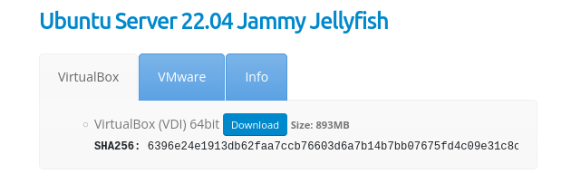

Descompacte este arquivo e criará uma pasta chamada `64bit` com um arquivo `Ubuntu Server 22.04 (64bit).vdi` dentro e usaremos esta arquivo `.vdi` nos próximos passos.

Abra o VirtualBox e clique em `Novo`

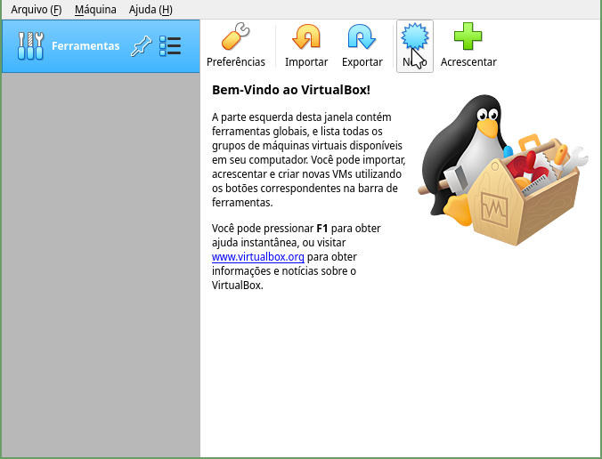

Preencha os campos com o nome do servidor e escolha `Linux` e `Ubuntu 64-bit`

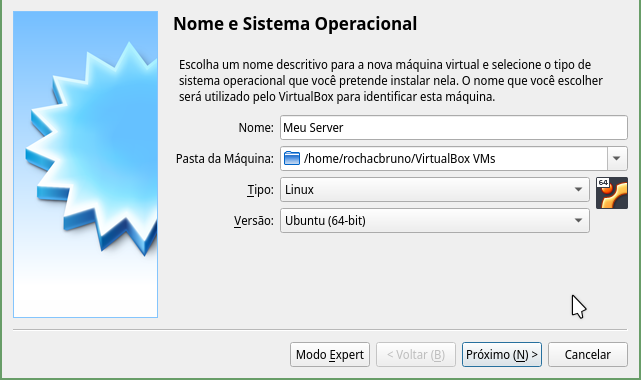

Na próxima tela escolheremos a quantidade de memória RAM, ,escolha qualquer valor que seja pelo menos 1024 (1GB), se o seu computador tem bastante memória recomendo escolher  2048 (2GB) que já será o suficiente para nosso experimento.

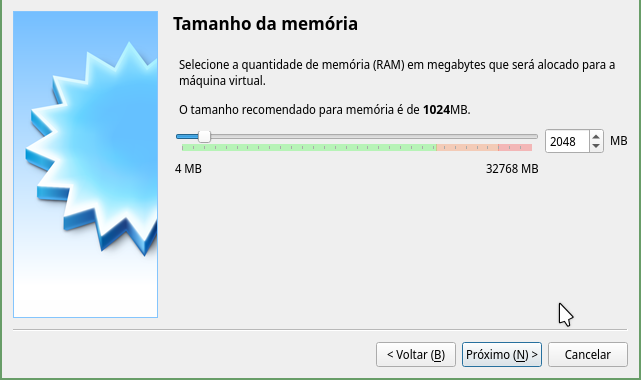


Na próxima tela escolha a opção "Utilizar um disco rigido existente"

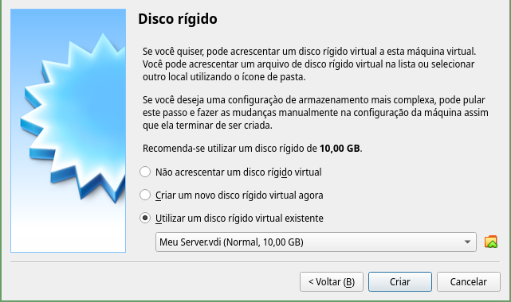


Selecione no icone de pasta a imagem `.vdi` que você baixou


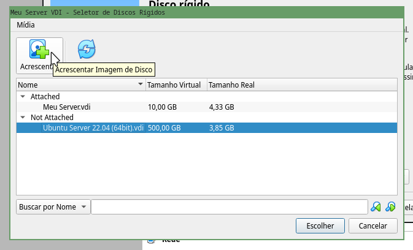

Clique em **escolher** e depois em **criar**

A próxima tela deve mostrar a VM desligada

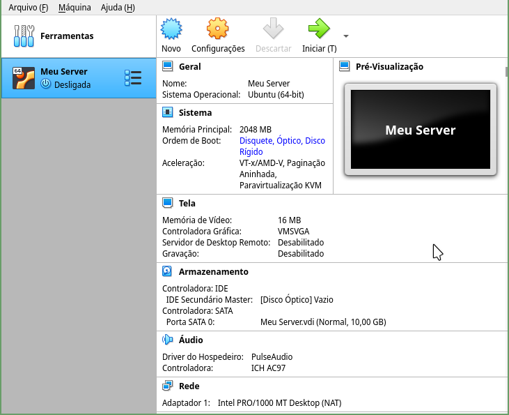

Agora vamos efetuar a configuração inicial, clique em **configurações** vá até a aba rede.

e selecione o modo **Placa em modo Bridge**


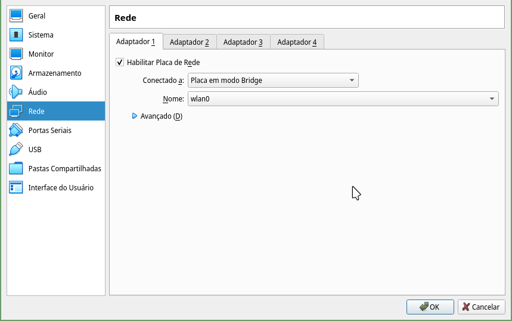

Agora pode clicar em **OK** e a máquina estará pronta para ser iniciada, clique no botão **Iniciar** e verá a VM iniciando com a seguinte mensagem:


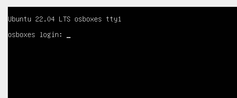


> **IMPORTANTE** neste procedimento as credenciais serão:  
>
> username: osboxes  
> password: osboxes.org  
> Root account password: osboxes.org

portanto efetue login com usuário `osboxes` e password `osboxes.org`

---

### VM - Opção 2 -  Instalando o Ubuntu Server em uma VM

Abra o VirtualBox e clique em `Novo`

> **Atenção** se você estiver utilizando outro sistema de virtualização basta escolher opções similares.


Preencha os campos com o nome do servidor e escolha `Linux` e `Ubuntu 64-bit`


Na próxima tela escolheremos a quantidade de memória RAM, ,escolha qualquer valor que seja pelo menos 1024 (1GB), se o seu computador tem bastante memória recomendo escolher  2048 (2GB) que já será o suficiente para nosso experimento.


Agora para o disco rigido pode continuar com a opção default e clicar em **Criar** e a apartir daqui apenas confirmar as opções padrão.

A próxima tela deve mostrar a VM desligada


Agora vamos efetuar a configuração inicial, clique em **configurações** vá até a aba armazenamento e verifique que existe uma **Controladora: IDE** mostrando que está **vazio**, esta controladora representa o drive de **CD** da máquina virtual e precisamos virtualmente **inserir** o disco **.iso** que baixamos com o Ubuntu Server.


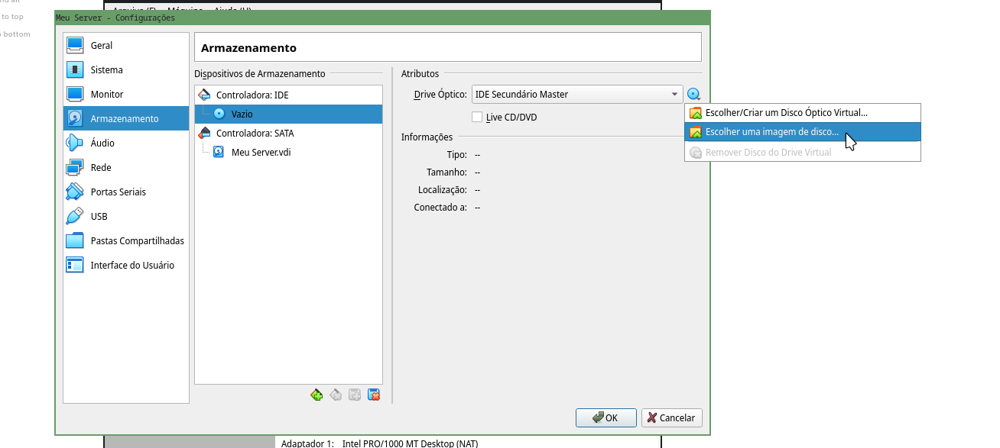

Clique no ícone de disco e escolha a opção **escolher uma imagem de disco** e encontre o arquivo `ubuntu-22.04-live-server-amd64.iso` que baixou.

Agora mude para a aba **rede** e selecione o modo **Placa em modo Bridge**


Agora pode clicar em **OK** e a máquina estará pronta para ser iniciada, clique no botão **Iniciar**

Após alguns segundos a próxima tela mostrará o instalador do Ubuntu Linux Server e a primeira tarefa é escolher a linguagem, eu recomendo deixar em Inglês, só dar enter.

> **Atenção** o Vbox captura o teclado e mouse do seu computador, caso necessite parar a captura use a tecla Ctrl da direita.

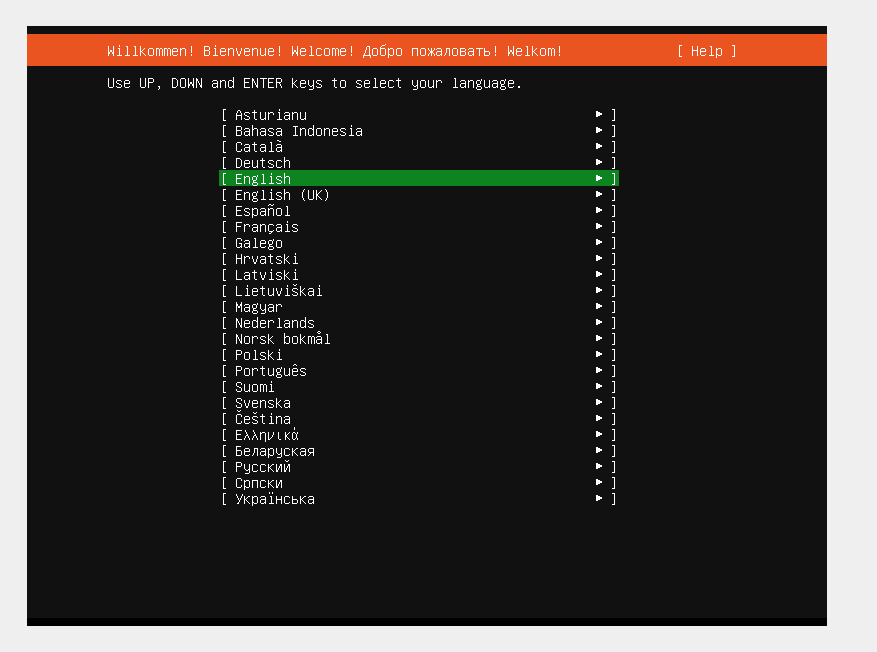

Depois de pressionar enter o instalador irá perguntar se deseja atualizar, recomendo que escolha a opção "Update to the new installer" e então basta esperar ele baixar e atualizar o instalador.

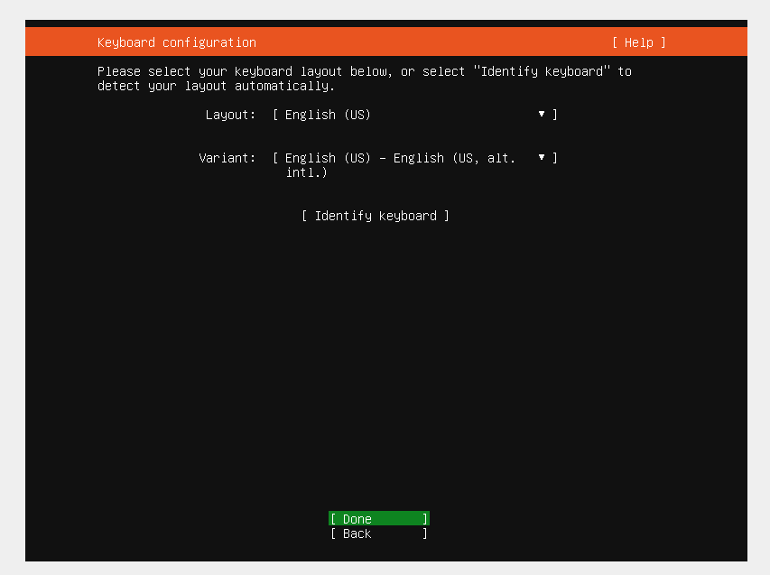

A próxima tela pede para configurar o teclado e isso vai depender de qual o layout do seu teclado, eu uso o English (US) portanto selcionei o layout do meu teclado, escolha o mais apropriado para o seu teclado ou clique em **identify keyboard** para obter ajuda na identificação.

Na próxima tela para escolher a opção default **Ubuntu Server** e apenas dar o enter.

neste ponto o Ubuntu vai configurar a interface de rede na VM e este passo é muito importante, repare que ele já seleciona um endereço de IP via DHCP da sua rede local.

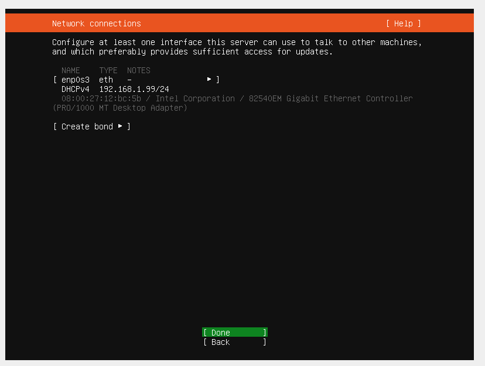

GEralmente você não precisa alterar nada, basta confirmar com enter.

A próxima tela pergunta se existe um servidor de proxy, pode deixar em branco (ou preencher caso você tenha um servidor proxy) e pressionar enter.

Nas próxima telas você pode simplesmente confirmar em **Done** com as opções default até a tela onde ele pede para você configurar o seu profile.


Eu escolhi `bruno` e `1234` como password, fique a vontade para usar o que preferir (não esqueça essa senha)

A próxima tela é bastante importante! ele te pergunta se deseja instalar o **OpenSSH** e a resposta é sim! use a barra de espaço para marcar a opção e se quiser pode importar uma chave SSH existente da sua conta github.

Essas foram as minhas escolhas:

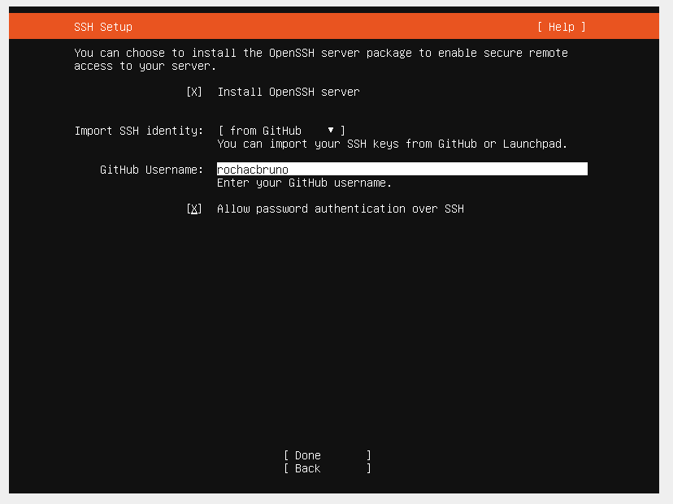

Na próxima tela ele pergunta se você deseja instalar algum pacote e não precisa escolher nenhum.

Agora é só esperar a instalação completar, isso pode levar alguns minutos.


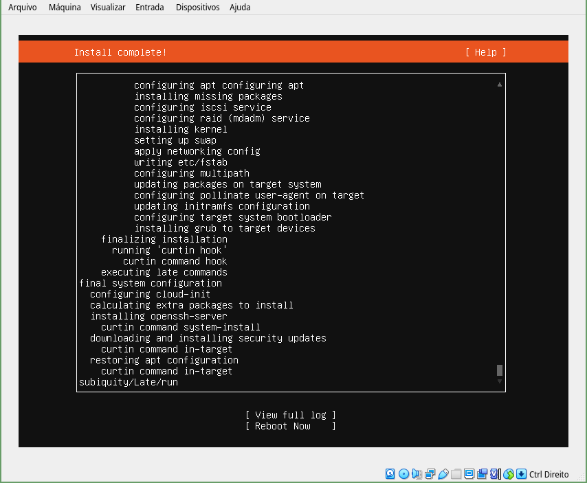

Quando aparecer a mensagem "Install Complete!" podemos escolher reboot now.

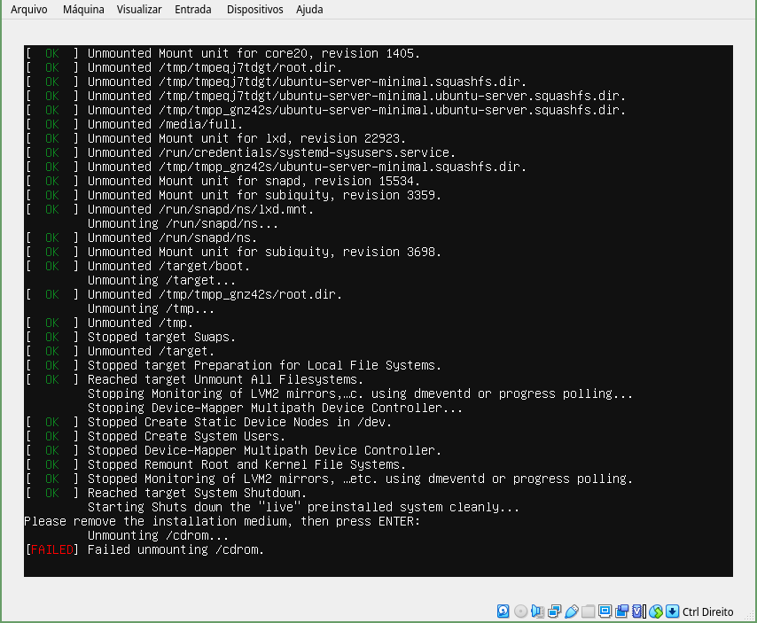

Repare que terá a mensagem 
**[FAILED] Failed unmounting /cdrom** pois o Ubuntu vai remover automaticamente o CD virtual que inserimos.

Agora a VM está pronta para ser usada, efetue login com o nome de usuário e senha que configurou.


---


### Atualizando os pacotes

```bash
sudo apt-get update
# (senha)
```

### (opcional) Configurando a chave SSH a partir do seu github

Fazer isso facilita ao efetuar login via SSH.

```bash
ssh-import-id-gh seu-usuario-github
```

### Descobrindo o IP da VM

```bash
ip address
```

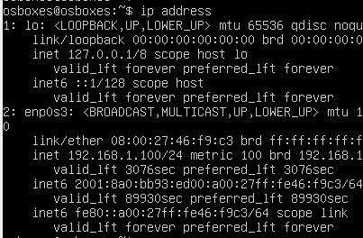

No exemplo acima estamos interessados no IP `192.168.1.100` que pode ser diferente no seu computador local.

Guarde este número pois vamos utilizar daqui para frente.

Pode deixar o Virtual Box minimizado que a partir de agora faremos o restante dos processos via SSH através de um terminal no computador local.

Verifique que usando um terminal do seu computador consegue acessar a VM, por exemplo.

```bash
ping 192.168.1.100
PING 192.168.1.100 (192.168.1.100) 56(84) bytes of data.
64 bytes from 192.168.1.100: icmp_seq=1 ttl=64 time=0.264 ms
64 bytes from 192.168.1.100: icmp_seq=2 ttl=64 time=0.833 ms
```

e

```bash
ssh osboxes@192.168.1.100
Welcome to Ubuntu 22.04 LTS (GNU/Linux 5.15.0-25-generic x86_64)
...
osboxes@osboxes:~$
```

> **Atenção**: Utilize o IP e usuário correspondente a sua instalação no VirtualBox.


Pode ser necessário dar um reboot na VM

```bash
sudo shutdown -r now
```

