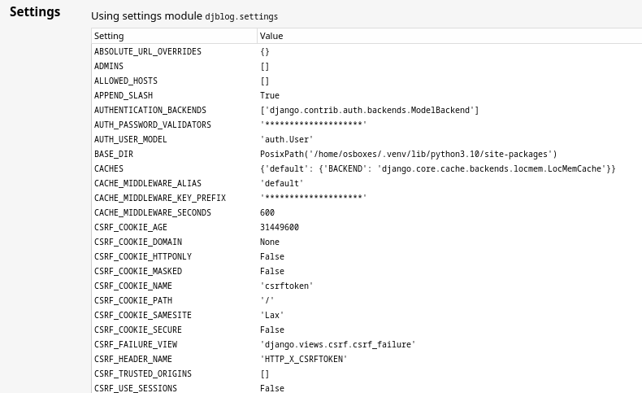
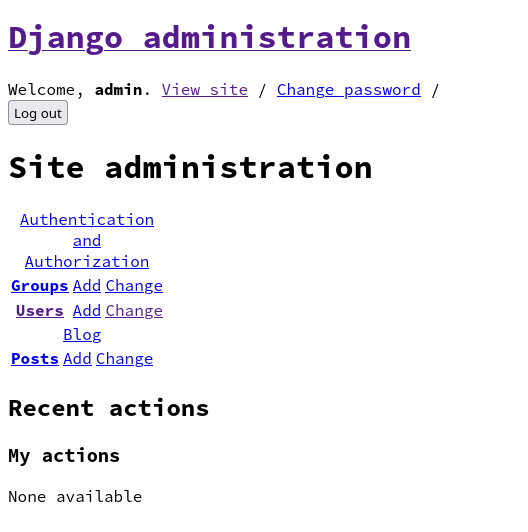

# 27 Config

## 4 Configurações iniciais

Agora vamos inicializar a nossa aplicação Django e fazer um pequeno teste para ver se tudo está funcionando.

Essas 2 variáveis de ambiente sempre serão requeridas.

```bash
export PYTHONPATH=/app/python-web-api/exemplos/day2/django/
export DJANGO_SETTINGS_MODULE=djblog.settings
```

```bash
$ ~/.venv/bin/django-admin --help
```
```
Type 'django-admin help <subcommand>' for help on a specific subcommand.

Available subcommands:

[auth]
    changepassword
    createsuperuser

[blog]
    add_post
...
```

Executando uma vez no modo standalone só para testar

```bash
~/.venv/bin/django-admin runserver 0.0.0.0:8000
```
```
Watching for file changes with StatReloader
Performing system checks...

System check identified no issues (0 silenced).

You have 19 unapplied migration(s). Your project may not work properly until you apply the migrations for app(s): admin, auth, blog, contenttypes, sessions.
Run 'python manage.py migrate' to apply them.

August 04, 2022 - 16:27:35
Django version 4.1, using settings 'djblog.settings'
Starting development server at http://0.0.0.0:8000/
Quit the server with CONTROL-C.
```

> **Atenção**: IGNORE A mensagem a respeito das 19 migrations não aplicadas por enquanto.

Agora abra o seu navegador e tente acessar http://192.168.1.100:8000/ (altere para o IP da sua VM se preciso)

Você vai reparar uma mensagem de erro.

```
DisallowedHost at /

Invalid HTTP_HOST header: '192.168.1.100:8000'. You may need to add '192.168.1.100' to ALLOWED_HOSTS.
```

A própria mensagem já nos dá a dica do que fazer para resolver, precisamos adicionar a cofniguração `ALLOWED_HOSTS` os endereços pelo qual o Django é autorizado a servir, esta é uma config de segurança e nós podemos colocar lá o IP completo como a mensagem recomenda ou podemos simplesmente colocar `"*"` para permitir qualquer host.

Ao fazer scroll pela página de erro você vai ser capaz de ver as chaves de configuração do projeto



E isso não é desejavel, estamos fazendo deploy em um servidor de produção, não podemos expor variáveis de modo debug, parece que remos agora 2 variáveis de configuração para alterar.

```python
DEBUG=False
ALLOWED_HOSTS=["*"]
```

No Django os settings ficam no arquivo `settings.py` então em teoria poderiamos abrir este arquivo e alterar as chaves de configuração, porém **não é recomendado alterar código diretamente no servidor** e além disso é recomendado seguirmos o **12factorapp** guide https://12factor.net/pt_br/config que recomenda que as configurações pertençam ao ambiente.

O Django por default não carrega as variáveis de ambiente, portanto usaremos a biblioteca [Dynaconf](https://dynaconf.com).

### Adicionando Dynaconf ao projeto.

As alterações a seguir já foram implementadas e você pode obter no server diretamente com os seguintes comandos:

```bash
cd /app/python-web-api
git fetch --all
git checkout day3
git pull --rebase
git branch
```

Agora seu projeto estará na branch day3, se preferir pode também fazer manualmente com as instruções a seguir.

#### (opcional) Alterando manualmente nos arquivos

https://github.com/rochacbruno/python-web-api/commit/8ec9bd739775bb0ed7fb3b01357fb47b331ca193#diff-532d2fc05000b33f7739009a73d7e39f90886a247667aa94c6823424b068712f

`/app/python-web-api/exemplos/day2/django/setup.py`
```python
from setuptools import setup

setup(
    name="django_blog",
    version="0.1.0",
    packages=["djblog", "blog", "templates"],  # NEW
    include_package_data=True,  # NEW
    install_requires=[
        "django",
        "django-markdownify",
        "django-extensions",
        "dynaconf",  # NEW
    ],
)
```

Adicione um arquivo MANIFEST para incluirmos os templates junto ao build.

```bash
echo "recursive-include templates *.html" > exemplos/day2/django/MANIFEST.in
```

Altere o `djblog/settings.py`
```python
# No final do arquivo
from dynaconf import DjangoDynaconf  # noqa

settings = DjangoDynaconf(
    __name__,
    load_dotenv=False,
    envvar_prefix='BLOG',
    env_switcher="BLOG_ENV",
    settings_files=["blog_settings.toml"]
)
```

Agora o projeto está pronto para ser configurado de maneira dinâmica através de variáveis de ambiente ou arquivo opcional local `blog_settings.toml`


### Reinstale

**IMPORTANTE** Reinstale pois não estamos em modo editável.

Apague o build anterior caso exista

```bash
rm -rf exemplos/day2/django/build/
rm -rf exemplos/day2/django/django_blog.egg-info/
```

Resinstale

```bash
~/.venv/bin/python -m pip install /app/python-web-api/exemplos/day2/django/
```

> Em VM pode demorar um pouco o download dos pacotes.

### Configuração local de deploy

O Dynaconf permite de duas maneiras

1. Environment

```bash
cd /app
export PYTHONPATH=/app/python-web-api/exemplos/day2/django/
export DJANGO_SETTINGS_MODULE=djblog.settings
export BLOG_DEBUG=false
export BLOG_DATABASES__default__NAME="/app/db.sqlite3"
export BLOG_ALLOWED_HOSTS='["*"]'
```

2. Ou com arquivo local `/app/blog_settings.toml`

Primeiro limpe as variáveis de ambiente prefixadas com `BLOG_` caso tenha testado com elas

```bash
unset BLOG_ALLOWED_HOSTS 
unset BLOG_DEBUG
unset BLOG_DATABASES__default__NAME
```

crie o arquivo `/app/blog_settings.toml` no servidor

> Dica: `nano /app/blog_settings.toml` e cole o conteúdo abaixo.

```toml
[production]
allowed_hosts = ["*"]
debug = false
DATABASES__default__NAME="/app/db.sqlite3"
```

> No Nano, Salve com `Ctrl + s` e depois saia com `Ctrl + x`  
> No Vim, Salve com `:w` e saia com `:q`


### Comandos iniciais

Repare que desta vez estamos indicando um caminho para o banco de dados
portanto vamos rodar o comando `migrate` para que o banco seja criado.

```bash
cd /app
export PYTHONPATH=/app/python-web-api/exemplos/day2/django/
export DJANGO_SETTINGS_MODULE=djblog.settings
export BLOG_ENV=production
~/.venv/bin/django-admin migrate
```
```
Operations to perform:
  Apply all migrations: admin, auth, blog, contenttypes, sessions
Running migrations:
  Applying contenttypes.0001_initial... OK
  Applying auth.0001_initial... OK
  Applying admin.0001_initial... OK
  Applying admin.0002_logentry_remove_auto_add... OK
  Applying admin.0003_logentry_add_action_flag_choices... OK
  Applying contenttypes.0002_remove_content_type_name... OK
  Applying auth.0002_alter_permission_name_max_length... OK
  Applying auth.0003_alter_user_email_max_length... OK
  Applying auth.0004_alter_user_username_opts... OK
  Applying auth.0005_alter_user_last_login_null... OK
  Applying auth.0006_require_contenttypes_0002... OK
  Applying auth.0007_alter_validators_add_error_messages... OK
  Applying auth.0008_alter_user_username_max_length... OK
  Applying auth.0009_alter_user_last_name_max_length... OK
  Applying auth.0010_alter_group_name_max_length... OK
  Applying auth.0011_update_proxy_permissions... OK
  Applying auth.0012_alter_user_first_name_max_length... OK
  Applying blog.0001_initial... OK
  Applying sessions.0001_initial... OK
```

Repare que agora existe um arquivo `db.sqlite3`

```bash
ls /app
```
```
blog_settings.toml  db.sqlite3  python-web-api
```

Criaremos agora um super usuário.

```bash
cd /app
~/.venv/bin/django-admin createsuperuser --username admin --email admin@example.com
```
```
Password: 
Password (again): 
The password is too similar to the username.
This password is too short. It must contain at least 8 characters.
This password is too common.
Bypass password validation and create user anyway? [y/N]: y
Superuser created successfully.
```

Executando para testar

```bash
cd /app
~/.venv/bin/django-admin runserver 0.0.0.0:8000
```
```
Performing system checks...

System check identified no issues (0 silenced).
August 04, 2022 - 17:40:29
Django version 4.1, using settings ['blog_settings.toml']
Starting development server at http://0.0.0.0:8000/
Quit the server with CONTROL-C.

```

http://192.168.1.100:8000/ e verifique se tudo funcionou

Tente agora o `/admin` e faça login.



Repare que funciona mas a aparencia do site admin não é muito boa!

Vamos resolver, precisamos criar uma pasta para os arquivos estáticos.

**Ctrl + C** para parar o server e então

```bash
mkdir /app/static
```

Agora ecolha uma das opções:

1. Exporte as variavéis com o prefixo `BLOG_`

```bash
export BLOG_STATIC_ROOT="/app/static/"
export BLOG_STATICFILES_DIR="/app/static/"
export BLOG_STATIC_URL="/static/"
```

2. Ou adicione ao `/app/blog_settings.toml` sem o prefixo **BLOG_** (recomendado)

> `nano /app/blog_settings.toml`

```toml
STATIC_ROOT="/app/static/"
STATICFILES_DIR="/app/static/"
STATIC_URL="/static/"
```

Agora execute

```bash
cd /app
~/.venv/bin/django-admin collectstatic
```
```
135 static files copied to '/app/static'.
```

Isso faz com que o Django copie os arquivos estáticos da app admin para a pasta `static` porém ainda não será possível acessar estes arquivos, por razões de segurança e performance o Django exige que usemos um proxy reverso para servir arquivos estáticos e faremos isso brevemente.

Execute o server novamente com 

```bash
~/.venv/bin/django-admin runserver 0.0.0.0:8000
```

Acesse http://192.168.1.100:8000/new/ e adicione um post.

Pode dar **Ctrl + C** para parar o servidor no terminal pois não é o ideal que a gente deixe o servidor rodando desta maneira, o ideal é usar um servidor `WSGI` mais robusto como o gunicorn.