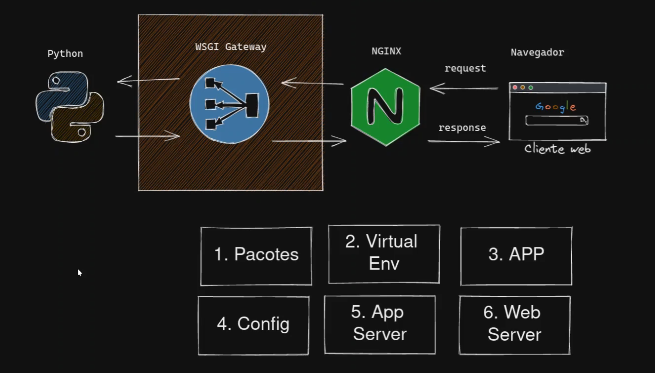

# 29 Automatizando o Deploy

Vamos usar o **Ansible** para criar a automatização do deploy,
todos os passos que fizemos nas aulas passadas iremos agora colocar em um **playbook** no Ansible.

## Ansible

Ansible é um projeto open-source para automatização de tarefas sequenciais e utiliza o protocolo SSH para se comunicar com um ou mais servidores e executar as **tasks** definidas em um arquivo no formato **yaml**.

Além de podermos descrever o passo a passo do deploy em um playbook ainda podemos reaproveitar automatizações criadas por outras pessoas e disponíveis no https://galaxy.ansible.com


### Instalando

```bash
pip install ansible
```

### Play e Playbook

**Play** é um conjunto de fatos, variavéis e tarefas (facts, vars, tasks) e um **playbook** é o arquivo no formato **.yaml** onde colocamos um ou mais plays, em cada play descrevemos o estado que desejamos que o servidor esteja assim que o playbook for executado.

### Inventário

O playbook é aplicado em todos os **hosts** de um inventário, o inventário é o local onde todos os IPs são agrupados e  normalmente colocamos nosso inventário de hosts em um arquivo chamado `inventory` ou passamos os IPs via linha de comando.

## Automatizando o Deploy

Vamos trabalhar na pasta `exemplos/day3/ansible` e para isso precisamos de uma VM no seu estado inicial, se você fez um snapshot pode agora salvar o estado atual da VM e então restaurar para o estado inicial.

Se não fez o snapshot pode baixar novamente o arquivo .vdi em osboxes.org e iniciar uma nova VM limpa.

### 1 Inventory

Criamos o arquivo `inventory` contendo o nosso host.

> **NOTA** confirme o endereço de IP com o comando `ip address` dentro da VM.

`nano exemplos/day3/ansible/inventory`
```ini
[webservers]
192.168.1.101
```

Caso queira fazer o deploy em mais servidores ao mesmo tempo poderá listar quantos IPS quiser e também pode criar quantos grupos quiser.


### 2 testando o Ansible

`exemplos/day3/ansible/django-deploy.yaml
```yaml
---
- hosts: webservers
  remote_user: osboxes
  vars:
    - msg: Hello
  tasks:
    - name: print hello
      debug:
        msg: "{{ msg }} World"
    - name: Ping the server
      ping:
```

Execute com o comando

```bash
ansible-playbook -i inventory django-deploy.yaml
```
```
PLAY [webservers] ***************************************************************

TASK [Gathering Facts] **********************************************************
ok: [192.168.1.101]

TASK [print hello] **************************************************************
ok: [192.168.1.101] => {
    "msg": "Hello World"
}

TASK [Ping the server] **********************************************************
ok: [192.168.1.101]

PLAY RECAP **********************************************************************
192.168.1.101              : ok=3    changed=0    unreachable=0    failed=0    skipped=0    rescued=0    ignored=0   

```

> **NOTAS** Substitua o `remote_user` caso seja necessário e se não tiver uma chave SSH configurada verá um erro de autenticação, pode passar `--ask-pass` para o Ansible pedir para você digitar a sua senha.

Repare que o Ansible executou 3 **TASKS** a primeira task **gathering facts** é default do próprio ansible, nesta tarefa ele coleta informações a respeito ma máquina remota e depois executa as nossa próprias tasks em sequência.


Agora que já temos a resposta do teste podemos alterar o playbook para fazer de fato o deploy.

### 3 Deploy

Agora vamos criar o playbook e nele descrever as variáveis e tarefas.

> **DICA** se usar o VSCode instale as extensões [YAML](https://marketplace.visualstudio.com/items?itemName=redhat.vscode-yaml) e [Ansible](https://marketplace.visualstudio.com/items?itemName=redhat.ansible)


Os passos que vamos colocar em cada uma das tasks do playbook são:




1. Pacotes
2. Virtual Env
3. APP (pastas, permissões, repo)
4. Configurações
5. App Server
6. Web Server

`exemplos/day3/ansible/django-deploy.yaml
```yaml
---
- hosts: webservers
  remote_user: osboxes
  vars:
    system_user: osboxes
    base_path: /app
    repo_url: 'https://github.com/rochacbruno/python-web-api'
    repo_branch: day3
    repo_path: "{{ base_path }}/python-web-api" 
    app_path: "{{ repo_path }}/exemplos/day2/django"
    app_name: djblog
    settings_path: "{{ app_name }}.settings"
    database_path: "{{ base_path }}/db.sqlite3"
    venv_path: /home/{{ system_user }}/.venv
    django_admin: "{{ venv_path }}/bin/django-admin"
  environment:
    PYTHONPATH: "{{ app_path }}"
    DJANGO_SETTINGS_MODULE: "{{ settings_path }}"
    BLOG_ENV: production
  tasks:

    - name: Instalação de pacotes
      become: true
      apt:
        update_cache: true
        state: present
        pkg:
          - python3-dev
          - python-is-python3
          - nginx
          - git
          - sqlite3
          - python3.10-venv

    - name: Virtual Env Python
      pip:
        virtualenv: "{{ venv_path }}"
        virtualenv_command: python3.10 -m venv
        name: pip
        state: latest

    - name: Adding user to www-data group
      become: true
      user: 
        name: "{{ system_user }}"
        groups: 
          - www-data
        append: true

    - name: Base APP Folder
      become: true
      file:
        path: "{{ base_path }}"
        state: directory
        owner: "{{ system_user }}"
        group: www-data
        mode: 0775
        recurse: true

    - name: Respository Codebase
      git:
        repo: "{{ repo_url }}"
        dest: "{{ repo_path }}"
        single_branch: true
        version: "{{ repo_branch }}"
        force: true

    - name: Installing the project 
      pip:
        virtualenv: "{{ venv_path }}"
        name: file://{{app_path}}
        state: present

    - name: Place the app settings file 
      template:
        src: blog_settings.toml.j2
        dest: "{{ base_path }}/blog_settings.toml"

    - name: Django - Get the database name
      command:
        chdir: "{{ base_path }}"
        cmd: >-
          {{ django_admin }} shell -c
          "from django.conf import settings;print(settings.DATABASES.default.NAME)"
      register: django_db_name

    - name: Django - Assert App is correctly set
      assert:
        that: django_db_name.stdout == database_path

    - name: Django - DB Migration
      command:
        chdir: "{{ base_path }}"
        cmd: "{{ django_admin }} migrate --noinput"

    - name: Django - Check if admin user exists 
      command:
        chdir: "{{ base_path }}"
        cmd: >-
          {{ django_admin }} shell -c 
          "from django.contrib.auth.models import User;print(User.objects.count())"
      register: django_admin_user_count

    - name: Django - Create admin user
      command:
        chdir: "{{ base_path }}"
        cmd: >-
          {{ django_admin }} shell -c 
          "from django.contrib.auth.models import User;
          User.objects.create_superuser('admin', 'admin@example.com', 'admin')"
      when: django_admin_user_count.stdout == "0"
       
    - name: Django - Collect static files
      command:
        chdir: "{{ base_path }}"
        cmd: "{{ django_admin }} collectstatic --noinput"

    - name: Gunicorn
      become: true
      block:
        - name: Gunicorn - Install 
          pip:
            name: gunicorn
            virtualenv: "{{ venv_path }}"
            state: present

        - name: Gunicorn - socket file 
          template:
            src: templates/gunicorn.socket.j2
            dest: /etc/systemd/system/gunicorn.socket

        - name: Gunicorn - service file
          template:
            src: templates/gunicorn.service.j2
            dest: /etc/systemd/system/gunicorn.service
            
        - name: Gunicorn - Reload systemd
          systemd:
            daemon_reload: yes
      
        - name: Gunicorn - Start service
          systemd:
            state: started
            enabled: true
            name: gunicorn.socket

    - name: NGINX
      become: true
      block:
        - name: NGINX - Copy site config
          template:
            src: templates/nginx_blog.j2
            dest: "/etc/nginx/sites-available/nginx_blog"

        - name: NGINX - Enable site config
          file:
            src: "/etc/nginx/sites-available/nginx_blog"
            dest: /etc/nginx/sites-enabled/default
            state: link
        
        - name: NGINX - Reload service
          systemd:
            state: restarted
            name: nginx

```

> **NOTA** como em algumas tasks usamos `become: true` para executar com `sudo` teremos que informar o password e por isso executamos com `--ask-become-pass`

```bash
ansible-playbook -i inventory django-deploy.yaml --ask-become-pass
```

```
BECOME password: 

PLAY [webservers] ***************************************************************

TASK [Gathering Facts] **********************************************************
ok: [192.168.1.101]

TASK [Instalação de pacotes] ****************************************************
ok: [192.168.1.101]

TASK [Virtual Env Python] *******************************************************
ok: [192.168.1.101]

TASK [Adding user to www-data group] ********************************************
ok: [192.168.1.101]

TASK [Base APP Folder] **********************************************************
changed: [192.168.1.101]

TASK [Respository Codebase] *****************************************************
changed: [192.168.1.101]

TASK [Installing the project] ***************************************************
changed: [192.168.1.101]

TASK [Place the app settings file] **********************************************
ok: [192.168.1.101]

TASK [Django - Get the database name] *******************************************
changed: [192.168.1.101]

TASK [Django - Assert App is correctly set] *************************************
ok: [192.168.1.101] => {
    "changed": false,
    "msg": "All assertions passed"
}

TASK [Django - DB Migration] ****************************************************
changed: [192.168.1.101]

TASK [Django - Check if admin user exists] **************************************
changed: [192.168.1.101]

TASK [Django - Create admin user] ***********************************************
changed: [192.168.1.101]

TASK [Django - Collect static files] ********************************************
changed: [192.168.1.101]

TASK [Gunicorn - Install] *******************************************************
changed: [192.168.1.101]

TASK [Gunicorn - socket file] ***************************************************
changed: [192.168.1.101]

TASK [Gunicorn - service file] **************************************************
changed: [192.168.1.101]

TASK [Gunicorn - Reload systemd] ************************************************
ok: [192.168.1.101]

TASK [Gunicorn - Start service] *************************************************
changed: [192.168.1.101]

TASK [NGINX - Copy site config] *************************************************
changed: [192.168.1.101]

TASK [NGINX - Enable site config] ***********************************************
changed: [192.168.1.101]

TASK [NGINX - Reload service] ***************************************************
changed: [192.168.1.101]

PLAY RECAP **********************************************************************
192.168.1.101              : ok=22   changed=15   unreachable=0    failed=0    skipped=0    rescued=0    ignored=0 
```
