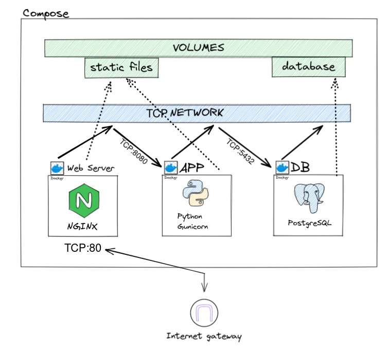

# 30 Container

Vamos colocar nossa aplicação para rodar dentro de containers mas
antes vamos alinhas alguns conceitos.

## O que é um container?

Container é um ambiente isolado do restante do sistema operacional, utiliza alguns recursos compartilhados como processamento e memória porém tem a sua árvore de execução de processos e escalonamento de permissões separado do restante do sistema.

Além disso os containers são iniciados a partir de uma imagem base que pode ser reutilizada para iniciar várias instâncias de container.

## Containerizando a app Django

### 1. Dockerfile

O Dockerfile é o arquivo a partir de onde o Docker (ou outro sistema de builds de container como buildah) irá ler as diretivas 
e criar uma imagem de container especifica para nossa aplicação.

Dentro do Dockerfile vamos colocar algumas diretivas como:

- `FROM` especifica a imagem que servirá de base
- `WORKDIR` especifica o diretório corrente dentro do container
- `RUN` executa um comando no shell do container
- `USER` altera o usuário atual logado no container
- `COPY` copia arquivos locais para dentro do container
- `ARG` especifica argumentos que podemos customizar ao rodar o container
- `ENV` seta variáveis de ambiente
-  `ENTRYPOINT` aponta para um executavél que roda sempre que usarmos `run` no container
- `CMD` especifica o comando padrão a ser passado ao entrypoint

Com essas diretivas podemos fazer exatamente como fizemos com o **Ansible** na aula anterior e automatizar os passos que usamos para construir a VM, porém ao invés de uma VM estaremos contruindo uma imagem de container que tem caracteristicas diferentes.


A recomendação é que o Dockerfile fique na raiz do nosso projeto, portanto:

`exemplos/day2/django/Dockerfile`

```docker
FROM python:3.10.6-slim-bullseye AS app

WORKDIR /app

RUN apt-get update \
  && apt-get install -y --no-install-recommends build-essential curl libpq-dev \
  && rm -rf /var/lib/apt/lists/* /usr/share/doc /usr/share/man \
  && apt-get clean \
  && useradd --create-home python \
  && chown python:python -R /app \
  && mkdir /static \
  && chown python:python -R /static

USER python

# Copy local django/ contents to container /app (WORKDIR)
COPY --chown=python:python . .

ARG DEBUG="false"
ENV DEBUG="${DEBUG}" \
    PYTHONUNBUFFERED="true" \
    PYTHONPATH="/app" \
    PATH="${PATH}:/home/python/.local/bin" \
    USER="python" \
    BLOG_STATIC_ROOT="/static/" \
    BLOG_STATIC_URL="/static/" \
    BLOG_DEBUG="${DEBUG}" \
    BLOG_ALLOWED_HOSTS='["*"]' \
    BLOG_DATABASES__default__ENGINE="django.db.backends.postgresql" \
    BLOG_DATABASES__default__NAME="blog" \
    BLOG_DATABASES__default__USER="blog" \
    BLOG_DATABASES__default__HOST="blog_postgres" \
    DJANGO_SETTINGS_MODULE="djblog.settings"

RUN python -m pip install install /app gunicorn psycopg2

RUN if [ "${DEBUG}" = "false" ]; then \
  SECRET_KEY=dummyvalue python manage.py collectstatic --no-input; \
  fi

ENTRYPOINT [ "/app/docker/entrypoint.sh" ]

EXPOSE 8000

CMD ["python -m gunicorn", "-c", "python:djblog.gunicorn", "djblog.wsgi"]

```

Para construir a imagem principal usamos alguns artefatos extras que teremos que criar:

`exemplos/day2/django/djblog/gunicorn.py`
```python
import os
import multiprocessing

bind = f"0.0.0.0:{os.getenv('PORT', '8000')}"
accesslog = "-"
access_log_format = "%(h)s %(l)s %(u)s %(t)s '%(r)s' %(s)s %(b)s '%(f)s' '%(a)s' in %(D)sµs"  # noqa: E501

workers = int(os.getenv("WEB_CONCURRENCY", multiprocessing.cpu_count() * 2))
threads = int(os.getenv("PYTHON_MAX_THREADS", 1))

reload = os.getenv("WEB_RELOAD","").lower() in ("1", "true")

```

Este script utiliza Python para configurar o `gunicorn` e a utilidade dele é calcular a quantidade de workers baseando-se na quantidade de CPUs disponíveis.

`exemplos/day2/django/docker/entrypoint.sh`
```bash
#!/usr/bin/env bash

set -e

# python manage.py migrate --noinput

$@
```

O script de ponto de entrada que irá executar sempre que o container iniciar e é nele que colocamos coisas como comandos iniciais de deploye outras utilidades casos seja necessário.


### Build

Para construir a imagem a partir do Dockerfile usaremos o seguinte comando:

```bash
cd exemplos/day2/django
docker build -t django-blog:latest .
```
```
Successfully built 4a8e606af015
Successfully tagged django-blog:latest
```

### Executando

Agora se tentarmos executar obteremos um erro:

```bash
docker run --rm -it -p 8000:8000 django-blog
Traceback (most recent call last):
  File "/home/python/.local/lib/python3.10/site-packages/django/db/backends/base/base.py", line 282, in ensure_connection
    self.connect()
  File "/home/python/.local/lib/python3.10/site-packages/django/utils/asyncio.py", line 26, in inner
    return func(*args, **kwargs)
  File "/home/python/.local/lib/python3.10/site-packages/django/db/backends/base/base.py", line 263, in connect
    self.connection = self.get_new_connection(conn_params)
  File "/home/python/.local/lib/python3.10/site-packages/django/utils/asyncio.py", line 26, in inner
    return func(*args, **kwargs)
  File "/home/python/.local/lib/python3.10/site-packages/django/db/backends/postgresql/base.py", line 215, in get_new_connection
    connection = Database.connect(**conn_params)
  File "/home/python/.local/lib/python3.10/site-packages/psycopg2/__init__.py", line 122, in connect
    conn = _connect(dsn, connection_factory=connection_factory, **kwasync)
psycopg2.OperationalError: could not connect to server: No such file or directory
	Is the server running locally and accepting
	connections on Unix domain socket "/var/run/postgresql/.s.PGSQL.5432"?

```

E isso acontece pois em nosso Dockerfile temos a seguinte configuração:

```bash
BLOG_DATABASES__default__ENGINE="django.db.backends.postgresql"
BLOG_DATABASES__default__NAME="blog"
BLOG_DATABASES__default__USER="blog"
```

E a aplicação tentará se conectar a um banco de dados `PostgreSQL` que não temos sendo executado.

Em containers rodamos cada serviço em seu container, portanto precisaremos de mais containers na nossa arquitetura.


### Compose

Existem alguns orquestradores de containers e entre eles temos Kubernetes para ambiente de produção e o docker-compose sendo o principal para ambientes de desenvolvimento.


#### Quais são os padrões para containers?

Cada container deve executar apenas um único processo, ou seja, servidor de aplicação, banco de dados, serviço de filas, web server, cada um em seu container separado e orquestrado via um orquestrador de containers.

#### Como a arquitetura se parece?




`exemplos/day2/django/docker/docker-compose.yaml`
```yaml
volumes:
  blog_pg_data:
    name: blog_pg_data
  blog_static:
    name: blog_static

services:
  django:
    image: compose-django-blog:latest
    build:
      context: ..
      dockerfile: Dockerfile
    expose: 
      - 8000
    volumes:
      - "blog_static:/static"
    depends_on:
      - blog_postgres
    environment:
      - BLOG_STATIC_ROOT=/static/
      - BLOG_STATIC_URL=/static/
      - BLOG_DEBUG=false
      - BLOG_ALLOWED_HOSTS=["*"]
      - BLOG_DATABASES__default__ENGINE=django.db.backends.postgresql
      - BLOG_DATABASES__default__NAME=blog
      - BLOG_DATABASES__default__USER=blog
      - BLOG_DATABASES__default__PASSWORD=blog
      - BLOG_DATABASES__default__HOST=blog_postgres
      - DJANGO_SETTINGS_MODULE=djblog.settings
      - PYTHONPATH=/app
      - PATH="${PATH}:/home/python/.local/bin"

  blog_postgres:
    image: "postgres:12"
    expose:
      - 5432
    environment:
      - POSTGRES_USER=blog
      - POSTGRES_PASSWORD=blog
      - POSTGRES_DB=blog
    volumes:
      - "blog_pg_data:/var/lib/postgresql/data"

  blog_nginx:
    image: nginx:1.21-alpine
    ports:
      - "80:80"
    volumes:
      - "blog_static:/usr/share/nginx/html"
      - "./nginx.conf:/etc/nginx/conf.d/default.conf:z"
    depends_on:
      - django
```

#### Iniciando o compose

```bash
docker-compose down -v
docker-compose up -d --build
docker-compose exec django python manage.py migrate --noinput
docker-compose exec django python manage.py createsuperuser --username=admin --email=admin@example.com
```
