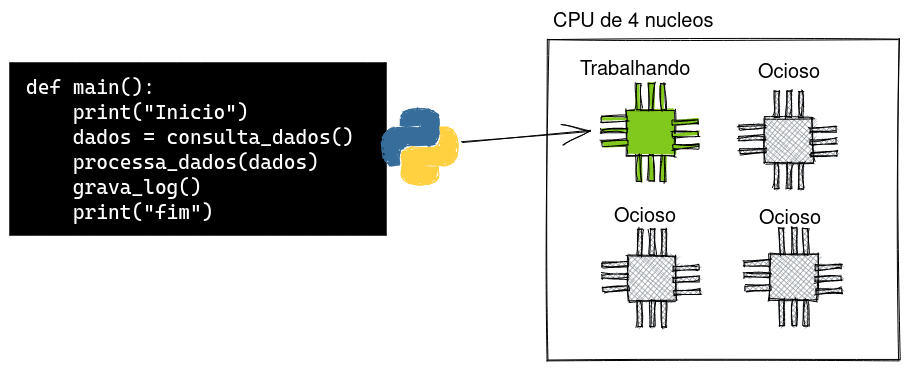
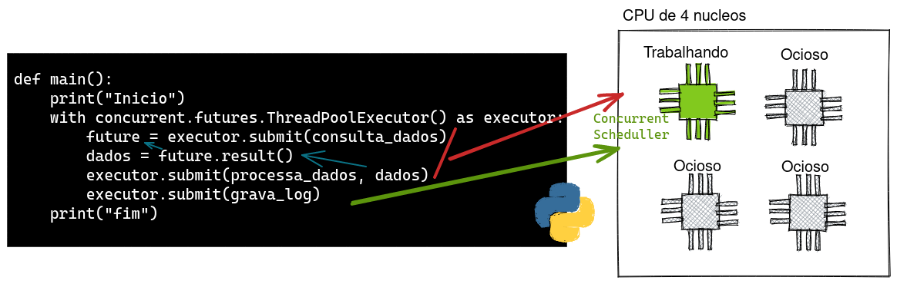

# 31 Modelos de concorrência em Python

## Diferença entre CPU bound e I/O bound

Categorizamos programas em dois tipos: CPU bound e I/O bound, dependendo de onde está o maior esforço computacional do programa,
em programas CPU bound, o maior esforço computacional está na CPU, por exemplo efetuando operações matemáticas, enquanto
em programas I/O bound, o maior esforço computacional está em operações de entrada e saída, como por exemplo ler um arquivo
de disco, consultar uma API externa ou um banco de dados.

A maioria dos computadores modernos tem mais de um nucleo de processamento e, portanto, pode executar mais de uma tarefa ao mesmo tempo, porém, a linguagem Python possui uma coisa chamada Global Interpreter Locker (GIL) que é a responsável por permitir que Python seja uma linguagem segura e dinâmica mas que ao mesmo tempo impede que mais de uma tarefa seja executada ao mesmo tempo. Isso significa que, mesmo que o computador tenha mais de um nucleo, o Python por padrão só vai  executar uma tarefa por vez em apenas um nucleo.


## Programação sequencial (sincrona)

```python
import time


def consulta_dados():
    print("Consultando dados...")
    time.sleep(2)
    return "dados"


def processa_dados(dados):
    print("Processando dados...")
    time.sleep(2)


def grava_log():
    print("Gravando log...")
    time.sleep(2)


def main():
    start = time.perf_counter()
    print("Inicio")
    dados = consulta_dados()
    processa_dados(dados)
    grava_log()
    print("fim")
    finish = time.perf_counter()
    print(f"Finished in {round(finish-start, 2)} second(s)")


main()

```

Ao executar o programa acima perceba que existe um tempo de espera entre cada uma das funções, estamos simulando este tempo de espera com a função `time.sleep()` mas imagine que cada uma dessas funções esteja acessando um banco de dados, um arquivo ou uma API externa, nesse caso o tempo de espera seria o tempo de resposta de I/O ou processamento.

```bash
Inicio
Consultando dados... (espera de 2 segundos)
Processando dados... (espera de 2 segundos)
Gravando log... (espera de 2 segundos)
fim
Finished in 6.0 second(s)
```

Durante os tempos de espera o processador fica ocioso, ou seja, ele não está fazendo nada, e isso é um desperdício de recursos computacionais.




## Concorrência e Parallelismo

Concorrência é quando duas ou mais tarefas podem ser executadas simultaneamente, porém, apenas uma delas é executada por vez, ou seja, o processador alternará entre as tarefas, enquanto que Parallelismo é quando duas ou mais tarefas são executadas simultaneamente, ou seja, o processador executa as tarefas ao mesmo tempo em diferentes nucleos.

Em Python podemos usar Threads, Processos, Filas e dependendo de como implementamos podemos usar a abordagem concorrente ou paralela.


## Soluções: Threads

Existem várias maneiras de contornar esta questão sendo a mais comum a utilização de threads, que são tarefas que podem ser executadas em paralelo e que são gerenciadas pelo sistema operacional, não é uma tarefa simples trabalhar com threads em Python, pois é necessário lidar com a sincronização de dados e com a concorrência, mas existem algumas bibliotecas que facilitam o trabalho com threads, como o [gevent](http://www.gevent.org/) que inclusive nós já usamos aqui no treinamento quando usamos o `gunicorn` para rodar o nosso servidor web.

Threads são recomendadas quando o programa tem muitas operações de Network e I/O.

Antigamente era necessário criar threads usando a biblioteca threading porém no python 3 existe uma abstração muito mais fácil de usar no módulo concurrent.futures.

```python
import time
import concurrent.futures

# a implementação das funções não são alteradas
...


def main():
    start = time.perf_counter()
    print("Inicio")
    with concurrent.futures.ThreadPoolExecutor() as executor:
        future = executor.submit(consulta_dados)
        dados = future.result()
        executor.submit(processa_dados, dados)
        executor.submit(grava_log)
    finish = time.perf_counter()
    print("fim")
    print(f"Finished in {round(finish-start, 2)} second(s)")


main()
```

A execução continua sequencial porem existe uma pequena melhoria em uso de recursos

```bash
...
Finished in 4.0 second(s)
```

O ganho de 2 segundos aconteceu pois a função `grava_log` foi capaz de ser executada em uma nova thread enquanto a função `consulta_dados` estava sendo executada e esperando a finalização de uma operação de I/O que simulamos com o `time.sleep`, mas ainda assim o processador ficou ocioso durante o tempo de espera de 2 segundos pois a função `processa_dados` depende dos dados retornados pela função `consulta_dados` e não pode ser executada em paralelo.




Essa melhoria não é tào significativa em nosso exemplo pois o tempo de espera é pequeno, mas imagine que cada uma dessas funções estejam demorando muito mais tempo em tarefas de I/O, neste caso a melhoria seria significativa, você pode testar isso alterando o tempo de espera das funções.

E além disso, com threads é possível executar código concorrente, ou seja, multiplas threads concorrendo por um único nucleo de processamento, porém não é possível paralelismo (usar mais de um nucleo de processamento) isso só é possível com multiplos processos, vamos ver como fazer isso.