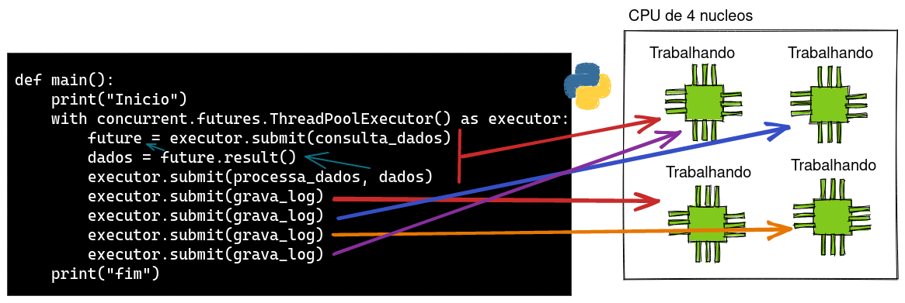
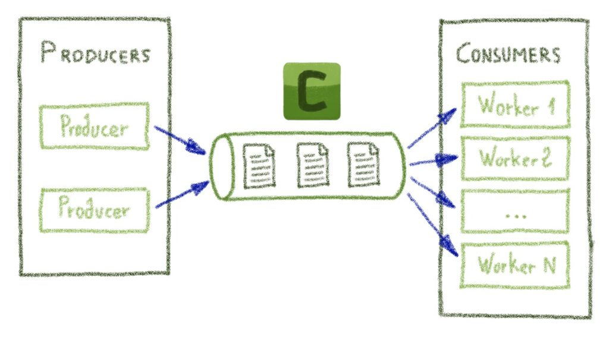

# 31 Modelos de concorrência em Python

## Diferença entre CPU bound e I/O bound

Categorizamos programas em dois tipos: CPU bound e I/O bound, dependendo de onde está o maior esforço computacional do programa,
em programas CPU bound, o maior esforço computacional está na CPU, por exemplo efetuando operações matemáticas, enquanto
em programas I/O bound, o maior esforço computacional está em operações de entrada e saída, como por exemplo ler um arquivo
de disco, consultar uma API externa ou um banco de dados.

A maioria dos computadores modernos tem mais de um nucleo de processamento e, portanto, pode executar mais de uma tarefa ao mesmo tempo, porém, a linguagem Python possui uma coisa chamada Global Interpreter Locker (GIL) que é a responsável por permitir que Python seja uma linguagem segura e dinâmica mas que ao mesmo tempo impede que mais de uma tarefa seja executada ao mesmo tempo. Isso significa que, mesmo que o computador tenha mais de um nucleo, o Python por padrão só vai  executar uma tarefa por vez em apenas um nucleo.


## Programação sequencial (sincrona)

```python
import time


def consulta_dados():
    print("Consultando dados...")
    time.sleep(2)
    return "dados"


def processa_dados(dados):
    print("Processando dados...")
    time.sleep(2)


def grava_log():
    print("Gravando log...")
    time.sleep(2)


def main():
    start = time.perf_counter()
    print("Inicio")
    dados = consulta_dados()
    processa_dados(dados)
    grava_log()
    print("fim")
    finish = time.perf_counter()
    print(f"Finished in {round(finish-start, 2)} second(s)")


main()

```

Ao executar o programa acima perceba que existe um tempo de espera entre cada uma das funções, estamos simulando este tempo de espera com a função `time.sleep()` mas imagine que cada uma dessas funções esteja acessando um banco de dados, um arquivo ou uma API externa, nesse caso o tempo de espera seria o tempo de resposta de I/O ou processamento.

```bash
Inicio
Consultando dados... (espera de 2 segundos)
Processando dados... (espera de 2 segundos)
Gravando log... (espera de 2 segundos)
fim
Finished in 6.0 second(s)
```

Durante os tempos de espera o processador fica ocioso, ou seja, ele não está fazendo nada, e isso é um desperdício de recursos computacionais.


## Concorrência e Parallelismo

Concorrência é quando duas ou mais tarefas podem ser executadas simultaneamente, porém, apenas uma delas é executada por vez, ou seja, o processador alternará entre as tarefas, enquanto que Parallelismo é quando duas ou mais tarefas são executadas simultaneamente, ou seja, o processador executa as tarefas ao mesmo tempo em diferentes nucleos.

Em Python podemos usar Threads, Processos, Filas e dependendo de como implementamos podemos usar a abordagem concorrente ou paralela.


## Soluções: Threads

Existem várias maneiras de contornar esta questão sendo a mais comum a utilização de threads, que são tarefas que podem ser executadas em paralelo e que são gerenciadas pelo sistema operacional, não é uma tarefa simples trabalhar com threads em Python, pois é necessário lidar com a sincronização de dados e com a concorrência, mas existem algumas bibliotecas que facilitam o trabalho com threads, como o [gevent](http://www.gevent.org/) que inclusive nós já usamos aqui no treinamento quando usamos o `gunicorn` para rodar o nosso servidor web.

Threads são recomendadas quando o programa tem muitas operações de Network e I/O.

Antigamente era necessário criar threads usando a biblioteca threading porém no python 3 existe uma abstração muito mais fácil de usar no módulo concurrent.futures.

```python
import time
import concurrent.futures

# a implementação das funções não são alteradas
...


def main():
    start = time.perf_counter()
    print("Inicio")
    with concurrent.futures.ThreadPoolExecutor() as executor:
        future = executor.submit(consulta_dados)
        dados = future.result()
        executor.submit(processa_dados, dados)
        executor.submit(grava_log)
    finish = time.perf_counter()
    print("fim")
    print(f"Finished in {round(finish-start, 2)} second(s)")


main()
```

A execução continua sequencial porem existe uma pequena melhoria em uso de recursos

```bash
...
Finished in 4.0 second(s)
```

O ganho de 2 segundos aconteceu pois a função `grava_log` foi capaz de ser executada em uma nova thread enquanto a função `consulta_dados` estava sendo executada e esperando a finalização de uma operação de I/O que simulamos com o `time.sleep`, mas ainda assim o processador ficou ocioso durante o tempo de espera de 2 segundos pois a função `processa_dados` depende dos dados retornados pela função `consulta_dados` e não pode ser executada em paralelo.


Essa melhoria não é tào significativa em nosso exemplo pois o tempo de espera é pequeno, mas imagine que cada uma dessas funções estejam demorando muito mais tempo em tarefas de I/O, neste caso a melhoria seria significativa, você pode testar isso alterando o tempo de espera das funções.

E além disso, com threads é possível executar código concorrente, ou seja, multiplas threads concorrendo por um único nucleo de processamento, porém não é possível paralelismo (usar mais de um nucleo de processamento) isso só é possível com multiplos processos, vamos ver como fazer isso.


## Soluções: Multiprocessing

Uma outra abordagem é executar as tarefas em processos separados, que são gerenciados pelo sistema operacional e que podem ser executados em paralelo, mas que não compartilham memória, ou seja, cada processo tem sua própria memória e não
é possível acessar a memória de outro processo. Para trabalhar com processos em Python nós podemos usar a biblioteca [multiprocessing](https://docs.python.org/3/library/multiprocessing.html) que é nativa do Python mas que é um pouco complicada de usar e dá um grande trabalho para sincronizar os dados entre os processos, na mesma `concurrent.futures` existe uma classe chamada `ProcessPoolExecutor` que é uma abstração para trabalhar com processos.


A única alteração necesária é usar o ProcessPoolExecutor ao invés do ThreadPoolExecutor.

```python
def main():
    start = time.perf_counter()
    print("Inicio")
    with concurrent.futures.ProcessPoolExecutor() as executor:
        future = executor.submit(consulta_dados)
        dados = future.result()
        executor.submit(processa_dados, dados)
        executor.submit(grava_log)
    finish = time.perf_counter()
    print("fim")
    print(f"Finished in {round(finish-start, 2)} second(s)")
```

Você vai reparar que o tempo de execução em nosso exemplo ficou na verdade pior usando processos.

```bash
...
Finished in 4.05 second(s)
```

Esses 5 milisegundos a mais são usados para o próprio bootstrap dos processos e pelo fato de que cada processo tem que copias os dados para a memória isolada usando pickle, isso adiciona um overhead considerável.

Usar processos só vai valer a pena quando o tempo de espera for muito maior que o tempo de bootstrap dos processos, ou seja, quando tivermos muitas funções a serem executadas ou funções que realmente tomam muito mais tempo esperando operações de I/O, para ter uma idéia vamos chamar a função `grava_log` mais 3 vezes, esperariamos que o tempo adicionado seria **2 segundos** por cada chamada, mas veja o que acontece.

```python
def main():
    start = time.perf_counter()
    print("Inicio")
    with concurrent.futures.ProcessPoolExecutor() as executor:
        future = executor.submit(consulta_dados)
        dados = future.result()
        executor.submit(processa_dados, dados)
        executor.submit(grava_log)

        executor.submit(grava_log)
        executor.submit(grava_log)
        executor.submit(grava_log)

    finish = time.perf_counter()
    print("fim")
    print(f"Finished in {round(finish-start, 2)} second(s)")
```
```bash
Finished in 4.05 second(s)
```

Mesmo chamando a função `grava_Log` multiplas vezes o tempo de execução não aumentou, isso acontece porque o sistema operacional é capaz de gerenciar os processos de forma eficiente e não precisa criar um novo processo para cada chamada, ele reutiliza os processos que já estão prontos para executar novas tarefas, como se fosse um cache de processos.





Processos não resolvem o problema de I/O, eles só resolvem o problema de processamento, portanto existem soluções que podem ser melhores dependendo do problema em questão.

## Soluções: Filas


Existem outras bibliotecas que facilitam o trabalho com processos, como o [celery](http://www.celeryproject.org/) ou o [python-rq](https://python-rq.org/) que utilizam uma abordagem de produção e consumo de mensagens, ou seja, ao invés de chamar uma função, o **producer** coloca a chamada da função em uma fila e então processos **consumers** distribuidos executam as tarefas uma a uma da fila.

Essa estrutura é muito poderosa e resolve 99% dos casos onde escalabilidade é necessária para tarefas em background.

```python
# Criando tasks com celery (producer)
from celery import Celery

...

def main():
    dados = consulta_dados.delay()  
    # .delay() coloca a tarefa na fila
    processa_dados.delay(kwargs={'dados': dados})
    grava_log.delay()
```

```bash
# Executando consumers (workers) para consumir as tasks
celery -A tasks worker --loglevel=info
```



## Soluções: Programação Assíncrona

Os modelos até aqui apresentados são bastante interessantes e úteis e não dá para selecionar apenas um, a escolha irá depender de uma análise detalhada das necessidades do projeto e muitas vezes será necessário combinar mais de um modelo para resolver o problema.

Percebendo que na maioria dos casos o que realmente precisamos é aproveitar o tempo ocioso da CPU em operações de I/O a maioria das linguagens de programação modernas adotam uma abordagem comumente conhecida como AsyncIO, que traz principalmente a caracteristica de ser mais legivel e mais fácil de implementar, inclusive pensando nisso as linguagens até adicionaram palavras chave especificas para este tipo de programação.

Em Python a biblioteca [asyncio](https://docs.python.org/3/library/asyncio.html) é nativa e já vem instalada por padrão, mas para trabalhar com ela é necessário usar a versão 3.7 ou superior.

Utilizando AsyncIO por padrão, não muda o fato de que Python só pode usar um processador, mas o que muda é que o Python não vai ficar esperando o resultado de uma operação de I/O para continuar executando outras tarefas, ele vai continuar executando outras tarefas enquanto a operação de I/O está sendo executada.

Vamos reescrever nosso exemplo com Asyncio, para isso usamos a palavra `async` antes da definição da e a palavra `await` antes de uma chamada.

Alguns conceitos muito importantes é que agora não chamamos mais de funções, mas sim de corrotinas, e que a palavra `await` só pode ser usada dentro de uma corrotina e sempre que usamos a palavra `await` para chamar uma corrotina não chamaremos o valor retornado de `valor` mas sim de `Future`, ou seja, uma probabilidade de retornar o valor eventualmente no futuro.

Vamos ver isso na prática:

```python
import asyncio
import time

async def consulta_dados():
    print("Consultando dados...")
    await asyncio.sleep(2)
    return "dados"

async def processa_dados(dados):
    print(f"Processando {dados}...")
    await asyncio.sleep(2)
    return "dados"

async def grava_log():
    print("Gravando log...")
    await asyncio.sleep(2)

async def main():
    start = time.perf_counter()
    print("Inicio")
    dados = await consulta_dados()
    await processa_dados(dados)
    await grava_log()
    finish = time.perf_counter()
    print("fim")
    print(f"Finished in {round(finish-start, 2)} second(s)")

asyncio.run(main())
```
    
```bash
Inicio
Consultando dados...
Processando dados...
Gravando log...
fim
Finished in 6.01 second(s)
```

E você deve estar pensando, mas o que aconteceu? Porque o tempo de execução foi o mesmo de um programa sincrono?

## Async Tasks

Apesar de estarmos utilizando a palavra chave `async` e `await` o Python não está executando o código de forma assíncrona, ele está executando de forma síncrona, repare que o uso de `await` faz com que o código pare de ser executado e literalmente **espere** até a função anterior ser executada.

Para que a gente consiga de fato fazer com que a execução seja assincrona precisamos utilizar o conceito de event loop e de tasks, nós enfileiramos taks em um pool de execução e o event loop vai executando as tasks de acordo com a disponibilidade de processamento.

```python

# sem altarações nas corrotinas

async def main():
    start = time.perf_counter()
    print("Inicio")

    dados = asyncio.create_task(consulta_dados())
    asyncio.create_task(processa_dados(await dados))
    await grava_log()

    finish = time.perf_counter()
    print("fim")
    print(f"Finished in {round(finish-start, 2)} second(s)")
```

Agora repare que não temos mais o controle da ordem de execução porém o tempo ficou muito mais rápido,
bastante parecido com o tempo de execução com threads
porém usando apenas um nucleo de processamento e com uma sintaxe muito mais fácil de controlar.

```bash
Inicio
Consultando dados...
Gravando log...
Processando dados dados...
fim
Finished in 4.0 second(s)
```

Modelo de execução do AsyncIO


## Conclusão

Agora você já conhece os principais modelos de programação concorrente e assíncrona, para aprofundar mais no tema eu aconselho o treinamento Python Engineer onde tem um capitulo focado em  concorrência e paralelismo com todos os detalhes e exemplos de código.

Uma leitura adicional muito interessante é a documentação do FastAPI no capitulo sobre [Async](https://fastapi.tiangolo.com/async/) 
